# White-Box Testing Increment 1 — Modul Pengguna & Data Induk

**Versi sistem yang diuji:** commit `8449a47c625bd6e1b185bd43bef9eb6e30320349` (branch `main`, working tree bersih saat pengujian dimulai; satu-satunya tambahan adalah berkas tes baru di `tests/Feature/JalurBasisModul*Test.php`).

**Konvensi penyusunan grafik alir** (berlaku untuk keempat dokumen increment):

1. Satu node mewakili satu blok pernyataan berurutan atau satu kondisi. Setiap kondisi atomik pada ekspresi majemuk (`&&`, `||`) digambar sebagai predicate node tersendiri (Pressman).
2. Konstruksi yang dihitung sebagai predicate: `if`/`elseif`, kepala perulangan (`foreach`, `for` bersyarat, `map` yang menjadi badan perulangan), setiap lengan `match` kecuali `default` (diurai menjadi perbandingan berurutan), operator ternary `?:`, null-coalescing `??`, setiap `catch`, serta pembantu bersyarat Laravel `when()` dan `abort_unless()` yang setara dengan `if`. Operator nullsafe `?->` tidak dihitung.
3. Closure yang dijalankan tepat sekali secara sinkron (`DB::transaction`) digambar sebaris. Closure yang diteruskan ke operasi koleksi (`filter`, `reject`, `sum`, `mapWithKeys`) adalah fungsi terpisah dan digambar sebagai satu node proses. Closure yang dievaluasi Filament sebagai aturan (mis. `->rule()`, `->placeholder()`, `visible()` aksi) dianalisis sebagai unit tersendiri bila memuat percabangan.
4. `return`, `throw`, `halt()`/`throw new Halt`, dan `abort()` langsung menuju node exit. Exception yang tidak ditangkap method itu sendiri tidak digambar sebagai edge.
5. Setiap grafik memiliki satu entry dan satu exit, P = 1. V(G) dihitung dengan dua rumus, dan kedua hasil diperiksa sama secara otomatis. Matriks grafik menandai 1 pada sel (baris = asal, kolom = tujuan); kolom terakhir berisi (jumlah sambungan keluar − 1).
6. Jalur independen dipilih sebanyak V(G) dan diperiksa secara otomatis: setiap jalur adalah walk sah dari entry ke exit, seluruh edge tercakup, dan rank matriks jalur × edge sama dengan V(G) (saling bebas linear). Untuk method berperulangan, satu jalur = entry, satu putaran badan, exit. Tes yang menjalankan beberapa putaran dihitung mencakup jalur bila salah satu putarannya mengikuti urutan node badan jalur itu.
7. Jalur yang secara logika tidak dapat dicapai tetap dicantumkan sebagai bagian himpunan basis (karena dimensi ruang jalurnya hanya dapat dibentuk oleh jalur itu), ditandai **mustahil**, disertai alasannya, dan tidak dipaksa dengan tes.

**Cara status jalur ditentukan.** Setiap jalur dipetakan ke method tes yang isinya dibaca dan dipastikan melalui urutan keputusan jalur tersebut (bukan dari nama tesnya). Status dibaca otomatis dari berkas JUnit hasil eksekusi:
- **Awal** = run seluruh tes yang sudah ada sebelum tes baru ditulis (SQLite: 742 tes; MySQL: run `awal-mysql`).
- **Akhir** = run Increment 4 (seluruh 83 berkas, termasuk tes baru) pada driver yang sama.
- `lolos` = semua method tes pemeta lolos; `tanpa-tes` = belum ada tes yang menjalankan jalur itu; `gagal` = tes pemeta dijalankan dan gagal; `mustahil` = jalur tak terjangkau.
- J_awal dan J_akhir = banyaknya jalur berstatus `lolos`. Persentase = J / V(G) × 100%.

**Unit yang diuji (Tabel 3.2):** UserForm, EditUser, model User (penghapusan dan penjaga Admin), ImporPengguna, StokMasuk dan BarangPersediaanForm (keunikan kode barang), AsetTetapForm (penempatan wajib saat buat, terkunci saat ubah).

**Method yang tidak dipilih dan alasannya**

| Kelas | Method / closure | Alasan |
|---|---|---|
| UserForm | `configure()` › `required` kolom `tim_id` (L95), `required`/`dehydrated` kata sandi (L73–74), `disabled`/`dehydrated` peran & status (L86–87, L101–102) | Ekspresi tunggal tanpa percabangan (V(G) = 1); aturan penguncian akun sendiri seluruhnya berada di `akunSendiri()` (1.1). |
| UserForm | `configure()` › `helperText` peran & status (L88, L103) | Ternary hanya memilih teks keterangan dari hasil `akunSendiri()`; bukan aturan bisnis. |
| EditUser | `tolakPerubahan()`, `getHeaderActions()` | Tanpa percabangan. |
| User | `canAccessPanel()`, `tim()`, `casts()` | Tanpa percabangan / getter. |
| ImporPengguna | `kolom()` | Deklarasi kolom, tanpa percabangan. |
| StokMasuk | `kodeBarangSudahDipakai()` | Satu kueri tanpa percabangan (V(G) = 1); dipakai dan ikut teruji lewat 1.10. |
| BarangPersediaanForm | `configure()` | V(G) = 1: tidak memuat satu pun closure bercabang **dan tidak memuat aturan keunikan kode barang** — lihat Temuan T-2 di bawah. |
| AsetTetapForm | `configure()` › `required` (L63), `disabled` (L72), `dehydrated` (L73) kolom penempatan | Ekspresi tunggal tanpa percabangan (V(G) = 1); pembeda Buat/Ubah dan kunci penempatan diwakili 1.12 dan 1.13 yang memakai kondisi yang sama. |

## Ringkasan

| ID | Method | V(G) | J_awal | % awal | J_akhir | % akhir | Mustahil | Belum lolos |
|---|---|---|---|---|---|---|---|---|
| 1.1 | `UserForm::akunSendiri` | 2 | 2 | 100.0% | 2 | 100.0% | 0 | — |
| 1.2 | `EditUser::beforeSave` | 11 ⚠ | 8 | 72.7% | 9 | 81.8% | 1 | J3 |
| 1.3 | `EditUser::afterSave` | 3 | 3 | 100.0% | 3 | 100.0% | 0 | — |
| 1.4 | `User::alasanTidakDapatDihapus` | 5 | 5 | 100.0% | 5 | 100.0% | 0 | — |
| 1.5 | `User::booting (pendengar deleting)` | 2 | 2 | 100.0% | 2 | 100.0% | 0 | — |
| 1.6 | `User::punyaRiwayat` | 5 | 3 | 60.0% | 5 | 100.0% | 0 | — |
| 1.7 | `ImporPengguna::jalankan` | 20 ⚠ | 11 | 55.0% | 18 | 90.0% | 2 | — |
| 1.8 | `ImporPengguna::pesanPenjagaAdmin` | 10 | 8 | 80.0% | 10 | 100.0% | 0 | — |
| 1.9 | `ImporPengguna::bacaYaTidak` | 4 | 2 | 50.0% | 4 | 100.0% | 0 | — |
| 1.10 | `StokMasuk::borangBarangBaru › aturan kode_barang` | 2 | 0 | 0.0% | 2 | 100.0% | 0 | — |
| 1.11 | `StokMasuk::simpanBarangBaru` | 3 | 2 | 66.7% | 3 | 100.0% | 0 | — |
| 1.12 | `AsetTetapForm::configure › placeholder tim_penempatan_id` | 2 | 2 | 100.0% | 2 | 100.0% | 0 | — |
| 1.13 | `AsetTetapForm::configure › helperText tim_penempatan_id` | 2 | 2 | 100.0% | 2 | 100.0% | 0 | — |
| **Jumlah** | 13 method | **71** | **50** | 70.4% | **67** | 94.4% | 3 | |

⚠ = V(G) > 10, batas yang disarankan McCabe (1976).

## Rincian per method

### 1.1 `UserForm::akunSendiri`

Berkas: `app/Filament/Resources/Users/Schemas/UserForm.php` baris 28–31. Dipilih karena: penentu apakah kolom Peran dan Status Aktif dikunci (Admin tidak mengunci dirinya sendiri); dipakai closure disabled/dehydrated/helperText.

**1. Grafik alir — node**

| Node | Baris | Isi |
|---|---|---|
| 1 | L30 | $record !== null ? *(predicate)* |
| 2 | L30 | $record->is(auth()->user()) |
| 3 | L30 | return (nilai ekspresi) |

**Edge** (asal → tujuan):

1→2 (T), 1→3 (F), 2→3

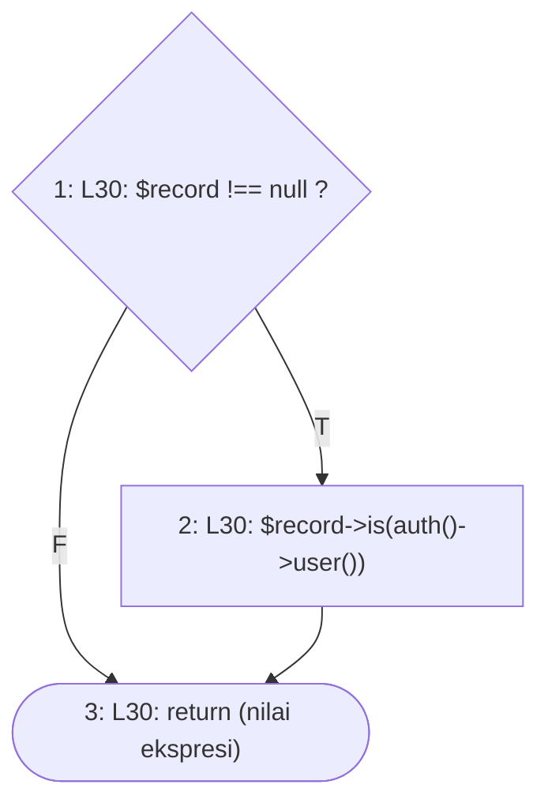

**2. Cyclomatic complexity**

- N = 3, E = 3, P = 1
- V(G) = E − N + 2P = 3 − 3 + 2 = **2**
- Predicate node: 1 (1 node); V(G) = 1 + 1 = **2**

**3. Matriks grafik**

| | 1 | 2 | 3 | Σ keluar − 1 |
|---|---|---|---|---|
| **1** |  | 1 | 1 | 1 |
| **2** |  |  | 1 | 0 |
| **3** |  |  |  | — |

Jumlah kolom terakhir = 1; V(G) = 1 + 1 = 2.

**4–5. Jalur independen dan kasus uji**

| No | Jalur | Kasus uji | Method tes | Awal | Akhir |
|---|---|---|---|---|---|
| J1 | 1–3 | Form Buat Pengguna (record null): kolom peran/status aktif | `AdminTidakMengunciDiriTest::test_form_buat_pengguna_tidak_terkunci_dan_berfungsi` | lolos | lolos |
| J2 | 1–2–3 | Form Ubah akun sendiri (terkunci) dan akun lain (tidak terkunci) | `AdminTidakMengunciDiriTest::test_admin_melihat_kolom_peran_dan_status_akun_sendiri_terkunci` `AdminTidakMengunciDiriTest::test_admin_dapat_menonaktifkan_admin_lain_selama_masih_ada_admin_aktif_lain` | lolos | lolos |

**6. Persentase jalur lolos:** J_awal = 2, J_akhir = 2; awal = 2/2 × 100% = 100.0%, akhir = 2/2 × 100% = 100.0%.

### 1.2 `EditUser::beforeSave`

Berkas: `app/Filament/Resources/Users/Pages/EditUser.php` baris 30–48. Dipilih karena: penjaga sisi peladen: menolak perubahan peran/status akun sendiri dan perubahan yang menghabiskan Admin aktif terakhir.

`tolakPerubahan()` mengirim notifikasi lalu `halt()` (melempar `Halt`), sehingga node 9 dan 16 langsung menuju exit.

**1. Grafik alir — node**

| Node | Baris | Isi |
|---|---|---|
| 1 | L32 | $akun = getRecord() |
| 2 | L33 | data['role'] bernilai null? (??) *(predicate)* |
| 3 | L33 | $peranBaru = $akun->role |
| 4 | L34 | data['status_aktif'] bernilai null? (??) *(predicate)* |
| 5 | L34 | $aktifBaru = $akun->status_aktif |
| 6 | L36 | $akun->is(auth()->user())? *(predicate)* |
| 7 | L37 | $peranBaru !== $akun->role? *(predicate)* |
| 8 | L37 | $aktifBaru !== status_aktif? *(predicate)* |
| 9 | L38 | tolakPerubahan(PESAN_AKUN_SENDIRI) |
| 10 | L41 | $akun->role === 'admin'? *(predicate)* |
| 11 | L42 | $akun->status_aktif? *(predicate)* |
| 12 | L43 | hitung ! ada Admin aktif lain |
| 13 | L45 | $adminAktifTerakhir? *(predicate)* |
| 14 | L45 | $peranBaru !== 'admin'? *(predicate)* |
| 15 | L45 | ! $aktifBaru? *(predicate)* |
| 16 | L46 | tolakPerubahan('Harus ada minimal satu Admin aktif.') |
| 17 | L48 | selesai (exit) |

**Edge** (asal → tujuan):

1→2, 2→3 (T), 2→4 (F), 3→4, 4→5 (T), 4→6 (F), 5→6, 6→7 (T), 6→10 (F), 7→9 (T), 7→8 (F), 8→9 (T), 8→10 (F), 9→17, 10→11 (T), 10→13 (F), 11→12 (T), 11→13 (F), 12→13, 13→14 (T), 13→17 (F), 14→16 (T), 14→15 (F), 15→16 (T), 15→17 (F), 16→17

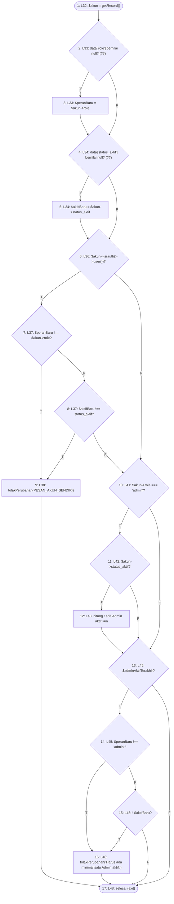

**2. Cyclomatic complexity**

- N = 17, E = 26, P = 1
- V(G) = E − N + 2P = 26 − 17 + 2 = **11**
- Predicate node: 2, 4, 6, 7, 8, 10, 11, 13, 14, 15 (10 node); V(G) = 10 + 1 = **11** — **melebihi batas 10 (McCabe, 1976)**

**3. Matriks grafik**

| | 1 | 2 | 3 | 4 | 5 | 6 | 7 | 8 | 9 | 10 | 11 | 12 | 13 | 14 | 15 | 16 | 17 | Σ keluar − 1 |
|---|---|---|---|---|---|---|---|---|---|---|---|---|---|---|---|---|---|---|
| **1** |  | 1 |  |  |  |  |  |  |  |  |  |  |  |  |  |  |  | 0 |
| **2** |  |  | 1 | 1 |  |  |  |  |  |  |  |  |  |  |  |  |  | 1 |
| **3** |  |  |  | 1 |  |  |  |  |  |  |  |  |  |  |  |  |  | 0 |
| **4** |  |  |  |  | 1 | 1 |  |  |  |  |  |  |  |  |  |  |  | 1 |
| **5** |  |  |  |  |  | 1 |  |  |  |  |  |  |  |  |  |  |  | 0 |
| **6** |  |  |  |  |  |  | 1 |  |  | 1 |  |  |  |  |  |  |  | 1 |
| **7** |  |  |  |  |  |  |  | 1 | 1 |  |  |  |  |  |  |  |  | 1 |
| **8** |  |  |  |  |  |  |  |  | 1 | 1 |  |  |  |  |  |  |  | 1 |
| **9** |  |  |  |  |  |  |  |  |  |  |  |  |  |  |  |  | 1 | 0 |
| **10** |  |  |  |  |  |  |  |  |  |  | 1 |  | 1 |  |  |  |  | 1 |
| **11** |  |  |  |  |  |  |  |  |  |  |  | 1 | 1 |  |  |  |  | 1 |
| **12** |  |  |  |  |  |  |  |  |  |  |  |  | 1 |  |  |  |  | 0 |
| **13** |  |  |  |  |  |  |  |  |  |  |  |  |  | 1 |  |  | 1 | 1 |
| **14** |  |  |  |  |  |  |  |  |  |  |  |  |  |  | 1 | 1 |  | 1 |
| **15** |  |  |  |  |  |  |  |  |  |  |  |  |  |  |  | 1 | 1 | 1 |
| **16** |  |  |  |  |  |  |  |  |  |  |  |  |  |  |  |  | 1 | 0 |
| **17** |  |  |  |  |  |  |  |  |  |  |  |  |  |  |  |  |  | — |

Jumlah kolom terakhir = 10; V(G) = 10 + 1 = 11.

**4–5. Jalur independen dan kasus uji**

| No | Jalur | Kasus uji | Method tes | Awal | Akhir |
|---|---|---|---|---|---|
| J1 | 1–2–4–6–10–13–17 | Ubah pengguna lain non-Admin | `AdminTidakMengunciDiriTest::test_ubah_pengguna_lain_yang_bukan_admin_tetap_berfungsi` | lolos | lolos |
| J2 | 1–2–3–4–6–7–8–10–11–12–13–14–15–17 | Akun sendiri, muatan peran null → memakai peran tersimpan | — | mustahil | mustahil |
| J3 | 1–2–4–5–6–10–11–12–13–14–15–17 | Admin aktif terakhir (pengguna lain), muatan status aktif null → seharusnya ditolak | `JalurBasisModul1Test::test_ubah_user_status_null_pada_admin_aktif_terakhir_ditolak` *(baru)* | tanpa-tes | gagal |
| J4 | 1–2–4–6–7–9–17 | Akun sendiri, peran diubah → ditolak | `AdminTidakMengunciDiriTest::test_muatan_yang_dimodifikasi_pada_akun_sendiri_ditolak_dan_tidak_berubah` | lolos | lolos |
| J5 | 1–2–4–6–7–8–9–17 | Akun sendiri, hanya status dinonaktifkan → ditolak | `AdminTidakMengunciDiriTest::test_hanya_peran_atau_hanya_status_yang_dimodifikasi_juga_ditolak` | lolos | lolos |
| J6 | 1–2–4–6–7–8–10–11–12–13–14–15–17 | Akun sendiri (Admin aktif satu-satunya), hanya data lain diubah → tersimpan | `AdminTidakMengunciDiriTest::test_admin_tetap_dapat_mengubah_data_lain_akun_sendiri` | lolos | lolos |
| J7 | 1–2–4–6–10–11–12–13–17 | Admin lain dinonaktifkan, masih ada Admin aktif lain → tersimpan | `AdminTidakMengunciDiriTest::test_admin_dapat_menonaktifkan_admin_lain_selama_masih_ada_admin_aktif_lain` | lolos | lolos |
| J8 | 1–2–4–6–10–11–13–17 | Admin lain yang sudah nonaktif disunting → tersimpan tanpa pemeriksaan Admin terakhir | `JalurBasisModul1Test::test_ubah_user_admin_nonaktif_tidak_dihitung_admin_terakhir` *(baru)* | tanpa-tes | lolos |
| J9 | 1–2–4–6–10–11–12–13–14–16–17 | Admin aktif terakhir diubah perannya → ditolak | `AdminTidakMengunciDiriTest::test_perubahan_yang_menghabiskan_admin_aktif_ditolak` | lolos | lolos |
| J10 | 1–2–4–6–10–11–12–13–14–15–16–17 | Admin aktif terakhir dinonaktifkan → ditolak | `AdminTidakMengunciDiriTest::test_perubahan_yang_menghabiskan_admin_aktif_ditolak` | lolos | lolos |
| J11 | 1–2–4–6–10–11–12–13–14–15–17 | Admin aktif terakhir (bukan akun sendiri), hanya nama diubah → tersimpan | `AdminTidakMengunciDiriTest::test_perubahan_yang_menghabiskan_admin_aktif_ditolak` | lolos | lolos |

**6. Persentase jalur lolos:** J_awal = 8, J_akhir = 9; awal = 8/11 × 100% = 72.7%, akhir = 9/11 × 100% = 81.8%.

Jalur J2 mustahil dicapai: `beforeSave()` hanya dipanggil `EditRecord::save()` sesudah `form->getState()` memvalidasi formulir, dan kolom Peran ber-`required()` tetap divalidasi walaupun dikunci pada akun sendiri. Percobaan `set('data.role', null)` lalu `save` berhenti dengan galat validasi `data.role => Kolom peran wajib diisi.` sebelum kait ini berjalan, sehingga node 2 tidak pernah benar.

### 1.3 `EditUser::afterSave`

Berkas: `app/Filament/Resources/Users/Pages/EditUser.php` baris 56–66. Dipilih karena: aturan sesi (G-003): Admin yang mengganti kata sandinya sendiri tetap masuk; akun lain tidak menyentuh sesi Admin.

**1. Grafik alir — node**

| Node | Baris | Isi |
|---|---|---|
| 1 | L58 | $akun = getRecord() |
| 2 | L60 | $akun->is(auth()->user())? *(predicate)* |
| 3 | L60 | $akun->wasChanged('password')? *(predicate)* |
| 4 | L62–64 | refresh(); perbaruiHashSesi() |
| 5 | L66 | selesai (exit) |

**Edge** (asal → tujuan):

1→2, 2→3 (T), 2→5 (F), 3→4 (T), 3→5 (F), 4→5

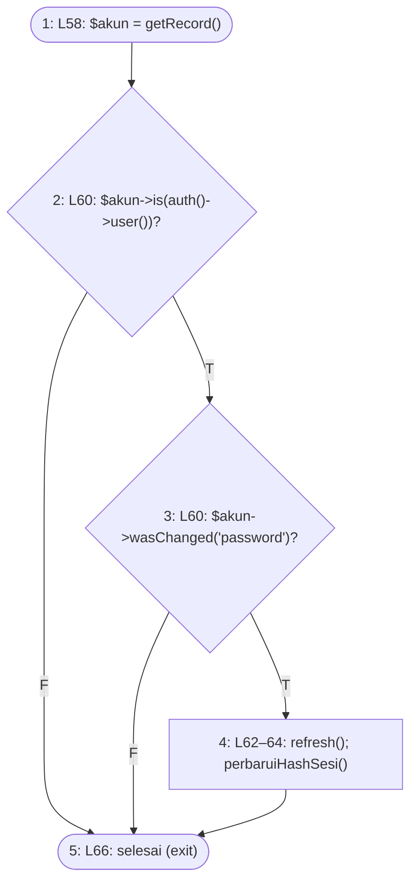

**2. Cyclomatic complexity**

- N = 5, E = 6, P = 1
- V(G) = E − N + 2P = 6 − 5 + 2 = **3**
- Predicate node: 2, 3 (2 node); V(G) = 2 + 1 = **3**

**3. Matriks grafik**

| | 1 | 2 | 3 | 4 | 5 | Σ keluar − 1 |
|---|---|---|---|---|---|---|
| **1** |  | 1 |  |  |  | 0 |
| **2** |  |  | 1 |  | 1 | 1 |
| **3** |  |  |  | 1 | 1 | 1 |
| **4** |  |  |  |  | 1 | 0 |
| **5** |  |  |  |  |  | — |

Jumlah kolom terakhir = 2; V(G) = 2 + 1 = 3.

**4–5. Jalur independen dan kasus uji**

| No | Jalur | Kasus uji | Method tes | Awal | Akhir |
|---|---|---|---|---|---|
| J1 | 1–2–5 | Admin mengganti sandi pengguna lain | `SandiFormPenggunaTest::test_admin_mengubah_sandi_pengguna_lain_tidak_menyentuh_sesinya_dan_memutus_sesi_lama_pengguna_itu` | lolos | lolos |
| J2 | 1–2–3–5 | Akun sendiri disimpan tanpa sandi baru | `SandiFormPenggunaTest::test_perubahan_tanpa_mengisi_sandi_tidak_menyentuh_apa_pun` | lolos | lolos |
| J3 | 1–2–3–4–5 | Admin mengganti sandi akunnya sendiri | `SandiFormPenggunaTest::test_admin_mengubah_sandi_akunnya_sendiri_tetap_terautentikasi` | lolos | lolos |

**6. Persentase jalur lolos:** J_awal = 3, J_akhir = 3; awal = 3/3 × 100% = 100.0%, akhir = 3/3 × 100% = 100.0%.

### 1.4 `User::alasanTidakDapatDihapus`

Berkas: `app/Models/User.php` baris 74–92. Dipilih karena: aturan penghapusan akun (G-001): tidak menghapus akun sendiri dan tidak menyisakan nol Admin aktif; dipakai aksi hapus tunggal, massal, dan pendengar deleting.

**1. Grafik alir — node**

| Node | Baris | Isi |
|---|---|---|
| 1 | L76 | $akun = collect($akun) |
| 2 | L78 | auth()->id() !== null? *(predicate)* |
| 3 | L78 | kumpulan memuat akun yang masuk? *(predicate)* |
| 4 | L79 | return 'Anda tidak dapat menghapus akun Anda sendiri.' |
| 5 | L82–84 | $adminAktifDihapus = filter/map |
| 6 | L86 | $adminAktifDihapus->isNotEmpty()? *(predicate)* |
| 7 | L87 | tidak ada Admin aktif lain di luar kumpulan? *(predicate)* |
| 8 | L88 | return 'Harus ada minimal satu Admin aktif.' |
| 9 | L91 | return null |
| 10 | — | exit |

**Edge** (asal → tujuan):

1→2, 2→3 (T), 2→5 (F), 3→4 (T), 3→5 (F), 4→10, 5→6, 6→7 (T), 6→9 (F), 7→8 (T), 7→9 (F), 8→10, 9→10

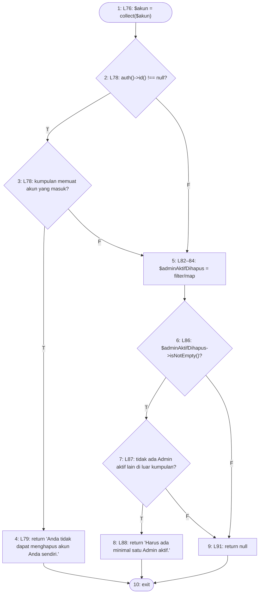

**2. Cyclomatic complexity**

- N = 10, E = 13, P = 1
- V(G) = E − N + 2P = 13 − 10 + 2 = **5**
- Predicate node: 2, 3, 6, 7 (4 node); V(G) = 4 + 1 = **5**

**3. Matriks grafik**

| | 1 | 2 | 3 | 4 | 5 | 6 | 7 | 8 | 9 | 10 | Σ keluar − 1 |
|---|---|---|---|---|---|---|---|---|---|---|---|
| **1** |  | 1 |  |  |  |  |  |  |  |  | 0 |
| **2** |  |  | 1 |  | 1 |  |  |  |  |  | 1 |
| **3** |  |  |  | 1 | 1 |  |  |  |  |  | 1 |
| **4** |  |  |  |  |  |  |  |  |  | 1 | 0 |
| **5** |  |  |  |  |  | 1 |  |  |  |  | 0 |
| **6** |  |  |  |  |  |  | 1 |  | 1 |  | 1 |
| **7** |  |  |  |  |  |  |  | 1 | 1 |  | 1 |
| **8** |  |  |  |  |  |  |  |  |  | 1 | 0 |
| **9** |  |  |  |  |  |  |  |  |  | 1 | 0 |
| **10** |  |  |  |  |  |  |  |  |  |  | — |

Jumlah kolom terakhir = 4; V(G) = 4 + 1 = 5.

**4–5. Jalur independen dan kasus uji**

| No | Jalur | Kasus uji | Method tes | Awal | Akhir |
|---|---|---|---|---|---|
| J1 | 1–2–5–6–9–10 | Tanpa pengguna masuk, menghapus akun non-Admin tanpa riwayat | `PerlindunganHapusTest::test_pengguna_tanpa_riwayat_tetap_dapat_dihapus` | lolos | lolos |
| J2 | 1–2–3–4–10 | Admin menghapus akunnya sendiri → ditolak | `HapusAkunTerjagaTest::test_admin_tidak_dapat_menghapus_akun_sendiri_walau_ada_admin_aktif_lain` | lolos | lolos |
| J3 | 1–2–3–5–6–9–10 | Admin menghapus pengguna non-Admin | `HapusAkunTerjagaTest::test_pengguna_biasa_tetap_dapat_dihapus_tunggal_dan_massal` | lolos | lolos |
| J4 | 1–2–3–5–6–7–8–10 | Menghapus satu-satunya Admin aktif → ditolak | `HapusAkunTerjagaTest::test_satu_satunya_admin_aktif_tidak_dapat_dihapus_oleh_pelaku_nonaktif` | lolos | lolos |
| J5 | 1–2–3–5–6–7–9–10 | Menghapus Admin lain selagi masih ada Admin aktif lain | `HapusAkunTerjagaTest::test_admin_dapat_menghapus_admin_lain_selama_masih_ada_admin_aktif_lain` | lolos | lolos |

**6. Persentase jalur lolos:** J_awal = 5, J_akhir = 5; awal = 5/5 × 100% = 100.0%, akhir = 5/5 × 100% = 100.0%.

### 1.5 `User::booting (pendengar deleting)`

Berkas: `app/Models/User.php` baris 102–105. Dipilih karena: penjaga penghapusan pada jalur model: `false` menolak, `null` meneruskan ke penjaga riwayat.

**1. Grafik alir — node**

| Node | Baris | Isi |
|---|---|---|
| 1 | L104 | alasanTidakDapatDihapus([$pengguna]) === null? *(predicate)* |
| 2 | L104 | hasil null (lanjut ke penjaga berikutnya) |
| 3 | L104 | hasil false (penghapusan ditolak) |
| 4 | — | exit |

**Edge** (asal → tujuan):

1→2 (T), 1→3 (F), 2→4, 3→4

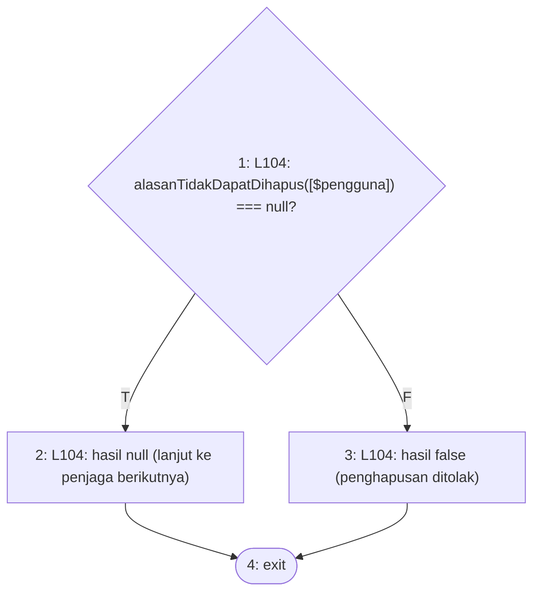

**2. Cyclomatic complexity**

- N = 4, E = 4, P = 1
- V(G) = E − N + 2P = 4 − 4 + 2 = **2**
- Predicate node: 1 (1 node); V(G) = 1 + 1 = **2**

**3. Matriks grafik**

| | 1 | 2 | 3 | 4 | Σ keluar − 1 |
|---|---|---|---|---|---|
| **1** |  | 1 | 1 |  | 1 |
| **2** |  |  |  | 1 | 0 |
| **3** |  |  |  | 1 | 0 |
| **4** |  |  |  |  | — |

Jumlah kolom terakhir = 1; V(G) = 1 + 1 = 2.

**4–5. Jalur independen dan kasus uji**

| No | Jalur | Kasus uji | Method tes | Awal | Akhir |
|---|---|---|---|---|---|
| J1 | 1–2–4 | Model pengguna tanpa hambatan dihapus langsung | `PerlindunganHapusTest::test_pengguna_tanpa_riwayat_tetap_dapat_dihapus` | lolos | lolos |
| J2 | 1–3–4 | Model pengguna yang sedang masuk dihapus langsung → false | `HapusAkunTerjagaTest::test_jalur_langsung_menolak_penghapusan_akun_yang_sedang_masuk` | lolos | lolos |

**6. Persentase jalur lolos:** J_awal = 2, J_akhir = 2; awal = 2/2 × 100% = 100.0%, akhir = 2/2 × 100% = 100.0%.

### 1.6 `User::punyaRiwayat`

Berkas: `app/Models/User.php` baris 55–62. Dipilih karena: aturan penghapusan: pengguna yang pernah bertindak (lima kunci asing penolak) tidak boleh dihapus.

**1. Grafik alir — node**

| Node | Baris | Isi |
|---|---|---|
| 1 | L57 | ada permintaan dengan pengaju_id ini? *(predicate)* |
| 2 | L58 | ada riwayat persetujuan dengan pelaksana_id ini? *(predicate)* |
| 3 | L59 | ada mutasi stok dengan petugas_id ini? *(predicate)* |
| 4 | L60 | ada BAST dengan dibuat_oleh_id ini? *(predicate)* |
| 5 | L61 | ada ketidaksesuaian dengan petugas_id ini (nilai) |
| 6 | L57 | return (exit) |

**Edge** (asal → tujuan):

1→6 (T), 1→2 (F), 2→6 (T), 2→3 (F), 3→6 (T), 3→4 (F), 4→6 (T), 4→5 (F), 5→6

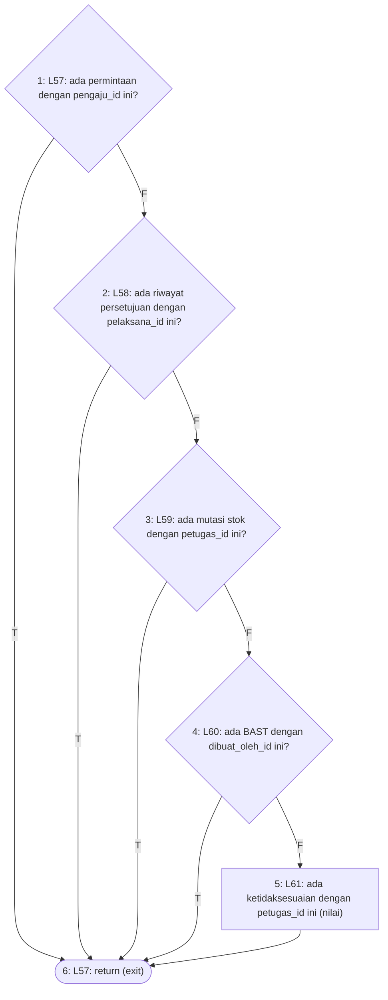

**2. Cyclomatic complexity**

- N = 6, E = 9, P = 1
- V(G) = E − N + 2P = 9 − 6 + 2 = **5**
- Predicate node: 1, 2, 3, 4 (4 node); V(G) = 4 + 1 = **5**

**3. Matriks grafik**

| | 1 | 2 | 3 | 4 | 5 | 6 | Σ keluar − 1 |
|---|---|---|---|---|---|---|---|
| **1** |  | 1 |  |  |  | 1 | 1 |
| **2** |  |  | 1 |  |  | 1 | 1 |
| **3** |  |  |  | 1 |  | 1 | 1 |
| **4** |  |  |  |  | 1 | 1 | 1 |
| **5** |  |  |  |  |  | 1 | 0 |
| **6** |  |  |  |  |  |  | — |

Jumlah kolom terakhir = 4; V(G) = 4 + 1 = 5.

**4–5. Jalur independen dan kasus uji**

| No | Jalur | Kasus uji | Method tes | Awal | Akhir |
|---|---|---|---|---|---|
| J1 | 1–6 | Pengguna pernah mengajukan permintaan | `PerlindunganHapusTest::test_hapus_massal_melewati_pengguna_yang_punya_riwayat` | lolos | lolos |
| J2 | 1–2–6 | Pengguna pernah menjadi pelaksana tahapan persetujuan | `JalurBasisModul1Test::test_punya_riwayat_pelaksana_persetujuan` *(baru)* | tanpa-tes | lolos |
| J3 | 1–2–3–6 | Pengguna pernah mencatat mutasi stok | `PerlindunganHapusTest::test_pengguna_yang_pernah_bertindak_tidak_dapat_dihapus` | lolos | lolos |
| J4 | 1–2–3–4–6 | Pengguna pernah membuat BAST | `JalurBasisModul1Test::test_punya_riwayat_pembuat_bast` *(baru)* | tanpa-tes | lolos |
| J5 | 1–2–3–4–5–6 | Pengguna tanpa riwayat (operand terakhir dievaluasi) | `PerlindunganHapusTest::test_pengguna_tanpa_riwayat_tetap_dapat_dihapus` | lolos | lolos |

**6. Persentase jalur lolos:** J_awal = 3, J_akhir = 5; awal = 3/5 × 100% = 60.0%, akhir = 5/5 × 100% = 100.0%.

### 1.7 `ImporPengguna::jalankan`

Berkas: `app/Services/Impor/ImporPengguna.php` baris 99–260. Dipilih karena: seluruh aturan validasi baris impor pengguna (wajib isi, peran, tim, status, email, bentrok email, penjaga Admin) dan pembuatan/pembaruan akun.

Closure `$ambil` (L115) dan closure `mapWithKeys` (L104–112) adalah fungsi terpisah dan digambar sebagai satu node proses; closure `DB::transaction` (L234–256) dijalankan tepat sekali secara sinkron sehingga digambar sebaris (node 33–39). Satu jalur = entry, satu putaran baris, exit; tes berbaris banyak dihitung mencakup jalur bila salah satu putarannya mengikuti urutan node badan jalur itu.

**1. Grafik alir — node**

| Node | Baris | Isi |
|---|---|---|
| 1 | L101–112 | inisialisasi hasil, baris, kolom, peta peran |
| 2 | L114 | masih ada baris? (foreach) *(predicate)* |
| 3 | L115–118 | ambil username dan nama |
| 4 | L120 | $username === ''? *(predicate)* |
| 5 | L120 | $nama === ''? *(predicate)* |
| 6 | L121–123 | galat wajib isi; continue |
| 7 | L127 | label peran dikenali (kiri ?? tidak null)? *(predicate)* |
| 8 | L128 | isset(ROLE_OPTIONS[$peranMentah])? *(predicate)* |
| 9 | L128 | $peran = $peranMentah |
| 10 | L130 | $peran === null? *(predicate)* |
| 11 | L131–137 | galat peran; continue |
| 12 | L140–141 | $namaTim, $tim = null |
| 13 | L143 | $namaTim !== ''? *(predicate)* |
| 14 | L144 | cari tim menurut nama |
| 15 | L146 | ! $tim? *(predicate)* |
| 16 | L147–152 | galat tim belum terdaftar; continue |
| 17 | L159 | peran tim/ketua_tim? *(predicate)* |
| 18 | L159 | ! $tim? *(predicate)* |
| 19 | L160–165 | galat wajib disertai Tim Kerja; continue |
| 20 | L168 | $aktif = bacaYaTidak(...) |
| 21 | L170 | $aktif === null? *(predicate)* |
| 22 | L171–176 | galat kolom Aktif; continue |
| 23 | L179–187 | $email = ...; $email === ''? *(predicate)* |
| 24 | L188–193 | galat email kosong; continue |
| 25 | L196 | ! filter_var(email)? *(predicate)* |
| 26 | L197–199 | galat format email; continue |
| 27 | L202–206 | email dipakai akun lain? *(predicate)* |
| 28 | L207–209 | galat email bentrok; continue |
| 29 | L212–217 | susun atribut; NIP terisi? (?:) *(predicate)* |
| 30 | L217 | 'nip' => null |
| 31 | L221–228 | no_hp dinormalkan; pesanPenjagaAdmin(...) ada? *(predicate)* |
| 32 | L229–231 | galat penjaga Admin; continue |
| 33 | L234–237 | transaksi: akun dengan username ini ada? *(predicate)* |
| 34 | L239–240 | perbarui akun; diperbarui++ |
| 35 | L242–248 | buat akun bersandi awal; ditambah++ |
| 36 | L253 | $peran === 'ketua_tim'? *(predicate)* |
| 37 | L253 | $tim? *(predicate)* |
| 38 | L254 | tetapkan ketua_tim_id tim |
| 39 | L256 | transaksi selesai |
| 40 | L259 | return $hasil (exit) |

**Edge** (asal → tujuan):

1→2, 2→3 (T), 2→40 (F), 3→4, 4→6 (T), 4→5 (F), 5→6 (T), 5→7 (F), 6→2, 7→10 (T), 7→8 (F), 8→9 (T), 8→10 (F), 9→10, 10→11 (T), 10→12 (F), 11→2, 12→13, 13→14 (T), 13→17 (F), 14→15, 15→16 (T), 15→17 (F), 16→2, 17→18 (T), 17→20 (F), 18→19 (T), 18→20 (F), 19→2, 20→21, 21→22 (T), 21→23 (F), 22→2, 23→24 (T), 23→25 (F), 24→2, 25→26 (T), 25→27 (F), 26→2, 27→28 (T), 27→29 (F), 28→2, 29→31 (T), 29→30 (F), 30→31, 31→32 (T), 31→33 (F), 32→2, 33→34 (T), 33→35 (F), 34→36, 35→36, 36→37 (T), 36→39 (F), 37→38 (T), 37→39 (F), 38→39, 39→2

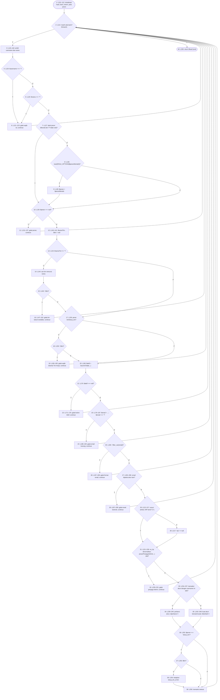

**2. Cyclomatic complexity**

- N = 40, E = 58, P = 1
- V(G) = E − N + 2P = 58 − 40 + 2 = **20**
- Predicate node: 2, 4, 5, 7, 8, 10, 13, 15, 17, 18, 21, 23, 25, 27, 29, 31, 33, 36, 37 (19 node); V(G) = 19 + 1 = **20** — **melebihi batas 10 (McCabe, 1976)**

**3. Matriks grafik**

| | 1 | 2 | 3 | 4 | 5 | 6 | 7 | 8 | 9 | 10 | 11 | 12 | 13 | 14 | 15 | 16 | 17 | 18 | 19 | 20 | 21 | 22 | 23 | 24 | 25 | 26 | 27 | 28 | 29 | 30 | 31 | 32 | 33 | 34 | 35 | 36 | 37 | 38 | 39 | 40 | Σ keluar − 1 |
|---|---|---|---|---|---|---|---|---|---|---|---|---|---|---|---|---|---|---|---|---|---|---|---|---|---|---|---|---|---|---|---|---|---|---|---|---|---|---|---|---|---|
| **1** |  | 1 |  |  |  |  |  |  |  |  |  |  |  |  |  |  |  |  |  |  |  |  |  |  |  |  |  |  |  |  |  |  |  |  |  |  |  |  |  |  | 0 |
| **2** |  |  | 1 |  |  |  |  |  |  |  |  |  |  |  |  |  |  |  |  |  |  |  |  |  |  |  |  |  |  |  |  |  |  |  |  |  |  |  |  | 1 | 1 |
| **3** |  |  |  | 1 |  |  |  |  |  |  |  |  |  |  |  |  |  |  |  |  |  |  |  |  |  |  |  |  |  |  |  |  |  |  |  |  |  |  |  |  | 0 |
| **4** |  |  |  |  | 1 | 1 |  |  |  |  |  |  |  |  |  |  |  |  |  |  |  |  |  |  |  |  |  |  |  |  |  |  |  |  |  |  |  |  |  |  | 1 |
| **5** |  |  |  |  |  | 1 | 1 |  |  |  |  |  |  |  |  |  |  |  |  |  |  |  |  |  |  |  |  |  |  |  |  |  |  |  |  |  |  |  |  |  | 1 |
| **6** |  | 1 |  |  |  |  |  |  |  |  |  |  |  |  |  |  |  |  |  |  |  |  |  |  |  |  |  |  |  |  |  |  |  |  |  |  |  |  |  |  | 0 |
| **7** |  |  |  |  |  |  |  | 1 |  | 1 |  |  |  |  |  |  |  |  |  |  |  |  |  |  |  |  |  |  |  |  |  |  |  |  |  |  |  |  |  |  | 1 |
| **8** |  |  |  |  |  |  |  |  | 1 | 1 |  |  |  |  |  |  |  |  |  |  |  |  |  |  |  |  |  |  |  |  |  |  |  |  |  |  |  |  |  |  | 1 |
| **9** |  |  |  |  |  |  |  |  |  | 1 |  |  |  |  |  |  |  |  |  |  |  |  |  |  |  |  |  |  |  |  |  |  |  |  |  |  |  |  |  |  | 0 |
| **10** |  |  |  |  |  |  |  |  |  |  | 1 | 1 |  |  |  |  |  |  |  |  |  |  |  |  |  |  |  |  |  |  |  |  |  |  |  |  |  |  |  |  | 1 |
| **11** |  | 1 |  |  |  |  |  |  |  |  |  |  |  |  |  |  |  |  |  |  |  |  |  |  |  |  |  |  |  |  |  |  |  |  |  |  |  |  |  |  | 0 |
| **12** |  |  |  |  |  |  |  |  |  |  |  |  | 1 |  |  |  |  |  |  |  |  |  |  |  |  |  |  |  |  |  |  |  |  |  |  |  |  |  |  |  | 0 |
| **13** |  |  |  |  |  |  |  |  |  |  |  |  |  | 1 |  |  | 1 |  |  |  |  |  |  |  |  |  |  |  |  |  |  |  |  |  |  |  |  |  |  |  | 1 |
| **14** |  |  |  |  |  |  |  |  |  |  |  |  |  |  | 1 |  |  |  |  |  |  |  |  |  |  |  |  |  |  |  |  |  |  |  |  |  |  |  |  |  | 0 |
| **15** |  |  |  |  |  |  |  |  |  |  |  |  |  |  |  | 1 | 1 |  |  |  |  |  |  |  |  |  |  |  |  |  |  |  |  |  |  |  |  |  |  |  | 1 |
| **16** |  | 1 |  |  |  |  |  |  |  |  |  |  |  |  |  |  |  |  |  |  |  |  |  |  |  |  |  |  |  |  |  |  |  |  |  |  |  |  |  |  | 0 |
| **17** |  |  |  |  |  |  |  |  |  |  |  |  |  |  |  |  |  | 1 |  | 1 |  |  |  |  |  |  |  |  |  |  |  |  |  |  |  |  |  |  |  |  | 1 |
| **18** |  |  |  |  |  |  |  |  |  |  |  |  |  |  |  |  |  |  | 1 | 1 |  |  |  |  |  |  |  |  |  |  |  |  |  |  |  |  |  |  |  |  | 1 |
| **19** |  | 1 |  |  |  |  |  |  |  |  |  |  |  |  |  |  |  |  |  |  |  |  |  |  |  |  |  |  |  |  |  |  |  |  |  |  |  |  |  |  | 0 |
| **20** |  |  |  |  |  |  |  |  |  |  |  |  |  |  |  |  |  |  |  |  | 1 |  |  |  |  |  |  |  |  |  |  |  |  |  |  |  |  |  |  |  | 0 |
| **21** |  |  |  |  |  |  |  |  |  |  |  |  |  |  |  |  |  |  |  |  |  | 1 | 1 |  |  |  |  |  |  |  |  |  |  |  |  |  |  |  |  |  | 1 |
| **22** |  | 1 |  |  |  |  |  |  |  |  |  |  |  |  |  |  |  |  |  |  |  |  |  |  |  |  |  |  |  |  |  |  |  |  |  |  |  |  |  |  | 0 |
| **23** |  |  |  |  |  |  |  |  |  |  |  |  |  |  |  |  |  |  |  |  |  |  |  | 1 | 1 |  |  |  |  |  |  |  |  |  |  |  |  |  |  |  | 1 |
| **24** |  | 1 |  |  |  |  |  |  |  |  |  |  |  |  |  |  |  |  |  |  |  |  |  |  |  |  |  |  |  |  |  |  |  |  |  |  |  |  |  |  | 0 |
| **25** |  |  |  |  |  |  |  |  |  |  |  |  |  |  |  |  |  |  |  |  |  |  |  |  |  | 1 | 1 |  |  |  |  |  |  |  |  |  |  |  |  |  | 1 |
| **26** |  | 1 |  |  |  |  |  |  |  |  |  |  |  |  |  |  |  |  |  |  |  |  |  |  |  |  |  |  |  |  |  |  |  |  |  |  |  |  |  |  | 0 |
| **27** |  |  |  |  |  |  |  |  |  |  |  |  |  |  |  |  |  |  |  |  |  |  |  |  |  |  |  | 1 | 1 |  |  |  |  |  |  |  |  |  |  |  | 1 |
| **28** |  | 1 |  |  |  |  |  |  |  |  |  |  |  |  |  |  |  |  |  |  |  |  |  |  |  |  |  |  |  |  |  |  |  |  |  |  |  |  |  |  | 0 |
| **29** |  |  |  |  |  |  |  |  |  |  |  |  |  |  |  |  |  |  |  |  |  |  |  |  |  |  |  |  |  | 1 | 1 |  |  |  |  |  |  |  |  |  | 1 |
| **30** |  |  |  |  |  |  |  |  |  |  |  |  |  |  |  |  |  |  |  |  |  |  |  |  |  |  |  |  |  |  | 1 |  |  |  |  |  |  |  |  |  | 0 |
| **31** |  |  |  |  |  |  |  |  |  |  |  |  |  |  |  |  |  |  |  |  |  |  |  |  |  |  |  |  |  |  |  | 1 | 1 |  |  |  |  |  |  |  | 1 |
| **32** |  | 1 |  |  |  |  |  |  |  |  |  |  |  |  |  |  |  |  |  |  |  |  |  |  |  |  |  |  |  |  |  |  |  |  |  |  |  |  |  |  | 0 |
| **33** |  |  |  |  |  |  |  |  |  |  |  |  |  |  |  |  |  |  |  |  |  |  |  |  |  |  |  |  |  |  |  |  |  | 1 | 1 |  |  |  |  |  | 1 |
| **34** |  |  |  |  |  |  |  |  |  |  |  |  |  |  |  |  |  |  |  |  |  |  |  |  |  |  |  |  |  |  |  |  |  |  |  | 1 |  |  |  |  | 0 |
| **35** |  |  |  |  |  |  |  |  |  |  |  |  |  |  |  |  |  |  |  |  |  |  |  |  |  |  |  |  |  |  |  |  |  |  |  | 1 |  |  |  |  | 0 |
| **36** |  |  |  |  |  |  |  |  |  |  |  |  |  |  |  |  |  |  |  |  |  |  |  |  |  |  |  |  |  |  |  |  |  |  |  |  | 1 |  | 1 |  | 1 |
| **37** |  |  |  |  |  |  |  |  |  |  |  |  |  |  |  |  |  |  |  |  |  |  |  |  |  |  |  |  |  |  |  |  |  |  |  |  |  | 1 | 1 |  | 1 |
| **38** |  |  |  |  |  |  |  |  |  |  |  |  |  |  |  |  |  |  |  |  |  |  |  |  |  |  |  |  |  |  |  |  |  |  |  |  |  |  | 1 |  | 0 |
| **39** |  | 1 |  |  |  |  |  |  |  |  |  |  |  |  |  |  |  |  |  |  |  |  |  |  |  |  |  |  |  |  |  |  |  |  |  |  |  |  |  |  | 0 |
| **40** |  |  |  |  |  |  |  |  |  |  |  |  |  |  |  |  |  |  |  |  |  |  |  |  |  |  |  |  |  |  |  |  |  |  |  |  |  |  |  |  | — |

Jumlah kolom terakhir = 19; V(G) = 19 + 1 = 20.

**4–5. Jalur independen dan kasus uji**

| No | Jalur | Kasus uji | Method tes | Awal | Akhir |
|---|---|---|---|---|---|
| J1 | 1–2–40 | Berkas hanya berisi tajuk (nol baris) | `JalurBasisModul1Test::test_impor_berkas_tanpa_baris_data` *(baru)* | tanpa-tes | lolos |
| J2 | 1–2–3–4–6–2–40 | Username kosong | `JalurBasisModul1Test::test_impor_username_kosong_ditolak` *(baru)* | tanpa-tes | lolos |
| J3 | 1–2–3–4–5–6–2–40 | Nama Lengkap kosong | `JalurBasisModul1Test::test_impor_nama_kosong_ditolak` *(baru)* | tanpa-tes | lolos |
| J4 | 1–2–3–4–5–7–8–10–11–2–40 | Peran tidak dikenali (Bendahara) | `ImporPenggunaTest::test_peran_asing_ditolak_beserta_daftar_pilihannya` | lolos | lolos |
| J5 | 1–2–3–4–5–7–8–9–10–12–13–17–20–21–23–25–27–29–30–31–33–35–36–39–2–40 | Peran ditulis sebagai nilai enum (petugas_gudang), akun baru | `ImporPenggunaTest::test_peran_boleh_ditulis_sebagai_label_maupun_nilainya` | lolos | lolos |
| J6 | 1–2–3–4–5–7–10–12–13–17–20–21–23–25–27–29–30–31–33–35–36–39–2–40 | Peran label (Admin Sistem), tanpa tim, NIP kosong, akun baru | `ImporPenggunaTest::test_email_yang_sah_tetap_diterima` | lolos | lolos |
| J7 | 1–2–3–4–5–7–10–12–13–14–15–17–18–20–21–23–25–27–29–31–33–35–36–37–38–39–2–40 | Ketua Tim bertim, NIP terisi, akun baru → ditetapkan ketua tim | `ImporPenggunaTest::test_akun_baru_lahir_dengan_sandi_awal_dan_wajib_ganti` | lolos | lolos |
| J8 | 1–2–3–4–5–7–10–12–13–14–15–16–2–40 | Tim Kerja belum terdaftar | `ImporPenggunaTest::test_tim_yang_belum_terdaftar_ditolak_dengan_petunjuk` | lolos | lolos |
| J9 | 1–2–3–4–5–7–10–12–13–17–18–19–2–40 | Peran Ketua Tim tanpa Tim Kerja | `ImporPenggunaTest::test_peran_bertim_wajib_disertai_tim_kerja` | lolos | lolos |
| J10 | 1–2–3–4–5–7–10–12–13–17–20–21–22–2–40 | Kolom Aktif berisi nilai asing ('Mungkin') | `JalurBasisModul1Test::test_impor_kolom_aktif_tidak_dikenali_ditolak` *(baru)* | tanpa-tes | lolos |
| J11 | 1–2–3–4–5–7–10–12–13–17–20–21–23–24–2–40 | Email kosong | `ImporPenggunaTest::test_baris_tanpa_email_ditolak_karena_email_dipakai_untuk_masuk` | lolos | lolos |
| J12 | 1–2–3–4–5–7–10–12–13–17–20–21–23–25–26–2–40 | Email bukan alamat surel | `ImporPenggunaTest::test_email_yang_bukan_alamat_surel_ditolak` | lolos | lolos |
| J13 | 1–2–3–4–5–7–10–12–13–17–20–21–23–25–27–28–2–40 | Email dipakai akun lain | `ImporPenggunaTest::test_email_yang_sudah_dipakai_akun_lain_ditolak` | lolos | lolos |
| J14 | 1–2–3–4–5–7–10–12–13–17–20–21–23–25–27–29–30–31–32–2–40 | Baris ditolak penjaga Admin (peran pengimpor sendiri diubah) | `ImporPenggunaPenjagaAdminTest::test_baris_yang_mengubah_peran_pengimpor_sendiri_ditolak` | lolos | lolos |
| J15 | 1–2–3–4–5–7–10–12–13–14–15–17–18–20–21–23–25–27–29–30–31–33–34–36–37–38–39–2–40 | Impor ulang akun lama menjadi Ketua Tim bertim → diperbarui, sandi tak tersentuh | `ImporPenggunaTest::test_impor_ulang_tidak_menyentuh_kata_sandi` | lolos | lolos |
| J16 | 1–2–3–4–5–7–10–12–13–14–15–17–18–20–21–23–25–27–29–30–31–33–35–36–39–2–40 | Peran Tim bertim, akun baru (bukan ketua) | `JalurBasisModul1Test::test_impor_peran_tim_bertim_bukan_ketua` *(baru)* | tanpa-tes | lolos |
| J17 | 1–2–3–4–5–7–10–12–13–17–20–21–23–25–27–29–30–31–33–35–36–37–39–2–40 | Peran ketua_tim tetapi $tim null pada L253 | — | mustahil | mustahil |
| J18 | 1–2–3–4–5–7–10–12–13–14–15–17–20–21–23–25–27–29–30–31–33–35–36–39–2–40 | Peran non-tim (Kasubbag) dengan Tim Kerja terisi dan terdaftar | `JalurBasisModul1Test::test_impor_peran_non_tim_dengan_tim_terisi` *(baru)* | tanpa-tes | lolos |
| J19 | 1–2–3–4–5–7–10–12–13–17–20–21–23–25–27–29–31–33–35–36–39–2–40 | Peran non-tim, NIP terisi, akun baru | `JalurBasisModul1Test::test_impor_nip_terisi_tanpa_tim` *(baru)* | tanpa-tes | lolos |
| J20 | 1–2–3–4–5–7–10–11–2–40 | Label peran dikenali tetapi $peran null pada L130 | — | mustahil | mustahil |

**6. Persentase jalur lolos:** J_awal = 11, J_akhir = 18; awal = 11/20 × 100% = 55.0%, akhir = 18/20 × 100% = 90.0%.

Jalur J17 mustahil dicapai: agar node 36 bernilai benar peran harus `ketua_tim`; peran itu hanya lolos node 17–18 bila `$tim` tidak null (baris L159–166 menolak ketua tanpa tim dan `$tim` tidak diubah sesudahnya), sehingga node 37 selalu benar — edge 37→39 tidak dapat dilalui.
Jalur J20 mustahil dicapai: node 7 bernilai benar berarti `$peranMenurutLabel[$peranMentah]` berisi kunci enum peran (string tidak kosong), sehingga `$peran` pasti tidak null dan node 10 selalu salah. Dimensi ke-20 ruang jalur hanya dapat dibentuk dari salah satu kombinasi 7→10→11, 7→8→9→10→11, atau 7→8→10→12, dan ketiganya mustahil karena alasan yang sama (node 8 salah selalu menghasilkan null, node 9 selalu menghasilkan nilai).

### 1.8 `ImporPengguna::pesanPenjagaAdmin`

Berkas: `app/Services/Impor/ImporPengguna.php` baris 272–292. Dipilih karena: penjaga Admin pada impor (G-002): tidak mengubah peran/status akun pengimpor dan tidak menghabiskan Admin aktif.

**1. Grafik alir — node**

| Node | Baris | Isi |
|---|---|---|
| 1 | L274 | ! $pengguna? *(predicate)* |
| 2 | L275 | return null (akun baru) |
| 3 | L278 | $pengguna->is(auth()->user())? *(predicate)* |
| 4 | L279 | peran pada baris berbeda? *(predicate)* |
| 5 | L279 | status aktif pada baris berbeda? *(predicate)* |
| 6 | L280 | return pesan akun sendiri |
| 7 | L283 | $pengguna->role === 'admin'? *(predicate)* |
| 8 | L283 | && $pengguna->status_aktif (nilai) |
| 9 | L285 | $adminAktif? *(predicate)* |
| 10 | L286 | peran baris !== 'admin'? *(predicate)* |
| 11 | L286 | ! status aktif baris? *(predicate)* |
| 12 | L287 | tidak ada Admin aktif lain? *(predicate)* |
| 13 | L288 | return pesan Admin aktif terakhir |
| 14 | L291 | return null |
| 15 | — | exit |

**Edge** (asal → tujuan):

1→2 (T), 1→3 (F), 2→15, 3→4 (T), 3→7 (F), 4→6 (T), 4→5 (F), 5→6 (T), 5→7 (F), 6→15, 7→8 (T), 7→9 (F), 8→9, 9→10 (T), 9→14 (F), 10→12 (T), 10→11 (F), 11→12 (T), 11→14 (F), 12→13 (T), 12→14 (F), 13→15, 14→15

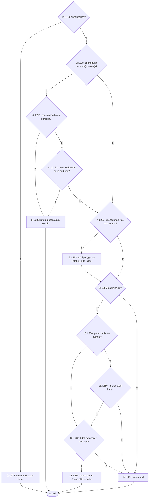

**2. Cyclomatic complexity**

- N = 15, E = 23, P = 1
- V(G) = E − N + 2P = 23 − 15 + 2 = **10**
- Predicate node: 1, 3, 4, 5, 7, 9, 10, 11, 12 (9 node); V(G) = 9 + 1 = **10**

**3. Matriks grafik**

| | 1 | 2 | 3 | 4 | 5 | 6 | 7 | 8 | 9 | 10 | 11 | 12 | 13 | 14 | 15 | Σ keluar − 1 |
|---|---|---|---|---|---|---|---|---|---|---|---|---|---|---|---|---|
| **1** |  | 1 | 1 |  |  |  |  |  |  |  |  |  |  |  |  | 1 |
| **2** |  |  |  |  |  |  |  |  |  |  |  |  |  |  | 1 | 0 |
| **3** |  |  |  | 1 |  |  | 1 |  |  |  |  |  |  |  |  | 1 |
| **4** |  |  |  |  | 1 | 1 |  |  |  |  |  |  |  |  |  | 1 |
| **5** |  |  |  |  |  | 1 | 1 |  |  |  |  |  |  |  |  | 1 |
| **6** |  |  |  |  |  |  |  |  |  |  |  |  |  |  | 1 | 0 |
| **7** |  |  |  |  |  |  |  | 1 | 1 |  |  |  |  |  |  | 1 |
| **8** |  |  |  |  |  |  |  |  | 1 |  |  |  |  |  |  | 0 |
| **9** |  |  |  |  |  |  |  |  |  | 1 |  |  |  | 1 |  | 1 |
| **10** |  |  |  |  |  |  |  |  |  |  | 1 | 1 |  |  |  | 1 |
| **11** |  |  |  |  |  |  |  |  |  |  |  | 1 |  | 1 |  | 1 |
| **12** |  |  |  |  |  |  |  |  |  |  |  |  | 1 | 1 |  | 1 |
| **13** |  |  |  |  |  |  |  |  |  |  |  |  |  |  | 1 | 0 |
| **14** |  |  |  |  |  |  |  |  |  |  |  |  |  |  | 1 | 0 |
| **15** |  |  |  |  |  |  |  |  |  |  |  |  |  |  |  | — |

Jumlah kolom terakhir = 9; V(G) = 9 + 1 = 10.

**4–5. Jalur independen dan kasus uji**

| No | Jalur | Kasus uji | Method tes | Awal | Akhir |
|---|---|---|---|---|---|
| J1 | 1–2–15 | Baris untuk akun baru | `ImporPenggunaTest::test_email_yang_sah_tetap_diterima` | lolos | lolos |
| J2 | 1–3–4–6–15 | Baris mengubah peran pengimpor sendiri | `ImporPenggunaPenjagaAdminTest::test_baris_yang_mengubah_peran_pengimpor_sendiri_ditolak` | lolos | lolos |
| J3 | 1–3–4–5–6–15 | Baris menonaktifkan pengimpor sendiri | `ImporPenggunaPenjagaAdminTest::test_baris_yang_menonaktifkan_pengimpor_sendiri_ditolak` | lolos | lolos |
| J4 | 1–3–4–5–7–8–9–10–11–14–15 | Baris akun pengimpor (Admin aktif) hanya mengubah nama | `ImporPenggunaPenjagaAdminTest::test_kolom_lain_pada_akun_pengimpor_tetap_boleh_diubah` | lolos | lolos |
| J5 | 1–3–7–9–14–15 | Baris akun lain non-Admin | `ImporPenggunaPenjagaAdminTest::test_impor_pengguna_biasa_dan_akun_baru_tetap_berhasil` | lolos | lolos |
| J6 | 1–3–7–8–9–10–12–13–15 | Admin aktif terakhir diturunkan perannya | `ImporPenggunaPenjagaAdminTest::test_baris_yang_menghabiskan_admin_aktif_ditolak_dan_baris_lain_tetap_diproses` | lolos | lolos |
| J7 | 1–3–7–8–9–10–12–14–15 | Admin aktif diturunkan selagi Admin aktif lain ada | `ImporPenggunaPenjagaAdminTest::test_baris_yang_menghabiskan_admin_aktif_ditolak_dan_baris_lain_tetap_diproses` | lolos | lolos |
| J8 | 1–3–7–8–9–10–11–12–13–15 | Admin aktif terakhir dinonaktifkan dengan peran tetap Admin | `JalurBasisModul1Test::test_impor_menonaktifkan_admin_aktif_terakhir_ditolak` *(baru)* | tanpa-tes | lolos |
| J9 | 1–3–7–8–9–14–15 | Admin nonaktif diturunkan | `ImporPenggunaPenjagaAdminTest::test_admin_yang_sudah_nonaktif_dapat_diturunkan_karena_tidak_mengurangi_admin_aktif` | lolos | lolos |
| J10 | 1–3–7–8–9–10–11–14–15 | Admin aktif lain diimpor ulang tanpa perubahan peran/status | `JalurBasisModul1Test::test_impor_ulang_admin_lain_tanpa_perubahan_peran_status` *(baru)* | tanpa-tes | lolos |

**6. Persentase jalur lolos:** J_awal = 8, J_akhir = 10; awal = 8/10 × 100% = 80.0%, akhir = 10/10 × 100% = 100.0%.

### 1.9 `ImporPengguna::bacaYaTidak`

Berkas: `app/Services/Impor/ImporPengguna.php` baris 295–312. Dipilih karena: aturan pembacaan kolom Aktif (kosong = Ya; nilai asing ditolak).

**1. Grafik alir — node**

| Node | Baris | Isi |
|---|---|---|
| 1 | L297 | $bersih = trim(lower($nilai)) |
| 2 | L299 | $bersih === ''? *(predicate)* |
| 3 | L300 | return true |
| 4 | L303 | termasuk ya/y/aktif/1/true/benar? *(predicate)* |
| 5 | L304 | return true |
| 6 | L307 | termasuk tidak/t/nonaktif/0/false/salah? *(predicate)* |
| 7 | L308 | return false |
| 8 | L311 | return null |
| 9 | — | exit |

**Edge** (asal → tujuan):

1→2, 2→3 (T), 2→4 (F), 3→9, 4→5 (T), 4→6 (F), 5→9, 6→7 (T), 6→8 (F), 7→9, 8→9

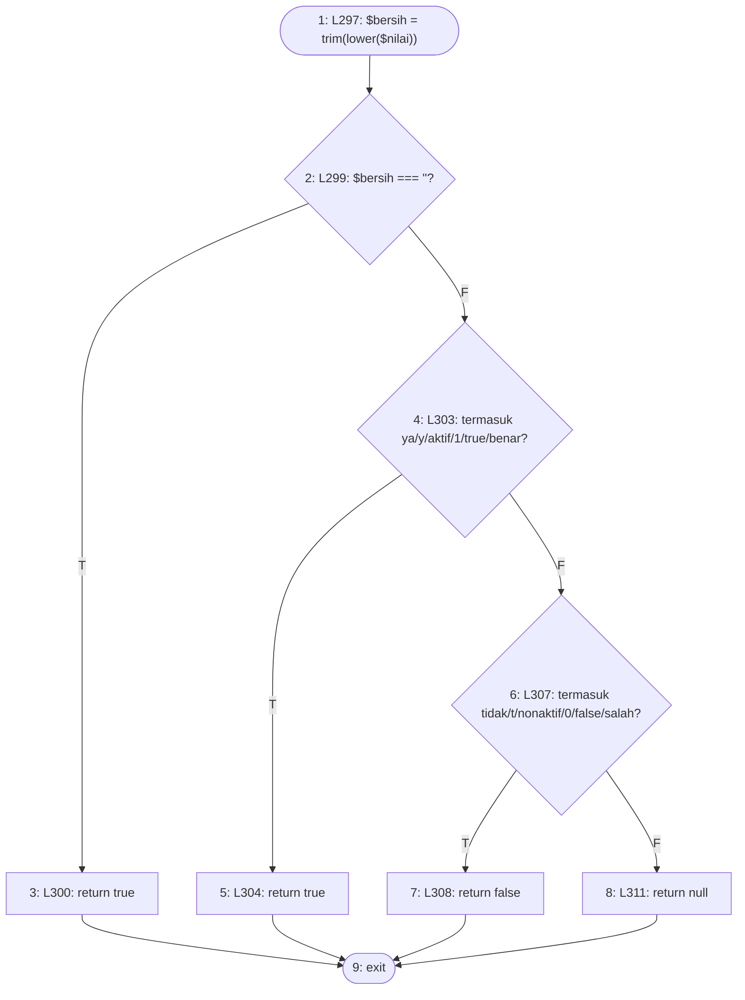

**2. Cyclomatic complexity**

- N = 9, E = 11, P = 1
- V(G) = E − N + 2P = 11 − 9 + 2 = **4**
- Predicate node: 2, 4, 6 (3 node); V(G) = 3 + 1 = **4**

**3. Matriks grafik**

| | 1 | 2 | 3 | 4 | 5 | 6 | 7 | 8 | 9 | Σ keluar − 1 |
|---|---|---|---|---|---|---|---|---|---|---|
| **1** |  | 1 |  |  |  |  |  |  |  | 0 |
| **2** |  |  | 1 | 1 |  |  |  |  |  | 1 |
| **3** |  |  |  |  |  |  |  |  | 1 | 0 |
| **4** |  |  |  |  | 1 | 1 |  |  |  | 1 |
| **5** |  |  |  |  |  |  |  |  | 1 | 0 |
| **6** |  |  |  |  |  |  | 1 | 1 |  | 1 |
| **7** |  |  |  |  |  |  |  |  | 1 | 0 |
| **8** |  |  |  |  |  |  |  |  | 1 | 0 |
| **9** |  |  |  |  |  |  |  |  |  | — |

Jumlah kolom terakhir = 3; V(G) = 3 + 1 = 4.

**4–5. Jalur independen dan kasus uji**

| No | Jalur | Kasus uji | Method tes | Awal | Akhir |
|---|---|---|---|---|---|
| J1 | 1–2–3–9 | Kolom Aktif kosong → aktif | `JalurBasisModul1Test::test_impor_kolom_aktif_kosong_berarti_aktif` *(baru)* | tanpa-tes | lolos |
| J2 | 1–2–4–5–9 | Kolom Aktif 'Ya' | `ImporPenggunaTest::test_email_yang_sah_tetap_diterima` | lolos | lolos |
| J3 | 1–2–4–6–7–9 | Kolom Aktif 'Tidak' | `ImporPenggunaPenjagaAdminTest::test_impor_pengguna_biasa_dan_akun_baru_tetap_berhasil` | lolos | lolos |
| J4 | 1–2–4–6–8–9 | Kolom Aktif 'Mungkin' | `JalurBasisModul1Test::test_impor_kolom_aktif_tidak_dikenali_ditolak` *(baru)* | tanpa-tes | lolos |

**6. Persentase jalur lolos:** J_awal = 2, J_akhir = 4; awal = 2/4 × 100% = 50.0%, akhir = 4/4 × 100% = 100.0%.

### 1.10 `StokMasuk::borangBarangBaru › aturan kode_barang`

Berkas: `app/Filament/Pages/StokMasuk.php` baris 458–462. Dipilih karena: aturan keunikan kode barang per kategori pada dialog Barang Baru (closure validasi `->rule()`).

**1. Grafik alir — node**

| Node | Baris | Isi |
|---|---|---|
| 1 | L459 | kodeBarangSudahDipakai(kategori, kode)? *(predicate)* |
| 2 | L460 | $fail('Kode barang sudah dipakai pada kategori ini.') |
| 3 | — | exit |

**Edge** (asal → tujuan):

1→2 (T), 1→3 (F), 2→3

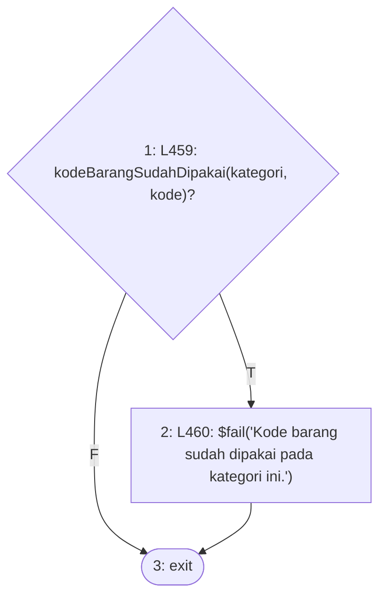

**2. Cyclomatic complexity**

- N = 3, E = 3, P = 1
- V(G) = E − N + 2P = 3 − 3 + 2 = **2**
- Predicate node: 1 (1 node); V(G) = 1 + 1 = **2**

**3. Matriks grafik**

| | 1 | 2 | 3 | Σ keluar − 1 |
|---|---|---|---|---|
| **1** |  | 1 | 1 | 1 |
| **2** |  |  | 1 | 0 |
| **3** |  |  |  | — |

Jumlah kolom terakhir = 1; V(G) = 1 + 1 = 2.

**4–5. Jalur independen dan kasus uji**

| No | Jalur | Kasus uji | Method tes | Awal | Akhir |
|---|---|---|---|---|---|
| J1 | 1–3 | Kode baru pada kategori → lolos validasi | `JalurBasisModul1Test::test_aturan_kode_barang_baru_lolos` *(baru)* | tanpa-tes | lolos |
| J2 | 1–2–3 | Kode (berspasi ujung) sudah dipakai pada kategori → galat validasi | `JalurBasisModul1Test::test_aturan_kode_barang_ganda_ditolak` *(baru)* | tanpa-tes | lolos |

**6. Persentase jalur lolos:** J_awal = 0, J_akhir = 2; awal = 0/2 × 100% = 0.0%, akhir = 2/2 × 100% = 100.0%.

### 1.11 `StokMasuk::simpanBarangBaru`

Berkas: `app/Filament/Pages/StokMasuk.php` baris 401–422. Dipilih karena: pembuatan barang baru dari Stok Masuk: kode dipangkas, stok nol, pelanggaran UNIQUE menjadi pesan (bukan galat SQL).

**1. Grafik alir — node**

| Node | Baris | Isi |
|---|---|---|
| 1 | L403–406 | kode_barang tersedia (kiri ?? tidak null)? *(predicate)* |
| 2 | L406 | kode_barang = '' |
| 3 | L404–413 | BarangPersediaan::create(...) melempar UniqueConstraintViolation? *(predicate)* |
| 4 | L414–420 | notifikasi galat; throw Halt |
| 5 | L413 | return id |
| 6 | — | exit |

**Edge** (asal → tujuan):

1→3 (T), 1→2 (F), 2→3, 3→4 (T), 3→5 (F), 4→6, 5→6

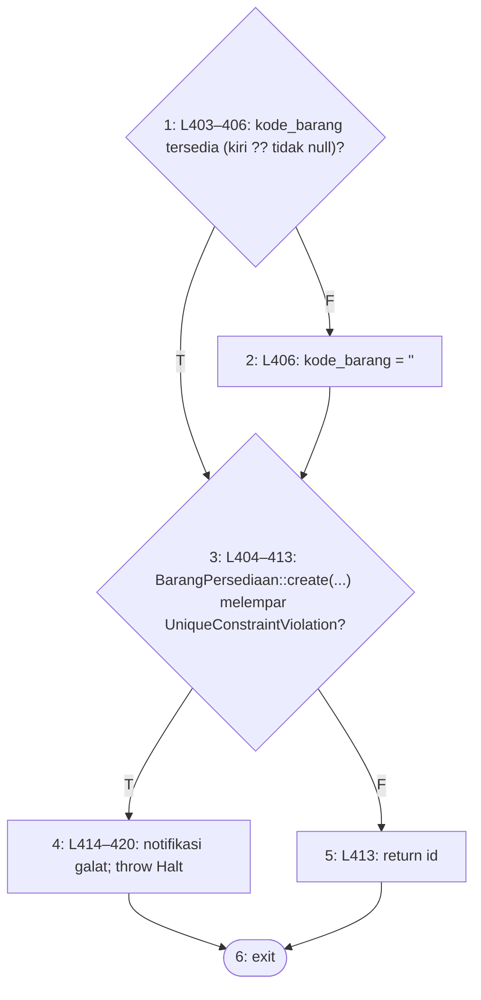

**2. Cyclomatic complexity**

- N = 6, E = 7, P = 1
- V(G) = E − N + 2P = 7 − 6 + 2 = **3**
- Predicate node: 1, 3 (2 node); V(G) = 2 + 1 = **3**

**3. Matriks grafik**

| | 1 | 2 | 3 | 4 | 5 | 6 | Σ keluar − 1 |
|---|---|---|---|---|---|---|---|
| **1** |  | 1 | 1 |  |  |  | 1 |
| **2** |  |  | 1 |  |  |  | 0 |
| **3** |  |  |  | 1 | 1 |  | 1 |
| **4** |  |  |  |  |  | 1 | 0 |
| **5** |  |  |  |  |  | 1 | 0 |
| **6** |  |  |  |  |  |  | — |

Jumlah kolom terakhir = 2; V(G) = 2 + 1 = 3.

**4–5. Jalur independen dan kasus uji**

| No | Jalur | Kasus uji | Method tes | Awal | Akhir |
|---|---|---|---|---|---|
| J1 | 1–3–5–6 | Kode 'A-100 ' pada kategori lain → dibuat, kode terpangkas, stok nol | `KodeBarangBaruStokMasukTest::test_barang_baru_berhasil_dibuat_berstok_nol_dengan_kode_terpangkas` | lolos | lolos |
| J2 | 1–3–4–6 | Bentrok UNIQUE yang lolos validasi → Halt + notifikasi | `KodeBarangBaruStokMasukTest::test_pelanggaran_unique_yang_lolos_validasi_menjadi_pesan_bukan_sql` | lolos | lolos |
| J3 | 1–2–3–5–6 | Data tanpa kunci kode_barang → disimpan berkode kosong | `JalurBasisModul1Test::test_simpan_barang_baru_tanpa_kunci_kode` *(baru)* | tanpa-tes | lolos |

**6. Persentase jalur lolos:** J_awal = 2, J_akhir = 3; awal = 2/3 × 100% = 66.7%, akhir = 3/3 × 100% = 100.0%.

### 1.12 `AsetTetapForm::configure › placeholder tim_penempatan_id`

Berkas: `app/Filament/Resources/AsetTetaps/Schemas/AsetTetapForm.php` baris 62. Dipilih karena: pembeda konteks Buat/Ubah pada kolom penempatan: pilihan 'Belum ditempatkan' hanya ada di Ubah (penempatan wajib saat Buat).

**1. Grafik alir — node**

| Node | Baris | Isi |
|---|---|---|
| 1 | L62 | $operation === 'create'? *(predicate)* |
| 2 | L62 | null (tanpa pilihan kosong) |
| 3 | L62 | 'Belum ditempatkan' |
| 4 | — | exit |

**Edge** (asal → tujuan):

1→2 (T), 1→3 (F), 2→4, 3→4

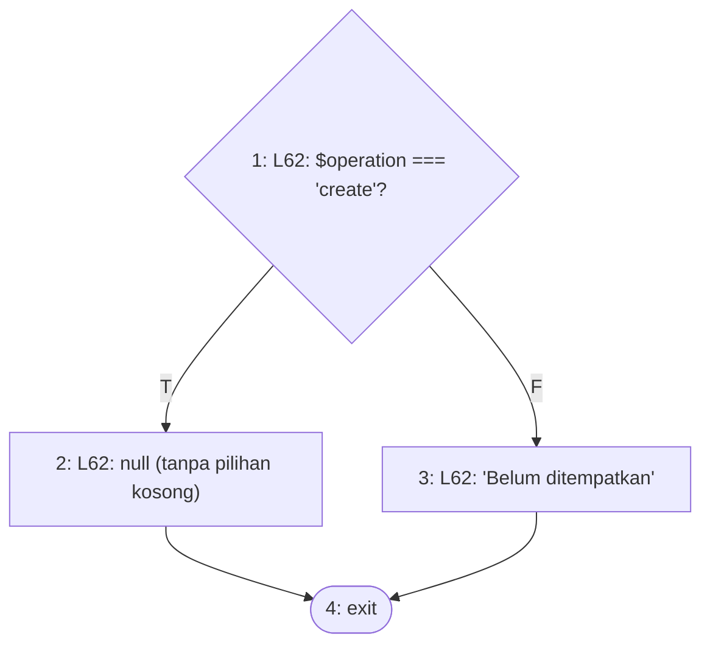

**2. Cyclomatic complexity**

- N = 4, E = 4, P = 1
- V(G) = E − N + 2P = 4 − 4 + 2 = **2**
- Predicate node: 1 (1 node); V(G) = 1 + 1 = **2**

**3. Matriks grafik**

| | 1 | 2 | 3 | 4 | Σ keluar − 1 |
|---|---|---|---|---|---|
| **1** |  | 1 | 1 |  | 1 |
| **2** |  |  |  | 1 | 0 |
| **3** |  |  |  | 1 | 0 |
| **4** |  |  |  |  | — |

Jumlah kolom terakhir = 1; V(G) = 1 + 1 = 2.

**4–5. Jalur independen dan kasus uji**

| No | Jalur | Kasus uji | Method tes | Awal | Akhir |
|---|---|---|---|---|---|
| J1 | 1–2–4 | Form Buat: tidak ada pilihan Belum ditempatkan | `PenempatanAsetFormTest::test_placeholder_belum_ditempatkan_hanya_muncul_di_ubah_bukan_di_buat` | lolos | lolos |
| J2 | 1–3–4 | Form Ubah: pilihan Belum ditempatkan tampil | `PenempatanAsetFormTest::test_placeholder_belum_ditempatkan_hanya_muncul_di_ubah_bukan_di_buat` | lolos | lolos |

**6. Persentase jalur lolos:** J_awal = 2, J_akhir = 2; awal = 2/2 × 100% = 100.0%, akhir = 2/2 × 100% = 100.0%.

### 1.13 `AsetTetapForm::configure › helperText tim_penempatan_id`

Berkas: `app/Filament/Resources/AsetTetaps/Schemas/AsetTetapForm.php` baris 74–76. Dipilih karena: keterangan kunci penempatan pada Ubah: aset yang sudah ditempatkan hanya berpindah lewat Mutasi Aset (F-002).

**1. Grafik alir — node**

| Node | Baris | Isi |
|---|---|---|
| 1 | L74 | filled($record?->tim_penempatan_id)? *(predicate)* |
| 2 | L75 | 'Penempatan diubah melalui Mutasi Aset (BAST).' |
| 3 | L76 | null |
| 4 | — | exit |

**Edge** (asal → tujuan):

1→2 (T), 1→3 (F), 2→4, 3→4

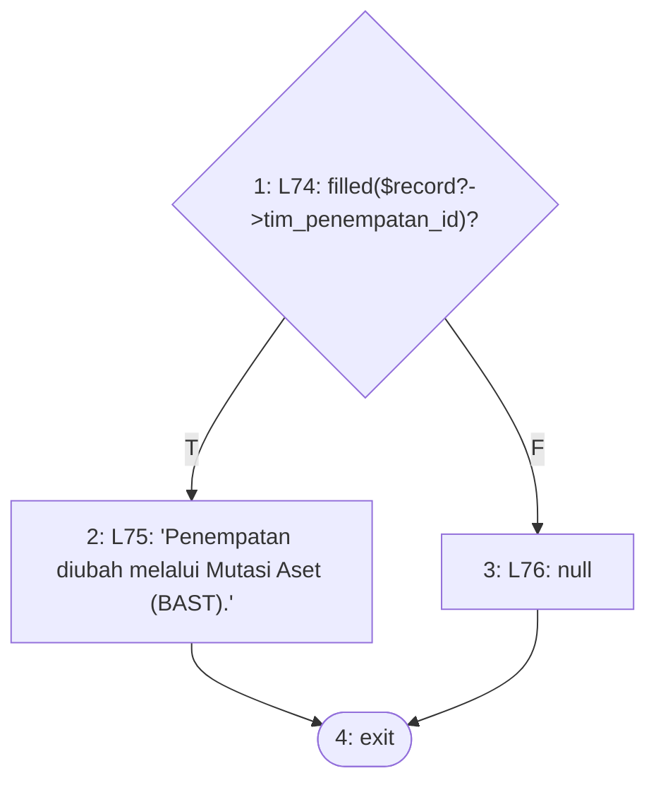

**2. Cyclomatic complexity**

- N = 4, E = 4, P = 1
- V(G) = E − N + 2P = 4 − 4 + 2 = **2**
- Predicate node: 1 (1 node); V(G) = 1 + 1 = **2**

**3. Matriks grafik**

| | 1 | 2 | 3 | 4 | Σ keluar − 1 |
|---|---|---|---|---|---|
| **1** |  | 1 | 1 |  | 1 |
| **2** |  |  |  | 1 | 0 |
| **3** |  |  |  | 1 | 0 |
| **4** |  |  |  |  | — |

Jumlah kolom terakhir = 1; V(G) = 1 + 1 = 2.

**4–5. Jalur independen dan kasus uji**

| No | Jalur | Kasus uji | Method tes | Awal | Akhir |
|---|---|---|---|---|---|
| J1 | 1–2–4 | Ubah aset yang sudah ditempatkan: keterangan kunci tampil | `PenempatanAsetFormTest::test_form_ubah_mengunci_penempatan_aset_yang_sudah_ditempatkan` | lolos | lolos |
| J2 | 1–3–4 | Ubah aset yang belum ditempatkan: kolom terbuka, tanpa keterangan | `PenempatanAsetFormTest::test_aset_yang_belum_ditempatkan_masih_dapat_diberi_penempatan_awal_lewat_ubah` | lolos | lolos |

**6. Persentase jalur lolos:** J_awal = 2, J_akhir = 2; awal = 2/2 × 100% = 100.0%, akhir = 2/2 × 100% = 100.0%.

## Temuan Increment 1

**T-1 — Penjaga "minimal satu Admin aktif" dapat dilewati dengan muatan `status_aktif = null` (jalur 1.2 J3, GAGAL).**
`EditUser::beforeSave()` membaca `$this->data['status_aktif'] ?? $akun->status_aktif`: nilai null dianggap "tidak berubah" sehingga `$aktifBaru` bernilai status tersimpan (true) dan node 15 salah. Namun Toggle menyimpan null sebagai `false`. Bukti (tes `JalurBasisModul1Test::test_ubah_user_status_null_pada_admin_aktif_terakhir_ditolak`, gagal di kedua driver): pelaku Admin nonaktif mengirim `data.status_aktif = null` untuk satu-satunya Admin aktif → tidak ada notifikasi penolakan, `status_aktif` tersimpan `0`, dan jumlah Admin aktif menjadi 0 (eksplorasi terpisah mencatat `errors=[]`, `status_aktif tersimpan=0`, `admin aktif tersisa=0`). Muatan null tidak dapat dikirim lewat Toggle biasa; ia hanya lahir dari muatan Livewire yang dimodifikasi — justru jenis muatan yang hendak ditolak penjaga ini. Tidak diperbaiki.

**T-2 — Form Barang Persediaan tidak memeriksa keunikan kode barang.**
`BarangPersediaanForm::configure()` hanya memberi `required()->maxLength(30)` pada `kode_barang`; keunikan `(kategori_id, kode_barang)` hanya dijaga indeks basis data. Keunikan kode yang diuji di increment ini karena itu hanya berlaku pada dialog *Barang Baru* di Stok Masuk (1.10–1.11). Method form ini tidak memiliki percabangan sehingga tidak menghasilkan jalur basis; temuan ini dicatat dari pembacaan kode, bukan dari eksekusi.

---

# Setelah perbaikan

Bagian ini ditambahkan sesudah perbaikan temuan T-1 dan T-2; hasil awal di atas tidak diubah. Kode dasar tetap commit `8449a47c625bd6e1b185bd43bef9eb6e30320349`, ditambah perbaikan yang belum di-commit pada `EditUser.php`, `BarangPersediaanForm.php`, `CreateBarangPersediaan.php`, dan `EditBarangPersediaan.php` (salinan asli di `E:\Projek Skripsi\cadangan-audit\perbaikan-pasca-whitebox\asli\`). Status jalur dibaca dari run Increment 4 setelah perbaikan (SQLite; jalur khusus MySQL dari run MySQL).

## Perbaikan yang dilakukan

**T-1.** `EditUser::beforeSave()` kini menentukan fallback dari ada-tidaknya kunci pada muatan: kunci `role`/`status_aktif` yang ada dibaca apa adanya, dan `status_aktif` null dibaca seperti Toggle menyimpannya (false).

**T-1b (celah sisa yang ditemukan saat uji ulang).** Menurut aturan perbaikan pertama, kunci yang tidak ada selalu jatuh ke status tersimpan. Eksplorasi pada kode perbaikan pertama (sesuai spesifikasi T-1: kunci tidak ada → status tersimpan), pelaku Admin nonaktif, satu-satunya Admin aktif adalah akun lain, muatan `data` dikirim ulang tanpa kunci `status_aktif`: `errors=[]`, `status_aktif tersimpan=0`, `Admin aktif tersisa=0`. Pada akun sendiri kasus yang sama aman (kolom tidak didehidrasi). Celah ini ikut ditutup: status tersimpan hanya dipakai bila kunci tidak ada **dan** yang disunting adalah akun sendiri; pada akun lain kunci yang hilang dibaca false. Tes `JalurBasisModul1Test::test_ubah_user_kunci_status_hilang_pada_admin_aktif_terakhir_ditolak` kini lolos: perubahan ditolak, status tetap aktif, Admin aktif tetap 1.

**T-2.** Kolom `kode_barang` pada `BarangPersediaanForm` diberi `trim()` dan `unique(ignoreRecord: true)` yang disaring `kategori_id`, dengan pesan 'Kode barang sudah dipakai pada kategori ini.'. `CreateBarangPersediaan::handleRecordCreation()` dan `EditBarangPersediaan::handleRecordUpdate()` menangkap `UniqueConstraintViolationException` menjadi notifikasi dengan pesan yang sama (pola `CreateAsetTetap`). Tesnya ada di `tests/Feature/KodeBarangUnikFormTest.php` (8 tes).

**BarangPersediaanForm tetap tidak dianalisis sebagai method basis path.** `configure()` masih tanpa percabangan, dan satu-satunya closure baru, `modifyRuleUsing` (`fn (Unique $rule, Get $get) => $rule->where(...)`), berupa satu ekspresi tanpa percabangan (V(G) = 1). Percabangan yang lahir dari perbaikan T-2 berada di dua method halaman, dan keduanya dianalisis di bawah (1.14, 1.15).

## Perubahan V(G) `EditUser::beforeSave`

| | N | E | Predicate | V(G) | Jalur mustahil | Jalur lolos |
|---|---|---|---|---|---|---|
| Sebelum perbaikan | 17 | 26 | 10 | 11 | 1 | 9 dari 11 (J3 gagal) |
| Setelah perbaikan | 20 | 30 | 11 | 12 | 1 | 11 dari 12 |

Predicate baru adalah node 6 (`elseif ($akunSendiri)`). Pembacaan `$akunSendiri` dipindah ke node 1 lalu dipakai ulang pada node 9, sehingga jumlah pemanggilan `is()` tidak menambah predicate.

## Increment 1 setelah perbaikan

| ID | Method | V(G) | Mustahil | J setelah perbaikan |
|---|---|---|---|---|
| 1.1 | `UserForm::akunSendiri` | 2 | 0 | 2 |
| 1.2 | `EditUser::beforeSave (setelah perbaikan)` | 12 ⚠ | 1 | 11 |
| 1.3 | `EditUser::afterSave` | 3 | 0 | 3 |
| 1.4 | `User::alasanTidakDapatDihapus` | 5 | 0 | 5 |
| 1.5 | `User::booting (pendengar deleting)` | 2 | 0 | 2 |
| 1.6 | `User::punyaRiwayat` | 5 | 0 | 5 |
| 1.7 | `ImporPengguna::jalankan` | 20 ⚠ | 2 | 18 |
| 1.8 | `ImporPengguna::pesanPenjagaAdmin` | 10 | 0 | 10 |
| 1.9 | `ImporPengguna::bacaYaTidak` | 4 | 0 | 4 |
| 1.10 | `StokMasuk::borangBarangBaru › aturan kode_barang` | 2 | 0 | 2 |
| 1.11 | `StokMasuk::simpanBarangBaru` | 3 | 0 | 3 |
| 1.12 | `AsetTetapForm::configure › placeholder tim_penempatan_id` | 2 | 0 | 2 |
| 1.13 | `AsetTetapForm::configure › helperText tim_penempatan_id` | 2 | 0 | 2 |
| 1.14 | `CreateBarangPersediaan::handleRecordCreation` | 2 | 0 | 2 |
| 1.15 | `EditBarangPersediaan::handleRecordUpdate` | 2 | 0 | 2 |
| **Jumlah** | 15 method | **76** | 3 | **73** |

J increment 1 setelah perbaikan = 73/76 × 100% = **96.1%** (sebelumnya 67/71 = 94,4%). Jalur yang tidak lolos hanyalah 3 jalur mustahil; tidak ada jalur gagal.

## Rincian method yang disusun ulang atau baru

### 1.2 (setelah perbaikan) `EditUser::beforeSave (setelah perbaikan)`

Berkas: `app/Filament/Resources/Users/Pages/EditUser.php` baris 42–68. Dipilih karena: penjaga sisi peladen sesudah perbaikan T-1 dan T-1b: kunci muatan yang ada dibaca seperti yang disimpan (null = false); kunci status yang hilang hanya berarti "tidak berubah" pada akun sendiri.

`tolakPerubahan()` mengirim notifikasi lalu `halt()` (melempar `Halt`), sehingga node 12 dan 19 langsung menuju exit. Dibanding versi awal (V(G) = 11) bertambah satu predicate: node 6 (`elseif ($akunSendiri)`).

**1. Grafik alir — node**

| Node | Baris | Isi |
|---|---|---|
| 1 | L44–45 | $akun = getRecord(); $akunSendiri = $akun->is(auth()->user()) |
| 2 | L46 | kunci 'role' ada pada muatan? *(predicate)* |
| 3 | L46 | $peranBaru = $akun->role |
| 4 | L48 | kunci 'status_aktif' ada pada muatan? *(predicate)* |
| 5 | L49 | $aktifBaru = (bool) data['status_aktif'] |
| 6 | L50 | $akunSendiri? *(predicate)* |
| 7 | L51 | $aktifBaru = status tersimpan |
| 8 | L53 | $aktifBaru = false |
| 9 | L56 | $akunSendiri? *(predicate)* |
| 10 | L57 | $peranBaru !== $akun->role? *(predicate)* |
| 11 | L57 | $aktifBaru !== status_aktif? *(predicate)* |
| 12 | L58 | tolakPerubahan(PESAN_AKUN_SENDIRI) |
| 13 | L61 | $akun->role === 'admin'? *(predicate)* |
| 14 | L62 | $akun->status_aktif? *(predicate)* |
| 15 | L63 | hitung ! ada Admin aktif lain |
| 16 | L65 | $adminAktifTerakhir? *(predicate)* |
| 17 | L65 | $peranBaru !== 'admin'? *(predicate)* |
| 18 | L65 | ! $aktifBaru? *(predicate)* |
| 19 | L66 | tolakPerubahan('Harus ada minimal satu Admin aktif.') |
| 20 | L68 | selesai (exit) |

**Edge** (asal → tujuan):

1→2, 2→4 (T), 2→3 (F), 3→4, 4→5 (T), 4→6 (F), 5→9, 6→7 (T), 6→8 (F), 7→9, 8→9, 9→10 (T), 9→13 (F), 10→12 (T), 10→11 (F), 11→12 (T), 11→13 (F), 12→20, 13→14 (T), 13→16 (F), 14→15 (T), 14→16 (F), 15→16, 16→17 (T), 16→20 (F), 17→19 (T), 17→18 (F), 18→19 (T), 18→20 (F), 19→20

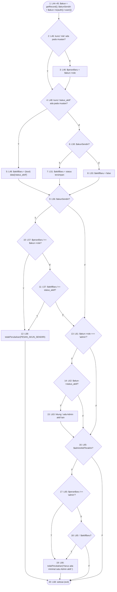

**2. Cyclomatic complexity**

- N = 20, E = 30, P = 1
- V(G) = E − N + 2P = 30 − 20 + 2 = **12**
- Predicate node: 2, 4, 6, 9, 10, 11, 13, 14, 16, 17, 18 (11 node); V(G) = 11 + 1 = **12** — **melebihi batas 10 (McCabe, 1976)**

**3. Matriks grafik**

| | 1 | 2 | 3 | 4 | 5 | 6 | 7 | 8 | 9 | 10 | 11 | 12 | 13 | 14 | 15 | 16 | 17 | 18 | 19 | 20 | Σ keluar − 1 |
|---|---|---|---|---|---|---|---|---|---|---|---|---|---|---|---|---|---|---|
| **1** |  | 1 |  |  |  |  |  |  |  |  |  |  |  |  |  |  |  |  |  |  | 0 |
| **2** |  |  | 1 | 1 |  |  |  |  |  |  |  |  |  |  |  |  |  |  |  |  | 1 |
| **3** |  |  |  | 1 |  |  |  |  |  |  |  |  |  |  |  |  |  |  |  |  | 0 |
| **4** |  |  |  |  | 1 | 1 |  |  |  |  |  |  |  |  |  |  |  |  |  |  | 1 |
| **5** |  |  |  |  |  |  |  |  | 1 |  |  |  |  |  |  |  |  |  |  |  | 0 |
| **6** |  |  |  |  |  |  | 1 | 1 |  |  |  |  |  |  |  |  |  |  |  |  | 1 |
| **7** |  |  |  |  |  |  |  |  | 1 |  |  |  |  |  |  |  |  |  |  |  | 0 |
| **8** |  |  |  |  |  |  |  |  | 1 |  |  |  |  |  |  |  |  |  |  |  | 0 |
| **9** |  |  |  |  |  |  |  |  |  | 1 |  |  | 1 |  |  |  |  |  |  |  | 1 |
| **10** |  |  |  |  |  |  |  |  |  |  | 1 | 1 |  |  |  |  |  |  |  |  | 1 |
| **11** |  |  |  |  |  |  |  |  |  |  |  | 1 | 1 |  |  |  |  |  |  |  | 1 |
| **12** |  |  |  |  |  |  |  |  |  |  |  |  |  |  |  |  |  |  |  | 1 | 0 |
| **13** |  |  |  |  |  |  |  |  |  |  |  |  |  | 1 |  | 1 |  |  |  |  | 1 |
| **14** |  |  |  |  |  |  |  |  |  |  |  |  |  |  | 1 | 1 |  |  |  |  | 1 |
| **15** |  |  |  |  |  |  |  |  |  |  |  |  |  |  |  | 1 |  |  |  |  | 0 |
| **16** |  |  |  |  |  |  |  |  |  |  |  |  |  |  |  |  | 1 |  |  | 1 | 1 |
| **17** |  |  |  |  |  |  |  |  |  |  |  |  |  |  |  |  |  | 1 | 1 |  | 1 |
| **18** |  |  |  |  |  |  |  |  |  |  |  |  |  |  |  |  |  |  | 1 | 1 | 1 |
| **19** |  |  |  |  |  |  |  |  |  |  |  |  |  |  |  |  |  |  |  | 1 | 0 |
| **20** |  |  |  |  |  |  |  |  |  |  |  |  |  |  |  |  |  |  |  |  | — |

Jumlah kolom terakhir = 11; V(G) = 11 + 1 = 12.

**4–5. Jalur independen dan kasus uji**

| No | Jalur | Kasus uji | Method tes | Status |
|---|---|---|---|---|
| J1 | 1–2–4–5–9–13–16–20 | Ubah pengguna lain non-Admin | `AdminTidakMengunciDiriTest::test_ubah_pengguna_lain_yang_bukan_admin_tetap_berfungsi` | lolos |
| J2 | 1–2–4–5–9–10–12–20 | Akun sendiri, peran diubah → ditolak | `AdminTidakMengunciDiriTest::test_muatan_yang_dimodifikasi_pada_akun_sendiri_ditolak_dan_tidak_berubah` | lolos |
| J3 | 1–2–4–5–9–10–11–12–20 | Akun sendiri, hanya status dinonaktifkan → ditolak | `AdminTidakMengunciDiriTest::test_hanya_peran_atau_hanya_status_yang_dimodifikasi_juga_ditolak` | lolos |
| J4 | 1–2–4–5–9–10–11–13–14–15–16–17–18–20 | Akun sendiri (Admin aktif satu-satunya), hanya data lain diubah → tersimpan | `AdminTidakMengunciDiriTest::test_admin_tetap_dapat_mengubah_data_lain_akun_sendiri` | lolos |
| J5 | 1–2–4–5–9–13–14–15–16–20 | Admin lain dinonaktifkan, masih ada Admin aktif lain → tersimpan | `AdminTidakMengunciDiriTest::test_admin_dapat_menonaktifkan_admin_lain_selama_masih_ada_admin_aktif_lain` | lolos |
| J6 | 1–2–4–5–9–13–14–16–20 | Admin lain yang sudah nonaktif disunting → tersimpan | `JalurBasisModul1Test::test_ubah_user_admin_nonaktif_tidak_dihitung_admin_terakhir` | lolos |
| J7 | 1–2–4–5–9–13–14–15–16–17–19–20 | Admin aktif terakhir diubah perannya → ditolak | `AdminTidakMengunciDiriTest::test_perubahan_yang_menghabiskan_admin_aktif_ditolak` | lolos |
| J8 | 1–2–4–5–9–13–14–15–16–17–18–19–20 | Admin aktif terakhir, muatan status null (T-1) → ditolak | `JalurBasisModul1Test::test_ubah_user_status_null_pada_admin_aktif_terakhir_ditolak` `AdminTidakMengunciDiriTest::test_perubahan_yang_menghabiskan_admin_aktif_ditolak` | lolos |
| J9 | 1–2–4–5–9–13–14–15–16–17–18–20 | Admin aktif terakhir (bukan akun sendiri), hanya nama diubah → tersimpan | `AdminTidakMengunciDiriTest::test_perubahan_yang_menghabiskan_admin_aktif_ditolak` | lolos |
| J10 | 1–2–4–6–7–9–10–11–13–14–15–16–17–18–20 | Akun sendiri, kunci status dihapus dari muatan → status tersimpan, tidak ditolak | `JalurBasisModul1Test::test_ubah_user_akun_sendiri_kunci_status_hilang_memakai_status_tersimpan` *(baru)* | lolos |
| J11 | 1–2–4–6–8–9–13–14–15–16–17–18–19–20 | Admin aktif terakhir (akun lain), kunci status dihapus dari muatan (T-1b) → ditolak | `JalurBasisModul1Test::test_ubah_user_kunci_status_hilang_pada_admin_aktif_terakhir_ditolak` *(baru)* | lolos |
| J12 | 1–2–3–4–5–9–13–16–20 | Kunci peran tidak ada pada muatan | — | mustahil |

**6. Persentase jalur lolos setelah perbaikan:** J = 11; 11/12 × 100% = 91.7%.

Jalur J12 mustahil dicapai: `beforeSave()` hanya dipanggil `EditRecord::save()` sesudah `form->getState()` memvalidasi formulir, dan kolom Peran ber-`required()`, termasuk ketika dikunci pada akun sendiri. Muatan tanpa kunci `role` (atau `role` null) berhenti di galat validasi `data.role => Kolom peran wajib diisi.` sebelum kait ini berjalan; dibuktikan eksplorasi: menghapus kunci `role` dan `status_aktif` dari muatan akun sendiri menghasilkan `errors={"data.role":["Kolom peran wajib diisi."]}` dan nama tidak berubah.

### 1.14 `CreateBarangPersediaan::handleRecordCreation`

Berkas: `app/Filament/Resources/BarangPersediaans/Pages/CreateBarangPersediaan.php` baris 25–37. Dipilih karena: method baru hasil perbaikan T-2: pelanggaran UNIQUE yang lolos aturan formulir Buat menjadi pesan, bukan galat SQL.

**1. Grafik alir — node**

| Node | Baris | Isi |
|---|---|---|
| 1 | — | parent::handleRecordCreation($data) melempar UniqueConstraintViolationException? *(predicate)* |
| 2 | — | notifikasi 'Kode barang sudah dipakai pada kategori ini.'; throw Halt |
| 3 | — | return model |
| 4 | — | exit |

**Edge** (asal → tujuan):

1→2 (T), 1→3 (F), 2→4, 3→4

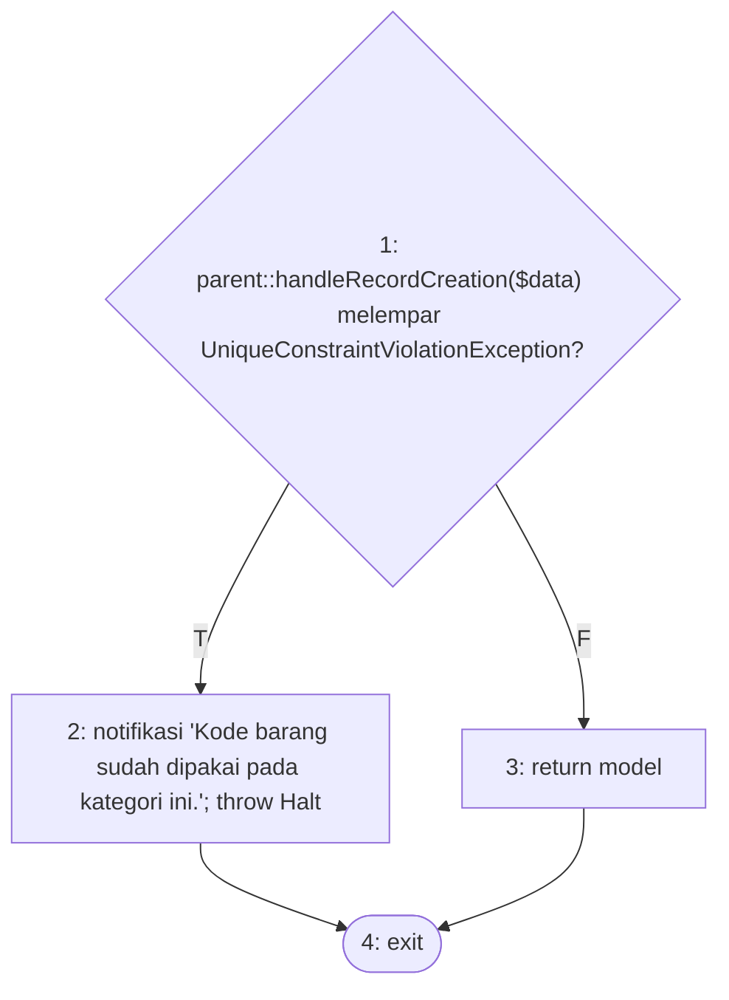

**2. Cyclomatic complexity**

- N = 4, E = 4, P = 1
- V(G) = E − N + 2P = 4 − 4 + 2 = **2**
- Predicate node: 1 (1 node); V(G) = 1 + 1 = **2**

**3. Matriks grafik**

| | 1 | 2 | 3 | 4 | Σ keluar − 1 |
|---|---|---|---|---|
| **1** |  | 1 | 1 |  | 1 |
| **2** |  |  |  | 1 | 0 |
| **3** |  |  |  | 1 | 0 |
| **4** |  |  |  |  | — |

Jumlah kolom terakhir = 1; V(G) = 1 + 1 = 2.

**4–5. Jalur independen dan kasus uji**

| No | Jalur | Kasus uji | Method tes | Status |
|---|---|---|---|---|
| J1 | 1–3–4 | Buat dengan kode sah → tersimpan | `KodeBarangUnikFormTest::test_buat_kode_yang_sama_pada_kategori_lain_diterima` *(baru)* | lolos |
| J2 | 1–2–4 | Bentrok yang lolos validasi (disisipkan tepat sebelum penyimpanan) → notifikasi | `KodeBarangUnikFormTest::test_buat_pelanggaran_unique_yang_lolos_validasi_menjadi_pesan` *(baru)* | lolos |

**6. Persentase jalur lolos setelah perbaikan:** J = 2; 2/2 × 100% = 100.0%.

### 1.15 `EditBarangPersediaan::handleRecordUpdate`

Berkas: `app/Filament/Resources/BarangPersediaans/Pages/EditBarangPersediaan.php` baris 103–116. Dipilih karena: method baru hasil perbaikan T-2: pelanggaran UNIQUE yang lolos aturan formulir Ubah menjadi pesan, bukan galat SQL.

**1. Grafik alir — node**

| Node | Baris | Isi |
|---|---|---|
| 1 | — | parent::handleRecordUpdate($record, $data) melempar UniqueConstraintViolationException? *(predicate)* |
| 2 | — | notifikasi 'Kode barang sudah dipakai pada kategori ini.'; throw Halt |
| 3 | — | return model |
| 4 | — | exit |

**Edge** (asal → tujuan):

1→2 (T), 1→3 (F), 2→4, 3→4

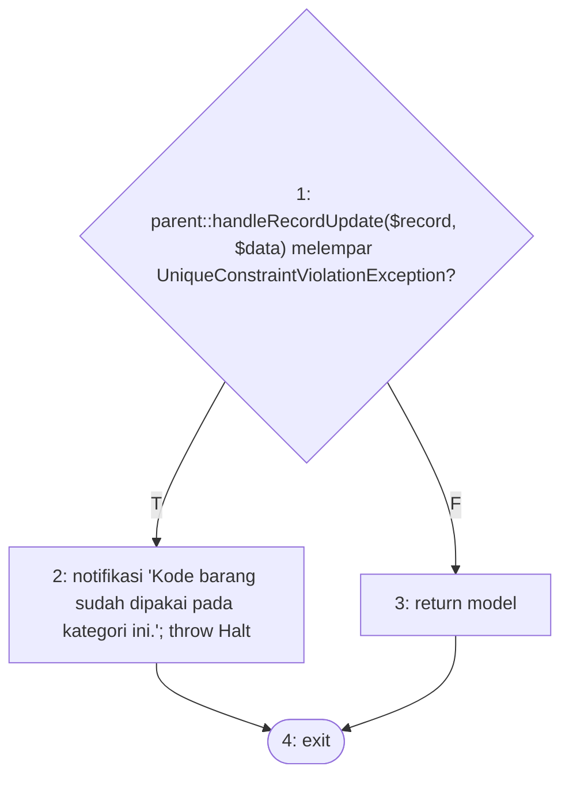

**2. Cyclomatic complexity**

- N = 4, E = 4, P = 1
- V(G) = E − N + 2P = 4 − 4 + 2 = **2**
- Predicate node: 1 (1 node); V(G) = 1 + 1 = **2**

**3. Matriks grafik**

| | 1 | 2 | 3 | 4 | Σ keluar − 1 |
|---|---|---|---|---|
| **1** |  | 1 | 1 |  | 1 |
| **2** |  |  |  | 1 | 0 |
| **3** |  |  |  | 1 | 0 |
| **4** |  |  |  |  | — |

Jumlah kolom terakhir = 1; V(G) = 1 + 1 = 2.

**4–5. Jalur independen dan kasus uji**

| No | Jalur | Kasus uji | Method tes | Status |
|---|---|---|---|---|
| J1 | 1–3–4 | Ubah dengan kode sah → tersimpan | `KodeBarangUnikFormTest::test_ubah_tanpa_mengganti_kode_tidak_ditolak` *(baru)* | lolos |
| J2 | 1–2–4 | Bentrok yang lolos validasi (disisipkan tepat sebelum penyimpanan) → notifikasi | `KodeBarangUnikFormTest::test_ubah_pelanggaran_unique_yang_lolos_validasi_menjadi_pesan` *(baru)* | lolos |

**6. Persentase jalur lolos setelah perbaikan:** J = 2; 2/2 × 100% = 100.0%.

