# White-Box Testing Increment 2 — Modul Permintaan Barang

**Versi sistem yang diuji:** commit `8449a47c625bd6e1b185bd43bef9eb6e30320349` (branch `main`, working tree bersih saat pengujian dimulai; satu-satunya tambahan adalah berkas tes baru di `tests/Feature/JalurBasisModul*Test.php`).

**Konvensi penyusunan grafik alir** (berlaku untuk keempat dokumen increment):

1. Satu node mewakili satu blok pernyataan berurutan atau satu kondisi. Setiap kondisi atomik pada ekspresi majemuk (`&&`, `||`) digambar sebagai predicate node tersendiri (Pressman).
2. Konstruksi yang dihitung sebagai predicate: `if`/`elseif`, kepala perulangan (`foreach`, `for` bersyarat, `map` yang menjadi badan perulangan), setiap lengan `match` kecuali `default` (diurai menjadi perbandingan berurutan), operator ternary `?:`, null-coalescing `??`, setiap `catch`, serta pembantu bersyarat Laravel `when()` dan `abort_unless()` yang setara dengan `if`. Operator nullsafe `?->` tidak dihitung.
3. Closure yang dijalankan tepat sekali secara sinkron (`DB::transaction`) digambar sebaris. Closure yang diteruskan ke operasi koleksi (`filter`, `reject`, `sum`, `mapWithKeys`) adalah fungsi terpisah dan digambar sebagai satu node proses. Closure yang dievaluasi Filament sebagai aturan (mis. `->rule()`, `->placeholder()`, `visible()` aksi) dianalisis sebagai unit tersendiri bila memuat percabangan.
4. `return`, `throw`, `halt()`/`throw new Halt`, dan `abort()` langsung menuju node exit. Exception yang tidak ditangkap method itu sendiri tidak digambar sebagai edge.
5. Setiap grafik memiliki satu entry dan satu exit, P = 1. V(G) dihitung dengan dua rumus, dan kedua hasil diperiksa sama secara otomatis. Matriks grafik menandai 1 pada sel (baris = asal, kolom = tujuan); kolom terakhir berisi (jumlah sambungan keluar − 1).
6. Jalur independen dipilih sebanyak V(G) dan diperiksa secara otomatis: setiap jalur adalah walk sah dari entry ke exit, seluruh edge tercakup, dan rank matriks jalur × edge sama dengan V(G) (saling bebas linear). Untuk method berperulangan, satu jalur = entry, satu putaran badan, exit. Tes yang menjalankan beberapa putaran dihitung mencakup jalur bila salah satu putarannya mengikuti urutan node badan jalur itu.
7. Jalur yang secara logika tidak dapat dicapai tetap dicantumkan sebagai bagian himpunan basis (karena dimensi ruang jalurnya hanya dapat dibentuk oleh jalur itu), ditandai **mustahil**, disertai alasannya, dan tidak dipaksa dengan tes.

**Cara status jalur ditentukan.** Setiap jalur dipetakan ke method tes yang isinya dibaca dan dipastikan melalui urutan keputusan jalur tersebut (bukan dari nama tesnya). Status dibaca otomatis dari berkas JUnit hasil eksekusi:
- **Awal** = run seluruh tes yang sudah ada sebelum tes baru ditulis (SQLite: 742 tes; MySQL: run `awal-mysql`).
- **Akhir** = run Increment 4 (seluruh 83 berkas, termasuk tes baru) pada driver yang sama.
- `lolos` = semua method tes pemeta lolos; `tanpa-tes` = belum ada tes yang menjalankan jalur itu; `gagal` = tes pemeta dijalankan dan gagal; `mustahil` = jalur tak terjangkau.
- J_awal dan J_akhir = banyaknya jalur berstatus `lolos`. Persentase = J / V(G) × 100%.

**Unit yang diuji (Tabel 3.2):** StokService, KedaluwarsaService. Seluruh method yang memuat percabangan dipilih.

**Method yang tidak dipilih dan alasannya**

| Kelas | Method | Alasan |
|---|---|---|
| StokService | `saldoAwalTersirat()` | Satu ekspresi tanpa percabangan (V(G) = 1). |
| KedaluwarsaService | `__construct()` | Injeksi dependensi. |

## Ringkasan

| ID | Method | V(G) | J_awal | % awal | J_akhir | % akhir | Mustahil | Belum lolos |
|---|---|---|---|---|---|---|---|---|
| 2.1 | `StokService::hold` | 4 | 3 | 75.0% | 4 | 100.0% | 0 | — |
| 2.2 | `StokService::release` | 4 | 2 | 50.0% | 3 | 75.0% | 1 | — |
| 2.3 | `StokService::pesanAturan` | 2 | 1 | 50.0% | 2 | 100.0% | 0 | — |
| 2.4 | `StokService::pastikanTidakMelebihiDiminta` | 5 | 2 | 40.0% | 4 | 80.0% | 1 | — |
| 2.5 | `StokService::sesuaikanHold` | 5 | 2 | 40.0% | 4 | 80.0% | 1 | — |
| 2.6 | `StokService::konversi` | 5 | 2 | 40.0% | 4 | 80.0% | 1 | — |
| 2.7 | `StokService::tambah` | 2 | 2 | 100.0% | 2 | 100.0% | 0 | — |
| 2.8 | `StokService::terbitkanNomorBon` | 3 | 2 | 66.7% | 3 | 100.0% | 0 | — |
| 2.9 | `StokService::hitungUlangSaldo` | 4 | 1 | 25.0% | 4 | 100.0% | 0 | — |
| 2.10 | `StokService::tanggalMutasiTerakhir` | 2 | 0 | 0.0% | 2 | 100.0% | 0 | — |
| 2.11 | `KedaluwarsaService::sapuBilaPerlu` | 2 | 1 | 50.0% | 2 | 100.0% | 0 | — |
| 2.12 | `KedaluwarsaService::sapu` | 9 | 4 | 44.4% | 8 | 88.9% | 1 | — |
| 2.13 | `KedaluwarsaService::tahapTerakhir` | 6 | 5 | 83.3% | 6 | 100.0% | 0 | — |
| **Jumlah** | 13 method | **53** | **27** | 50.9% | **48** | 90.6% | 5 | |

⚠ = V(G) > 10, batas yang disarankan McCabe (1976).

## Rincian per method

### 2.1 `StokService::hold`

Berkas: `app/Services/StokService.php` baris 36–59. Dipilih karena: HOLD: mengunci stok saat permintaan diajukan; menolak barang nonaktif dan jumlah melebihi stok tersedia.

Closure `DB::transaction` dijalankan sekali secara sinkron sehingga digambar sebaris. `findOrFail` yang gagal adalah exception tak tertangkap dan tidak dimodelkan sebagai edge.

**1. Grafik alir — node**

| Node | Baris | Isi |
|---|---|---|
| 1 | L38 | mulai transaksi |
| 2 | L39 | masih ada item? (foreach) *(predicate)* |
| 3 | L40 | kunci dan ambil barang |
| 4 | L42 | ! $barang->status_aktif? *(predicate)* |
| 5 | L43–45 | throw RuntimeException (tidak tersedia) |
| 6 | L48–50 | $jumlah > $tersedia? *(predicate)* |
| 7 | L51–53 | throw RuntimeException (tidak mencukupi) |
| 8 | L56 | increment('stok_hold') |
| 9 | L58 | transaksi selesai |
| 10 | — | exit |

**Edge** (asal → tujuan):

1→2, 2→3 (T), 2→9 (F), 3→4, 4→5 (T), 4→6 (F), 5→10, 6→7 (T), 6→8 (F), 7→10, 8→2, 9→10

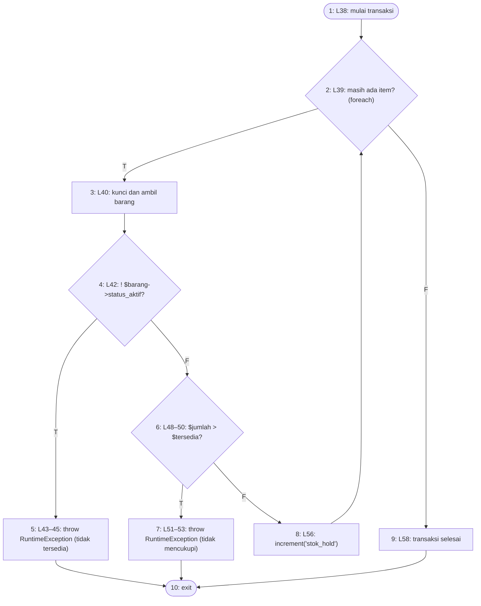

**2. Cyclomatic complexity**

- N = 10, E = 12, P = 1
- V(G) = E − N + 2P = 12 − 10 + 2 = **4**
- Predicate node: 2, 4, 6 (3 node); V(G) = 3 + 1 = **4**

**3. Matriks grafik**

| | 1 | 2 | 3 | 4 | 5 | 6 | 7 | 8 | 9 | 10 | Σ keluar − 1 |
|---|---|---|---|---|---|---|---|---|---|---|---|
| **1** |  | 1 |  |  |  |  |  |  |  |  | 0 |
| **2** |  |  | 1 |  |  |  |  |  | 1 |  | 1 |
| **3** |  |  |  | 1 |  |  |  |  |  |  | 0 |
| **4** |  |  |  |  | 1 | 1 |  |  |  |  | 1 |
| **5** |  |  |  |  |  |  |  |  |  | 1 | 0 |
| **6** |  |  |  |  |  |  | 1 | 1 |  |  | 1 |
| **7** |  |  |  |  |  |  |  |  |  | 1 | 0 |
| **8** |  | 1 |  |  |  |  |  |  |  |  | 0 |
| **9** |  |  |  |  |  |  |  |  |  | 1 | 0 |
| **10** |  |  |  |  |  |  |  |  |  |  | — |

Jumlah kolom terakhir = 3; V(G) = 3 + 1 = 4.

**4–5. Jalur independen dan kasus uji**

| No | Jalur | Kasus uji | Method tes | Awal | Akhir |
|---|---|---|---|---|---|
| J1 | 1–2–9–10 | Daftar item kosong | `JalurBasisModul2Test::test_hold_tanpa_item_tidak_mengubah_apa_pun` *(baru)* | tanpa-tes | lolos |
| J2 | 1–2–3–4–5–10 | Barang nonaktif diminta | `PengajuanKatalogAturanTest::test_barang_nonaktif_ditolak_tanpa_permintaan_dan_tanpa_kunci` | lolos | lolos |
| J3 | 1–2–3–4–6–7–10 | Jumlah melebihi stok tersedia | `PengendalianStokTest::test_hold_ditolak_ketika_stok_tersedia_tidak_cukup` | lolos | lolos |
| J4 | 1–2–3–4–6–8–2–9–10 | Jumlah tersedia → stok terkunci bertambah | `PengendalianStokTest::test_hold_mengunci_stok_tanpa_mengurangi_stok_fisik` | lolos | lolos |

**6. Persentase jalur lolos:** J_awal = 3, J_akhir = 4; awal = 3/4 × 100% = 75.0%, akhir = 4/4 × 100% = 100.0%.

### 2.2 `StokService::release`

Berkas: `app/Services/StokService.php` baris 64–85. Dipilih karena: RELEASE: melepas kunci permintaan yang ditolak/bermasalah/kedaluwarsa tanpa menyentuh stok fisik dan tanpa melepas kunci permintaan lain.

**1. Grafik alir — node**

| Node | Baris | Isi |
|---|---|---|
| 1 | L66 | mulai transaksi |
| 2 | L67 | masih ada rincian? (foreach) *(predicate)* |
| 3 | L70 | jumlah_final null? (??) *(predicate)* |
| 4 | L70 | pakai jumlah_diminta |
| 5 | L70–73 | jumlah = min(...); cari barang; ! $barang? *(predicate)* |
| 6 | L78–80 | kurangi stok_hold (tidak < 0) |
| 7 | L83 | catat hold_released_at |
| 8 | — | exit |

**Edge** (asal → tujuan):

1→2, 2→3 (T), 2→7 (F), 3→4 (T), 3→5 (F), 4→5, 5→2 (T), 5→6 (F), 6→2, 7→8

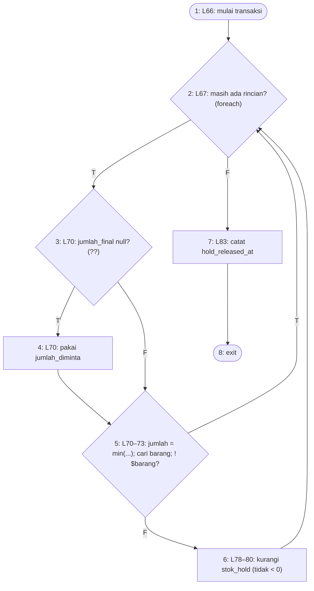

**2. Cyclomatic complexity**

- N = 8, E = 10, P = 1
- V(G) = E − N + 2P = 10 − 8 + 2 = **4**
- Predicate node: 2, 3, 5 (3 node); V(G) = 3 + 1 = **4**

**3. Matriks grafik**

| | 1 | 2 | 3 | 4 | 5 | 6 | 7 | 8 | Σ keluar − 1 |
|---|---|---|---|---|---|---|---|---|---|
| **1** |  | 1 |  |  |  |  |  |  | 0 |
| **2** |  |  | 1 |  |  |  | 1 |  | 1 |
| **3** |  |  |  | 1 | 1 |  |  |  | 1 |
| **4** |  |  |  |  | 1 |  |  |  | 0 |
| **5** |  | 1 |  |  |  | 1 |  |  | 1 |
| **6** |  | 1 |  |  |  |  |  |  | 0 |
| **7** |  |  |  |  |  |  |  | 1 | 0 |
| **8** |  |  |  |  |  |  |  |  | — |

Jumlah kolom terakhir = 3; V(G) = 3 + 1 = 4.

**4–5. Jalur independen dan kasus uji**

| No | Jalur | Kasus uji | Method tes | Awal | Akhir |
|---|---|---|---|---|---|
| J1 | 1–2–7–8 | Permintaan tanpa rincian | `JalurBasisModul2Test::test_release_tanpa_rincian_hanya_menandai_waktu` *(baru)* | tanpa-tes | lolos |
| J2 | 1–2–3–4–5–6–2–7–8 | Rincian tanpa jumlah_final → lepas sejumlah diminta | `PengendalianStokTest::test_release_melepas_kunci_dan_menandai_waktu_pelepasan` | lolos | lolos |
| J3 | 1–2–3–5–6–2–7–8 | Rincian dengan jumlah_final (> diminta) → dibatasi sejumlah diminta | `PersetujuanTidakMelebihiDimintaTest::test_konversi_dan_release_tidak_menyentuh_kunci_permintaan_lain` | lolos | lolos |
| J4 | 1–2–3–4–5–2–7–8 | Barang rincian tidak ditemukan | — | mustahil | mustahil |

**6. Persentase jalur lolos:** J_awal = 2, J_akhir = 3; awal = 2/4 × 100% = 50.0%, akhir = 3/4 × 100% = 75.0%.

Jalur J4 mustahil dicapai: `detail_permintaan_barang.barang_id` berkunci asing `restrictOnDelete` ke `barang_persediaan` (migration 2026_08_26_000011) dan `BarangPersediaan` tidak memakai soft delete, sedangkan kunci asing ditegakkan di kedua driver (`foreign_key_constraints` SQLite = true, InnoDB MySQL). Selama rincian permintaan ada, baris barangnya tidak dapat dihapus, sehingga `find($detail->barang_id)` di dalam transaksi tidak pernah null. Mencapainya menuntut rincian palsu yang disuntikkan ke relasi — memaksa jalur, bukan menguji keadaan yang dapat terjadi.

### 2.3 `StokService::pesanAturan`

Berkas: `app/Services/StokService.php` baris 93–98. Dipilih karena: pemisah penolakan aturan bisnis (ditampilkan) dari galat teknis (dilempar ulang); dipakai Katalog Barang dan Mutasi Aset.

**1. Grafik alir — node**

| Node | Baris | Isi |
|---|---|---|
| 1 | L95 | kelas $e persis RuntimeException/InvalidArgumentException? *(predicate)* |
| 2 | L96 | $e->getMessage() |
| 3 | L97 | null |
| 4 | — | exit |

**Edge** (asal → tujuan):

1→2 (T), 1→3 (F), 2→4, 3→4

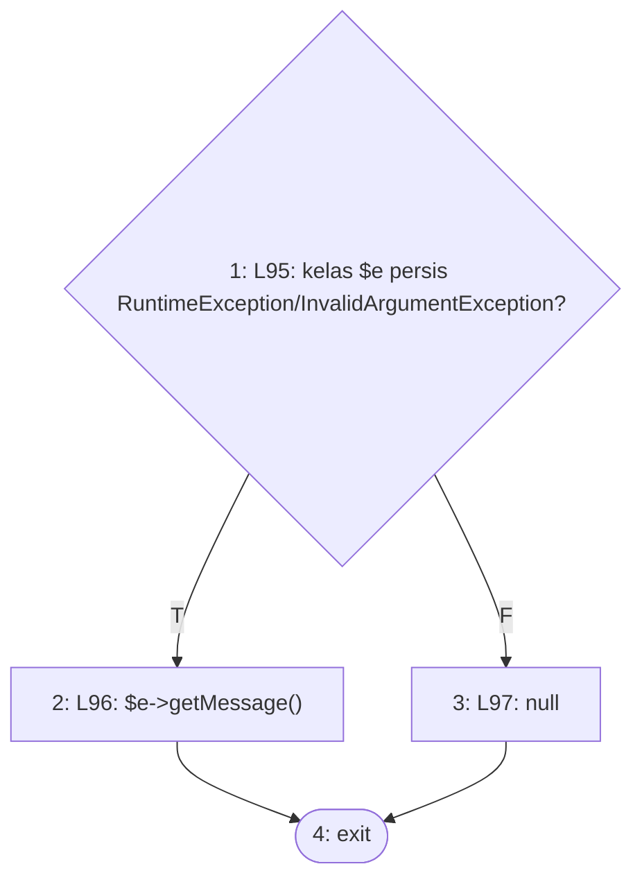

**2. Cyclomatic complexity**

- N = 4, E = 4, P = 1
- V(G) = E − N + 2P = 4 − 4 + 2 = **2**
- Predicate node: 1 (1 node); V(G) = 1 + 1 = **2**

**3. Matriks grafik**

| | 1 | 2 | 3 | 4 | Σ keluar − 1 |
|---|---|---|---|---|---|
| **1** |  | 1 | 1 |  | 1 |
| **2** |  |  |  | 1 | 0 |
| **3** |  |  |  | 1 | 0 |
| **4** |  |  |  |  | — |

Jumlah kolom terakhir = 1; V(G) = 1 + 1 = 2.

**4–5. Jalur independen dan kasus uji**

| No | Jalur | Kasus uji | Method tes | Awal | Akhir |
|---|---|---|---|---|---|
| J1 | 1–2–4 | RuntimeException aturan (barang nonaktif) tampil sebagai notifikasi | `PengajuanKatalogAturanTest::test_barang_nonaktif_ditolak_tanpa_permintaan_dan_tanpa_kunci` | lolos | lolos |
| J2 | 1–3–4 | QueryException (turunan RuntimeException) → null | `JalurBasisModul2Test::test_pesan_aturan_galat_teknis_mengembalikan_null` *(baru)* | tanpa-tes | lolos |

**6. Persentase jalur lolos:** J_awal = 1, J_akhir = 2; awal = 1/2 × 100% = 50.0%, akhir = 2/2 × 100% = 100.0%.

### 2.4 `StokService::pastikanTidakMelebihiDiminta`

Berkas: `app/Services/StokService.php` baris 106–117. Dipilih karena: aturan jumlah disetujui ≤ jumlah diminta (A-003), ditegakkan di server.

**1. Grafik alir — node**

| Node | Baris | Isi |
|---|---|---|
| 0 | L106 | masuk method |
| 1 | L108 | masih ada rincian? (foreach) *(predicate)* |
| 2 | L109 | $jumlah[$detail->id] tidak null? (??) *(predicate)* |
| 3 | L109 | $final = null |
| 4 | L111 | $final !== null? *(predicate)* |
| 5 | L111 | (int) $final > jumlah_diminta? *(predicate)* |
| 6 | L112–114 | throw InvalidArgumentException |
| 7 | — | exit |

**Edge** (asal → tujuan):

0→1, 1→2 (T), 1→7 (F), 2→4 (T), 2→3 (F), 3→4, 4→5 (T), 4→1 (F), 5→6 (T), 5→1 (F), 6→7

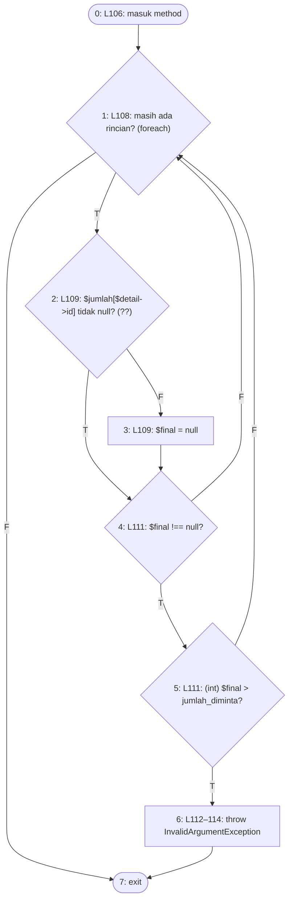

**2. Cyclomatic complexity**

- N = 8, E = 11, P = 1
- V(G) = E − N + 2P = 11 − 8 + 2 = **5**
- Predicate node: 1, 2, 4, 5 (4 node); V(G) = 4 + 1 = **5**

**3. Matriks grafik**

| | 0 | 1 | 2 | 3 | 4 | 5 | 6 | 7 | Σ keluar − 1 |
|---|---|---|---|---|---|---|---|---|---|
| **0** |  | 1 |  |  |  |  |  |  | 0 |
| **1** |  |  | 1 |  |  |  |  | 1 | 1 |
| **2** |  |  |  | 1 | 1 |  |  |  | 1 |
| **3** |  |  |  |  | 1 |  |  |  | 0 |
| **4** |  | 1 |  |  |  | 1 |  |  | 1 |
| **5** |  | 1 |  |  |  |  | 1 |  | 1 |
| **6** |  |  |  |  |  |  |  | 1 | 0 |
| **7** |  |  |  |  |  |  |  |  | — |

Jumlah kolom terakhir = 4; V(G) = 4 + 1 = 5.

**4–5. Jalur independen dan kasus uji**

| No | Jalur | Kasus uji | Method tes | Awal | Akhir |
|---|---|---|---|---|---|
| J1 | 0–1–7 | Permintaan tanpa rincian | `JalurBasisModul2Test::test_pastikan_tidak_melebihi_tanpa_rincian` *(baru)* | tanpa-tes | lolos |
| J2 | 0–1–2–3–4–1–7 | Rincian tanpa jumlah disetujui (null dilewati) | `JalurBasisModul2Test::test_pastikan_tidak_melebihi_melewati_jumlah_null` *(baru)* | tanpa-tes | lolos |
| J3 | 0–1–2–4–5–1–7 | Disetujui = diminta | `PengendalianStokTest::test_persetujuan_penuh_tidak_mengubah_kunci` | lolos | lolos |
| J4 | 0–1–2–4–5–6–7 | Disetujui > diminta → ditolak | `PersetujuanTidakMelebihiDimintaTest::test_layanan_stok_menolak_jumlah_tersimpan_yang_melebihi_diminta` | lolos | lolos |
| J5 | 0–1–2–3–4–5–1–7 | $final null tetapi node 4 benar | — | mustahil | mustahil |

**6. Persentase jalur lolos:** J_awal = 2, J_akhir = 4; awal = 2/5 × 100% = 40.0%, akhir = 4/5 × 100% = 80.0%.

Jalur J5 mustahil dicapai: node 3 menetapkan `$final = null` tepat sebelum node 4, sehingga sesudah 2→3 node 4 selalu salah; sebaliknya sesudah 2→4 (`$final` tidak null) node 4 selalu benar. Dimensi terakhir ruang jalur hanya terbentuk dari salah satu kombinasi yang bertentangan itu.

### 2.5 `StokService::sesuaikanHold`

Berkas: `app/Services/StokService.php` baris 122–145. Dipilih karena: persetujuan sebagian: selisih kunci dikembalikan agar tersedia bagi tim lain.

**1. Grafik alir — node**

| Node | Baris | Isi |
|---|---|---|
| 1 | L124 | pastikanTidakMelebihiDiminta(...) |
| 2 | L126 | mulai transaksi |
| 3 | L127 | masih ada rincian? (foreach) *(predicate)* |
| 4 | L128 | jumlah_final === null? *(predicate)* |
| 5 | L132–133 | $selisih <= 0? *(predicate)* |
| 6 | L137–138 | cari barang; $barang? *(predicate)* |
| 7 | L139–141 | kurangi stok_hold sebesar selisih |
| 8 | L144 | transaksi selesai |
| 9 | — | exit |

**Edge** (asal → tujuan):

1→2, 2→3, 3→4 (T), 3→8 (F), 4→3 (T), 4→5 (F), 5→3 (T), 5→6 (F), 6→7 (T), 6→3 (F), 7→3, 8→9

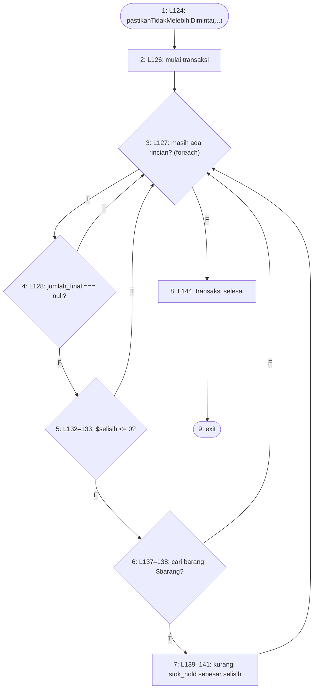

**2. Cyclomatic complexity**

- N = 9, E = 12, P = 1
- V(G) = E − N + 2P = 12 − 9 + 2 = **5**
- Predicate node: 3, 4, 5, 6 (4 node); V(G) = 4 + 1 = **5**

**3. Matriks grafik**

| | 1 | 2 | 3 | 4 | 5 | 6 | 7 | 8 | 9 | Σ keluar − 1 |
|---|---|---|---|---|---|---|---|---|---|---|
| **1** |  | 1 |  |  |  |  |  |  |  | 0 |
| **2** |  |  | 1 |  |  |  |  |  |  | 0 |
| **3** |  |  |  | 1 |  |  |  | 1 |  | 1 |
| **4** |  |  | 1 |  | 1 |  |  |  |  | 1 |
| **5** |  |  | 1 |  |  | 1 |  |  |  | 1 |
| **6** |  |  | 1 |  |  |  | 1 |  |  | 1 |
| **7** |  |  | 1 |  |  |  |  |  |  | 0 |
| **8** |  |  |  |  |  |  |  |  | 1 | 0 |
| **9** |  |  |  |  |  |  |  |  |  | — |

Jumlah kolom terakhir = 4; V(G) = 4 + 1 = 5.

**4–5. Jalur independen dan kasus uji**

| No | Jalur | Kasus uji | Method tes | Awal | Akhir |
|---|---|---|---|---|---|
| J1 | 1–2–3–8–9 | Permintaan tanpa rincian | `JalurBasisModul2Test::test_sesuaikan_hold_tanpa_rincian` *(baru)* | tanpa-tes | lolos |
| J2 | 1–2–3–4–3–8–9 | Rincian belum diputuskan (final null) → dilewati | `JalurBasisModul2Test::test_sesuaikan_hold_melewati_rincian_tanpa_jumlah_final` *(baru)* | tanpa-tes | lolos |
| J3 | 1–2–3–4–5–3–8–9 | Disetujui penuh → kunci tetap | `PengendalianStokTest::test_persetujuan_penuh_tidak_mengubah_kunci` | lolos | lolos |
| J4 | 1–2–3–4–5–6–7–3–8–9 | Disetujui sebagian → selisih dilepas | `PengendalianStokTest::test_persetujuan_sebagian_melepas_selisih_kunci` | lolos | lolos |
| J5 | 1–2–3–4–5–6–3–8–9 | Barang rincian tidak ditemukan | — | mustahil | mustahil |

**6. Persentase jalur lolos:** J_awal = 2, J_akhir = 4; awal = 2/5 × 100% = 40.0%, akhir = 4/5 × 100% = 80.0%.

Jalur J5 mustahil dicapai: `detail_permintaan_barang.barang_id` berkunci asing `restrictOnDelete` ke `barang_persediaan` (migration 2026_08_26_000011) dan `BarangPersediaan` tidak memakai soft delete, sedangkan kunci asing ditegakkan di kedua driver (`foreign_key_constraints` SQLite = true, InnoDB MySQL). Selama rincian permintaan ada, baris barangnya tidak dapat dihapus, sehingga `find($detail->barang_id)` di dalam transaksi tidak pernah null. Mencapainya menuntut rincian palsu yang disuntikkan ke relasi — memaksa jalur, bukan menguji keadaan yang dapat terjadi.

### 2.6 `StokService::konversi`

Berkas: `app/Services/StokService.php` baris 151–196. Dipilih karena: KONVERSI: kunci menjadi pengeluaran, nomor bon terbit, buku besar dicatat dan saldo dihitung ulang.

**1. Grafik alir — node**

| Node | Baris | Isi |
|---|---|---|
| 1 | L153–154 | mulai transaksi; terbitkanNomorBon() |
| 2 | L156 | masih ada rincian? (foreach) *(predicate)* |
| 3 | L157 | jumlah_final null? (??) *(predicate)* |
| 4 | L157 | pakai jumlah_diminta |
| 5 | L158 | $jumlah <= 0? *(predicate)* |
| 6 | L162–163 | cari barang; ! $barang? *(predicate)* |
| 7 | L167–193 | saldo awal, lepas kunci, catat mutasi keluar, hitung ulang saldo |
| 8 | L195 | transaksi selesai |
| 9 | — | exit |

**Edge** (asal → tujuan):

1→2, 2→3 (T), 2→8 (F), 3→4 (T), 3→5 (F), 4→5, 5→2 (T), 5→6 (F), 6→2 (T), 6→7 (F), 7→2, 8→9

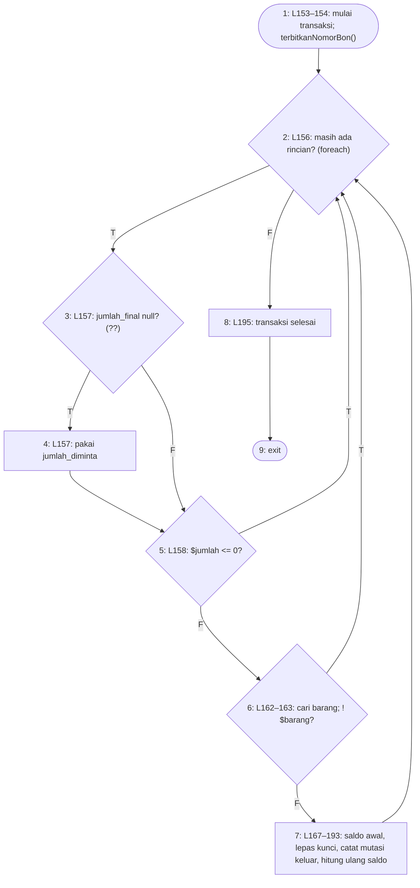

**2. Cyclomatic complexity**

- N = 9, E = 12, P = 1
- V(G) = E − N + 2P = 12 − 9 + 2 = **5**
- Predicate node: 2, 3, 5, 6 (4 node); V(G) = 4 + 1 = **5**

**3. Matriks grafik**

| | 1 | 2 | 3 | 4 | 5 | 6 | 7 | 8 | 9 | Σ keluar − 1 |
|---|---|---|---|---|---|---|---|---|---|---|
| **1** |  | 1 |  |  |  |  |  |  |  | 0 |
| **2** |  |  | 1 |  |  |  |  | 1 |  | 1 |
| **3** |  |  |  | 1 | 1 |  |  |  |  | 1 |
| **4** |  |  |  |  | 1 |  |  |  |  | 0 |
| **5** |  | 1 |  |  |  | 1 |  |  |  | 1 |
| **6** |  | 1 |  |  |  |  | 1 |  |  | 1 |
| **7** |  | 1 |  |  |  |  |  |  |  | 0 |
| **8** |  |  |  |  |  |  |  |  | 1 | 0 |
| **9** |  |  |  |  |  |  |  |  |  | — |

Jumlah kolom terakhir = 4; V(G) = 4 + 1 = 5.

**4–5. Jalur independen dan kasus uji**

| No | Jalur | Kasus uji | Method tes | Awal | Akhir |
|---|---|---|---|---|---|
| J1 | 1–2–8–9 | Permintaan tanpa rincian → hanya nomor bon | `JalurBasisModul2Test::test_konversi_tanpa_rincian_tidak_mencatat_mutasi` *(baru)* | tanpa-tes | lolos |
| J2 | 1–2–3–4–5–6–7–2–8–9 | Tanpa jumlah_final → keluar sejumlah diminta | `PengendalianStokTest::test_konversi_mengurangi_stok_fisik_dan_mencatat_mutasi_keluar` | lolos | lolos |
| J3 | 1–2–3–5–6–7–2–8–9 | Dengan jumlah_final → keluar sejumlah disetujui | `PengendalianStokTest::test_konversi_memakai_jumlah_final_ketika_disetujui_sebagian` | lolos | lolos |
| J4 | 1–2–3–5–2–8–9 | jumlah_final 0 → rincian dilewati | `JalurBasisModul2Test::test_konversi_melewati_rincian_berjumlah_nol` *(baru)* | tanpa-tes | lolos |
| J5 | 1–2–3–4–5–6–2–8–9 | Barang rincian tidak ditemukan | — | mustahil | mustahil |

**6. Persentase jalur lolos:** J_awal = 2, J_akhir = 4; awal = 2/5 × 100% = 40.0%, akhir = 4/5 × 100% = 80.0%.

Jalur J5 mustahil dicapai: `detail_permintaan_barang.barang_id` berkunci asing `restrictOnDelete` ke `barang_persediaan` (migration 2026_08_26_000011) dan `BarangPersediaan` tidak memakai soft delete, sedangkan kunci asing ditegakkan di kedua driver (`foreign_key_constraints` SQLite = true, InnoDB MySQL). Selama rincian permintaan ada, baris barangnya tidak dapat dihapus, sehingga `find($detail->barang_id)` di dalam transaksi tidak pernah null. Mencapainya menuntut rincian palsu yang disuntikkan ke relasi — memaksa jalur, bukan menguji keadaan yang dapat terjadi.

### 2.7 `StokService::tambah`

Berkas: `app/Services/StokService.php` baris 217–242. Dipilih karena: stok masuk: tanggal dokumen dipakai sebagai tanggal mutasi, hari ini bila kosong.

**1. Grafik alir — node**

| Node | Baris | Isi |
|---|---|---|
| 1 | L219 | $tanggal terisi? (?:) *(predicate)* |
| 2 | L219 | now()->toDateString() |
| 3 | L221–241 | transaksi: saldo awal, catat mutasi masuk, hitung ulang saldo |
| 4 | — | exit |

**Edge** (asal → tujuan):

1→3 (T), 1→2 (F), 2→3, 3→4

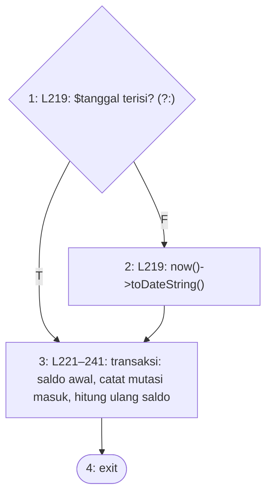

**2. Cyclomatic complexity**

- N = 4, E = 4, P = 1
- V(G) = E − N + 2P = 4 − 4 + 2 = **2**
- Predicate node: 1 (1 node); V(G) = 1 + 1 = **2**

**3. Matriks grafik**

| | 1 | 2 | 3 | 4 | Σ keluar − 1 |
|---|---|---|---|---|---|
| **1** |  | 1 | 1 |  | 1 |
| **2** |  |  | 1 |  | 0 |
| **3** |  |  |  | 1 | 0 |
| **4** |  |  |  |  | — |

Jumlah kolom terakhir = 1; V(G) = 1 + 1 = 2.

**4–5. Jalur independen dan kasus uji**

| No | Jalur | Kasus uji | Method tes | Awal | Akhir |
|---|---|---|---|---|---|
| J1 | 1–3–4 | Tanggal dokumen diisi | `StokMasukTest::test_tanggal_dokumen_dipakai_pada_kartu_kendali` | lolos | lolos |
| J2 | 1–2–3–4 | Tanggal tidak diisi → hari ini | `PengendalianStokTest::test_stok_masuk_menambah_stok_dan_mencatat_saldo_berjalan` | lolos | lolos |

**6. Persentase jalur lolos:** J_awal = 2, J_akhir = 2; awal = 2/2 × 100% = 100.0%, akhir = 2/2 × 100% = 100.0%.

### 2.8 `StokService::terbitkanNomorBon`

Berkas: `app/Services/StokService.php` baris 260–285. Dipilih karena: penomoran bon per tahun, diurutkan sebagai angka (A-001); tipe CAST bergantung driver.

Jalur J2 hanya dapat dilalui pada SQLite dan J3 hanya pada MySQL, sebab node 3 membaca driver koneksi. Statusnya diambil dari run driver yang bersangkutan.

**1. Grafik alir — node**

| Node | Baris | Isi |
|---|---|---|
| 1 | L262 | filled($permintaan->nomor_bon)? *(predicate)* |
| 2 | L263 | return nomor bon yang ada |
| 3 | L266–270 | driver === 'sqlite'? *(predicate)* |
| 4 | L270 | 'INTEGER' |
| 5 | L270 | 'SIGNED' |
| 6 | L272–284 | cari nomor terbesar, +1, simpan, return |
| 7 | — | exit |

**Edge** (asal → tujuan):

1→2 (T), 1→3 (F), 2→7, 3→4 (T), 3→5 (F), 4→6, 5→6, 6→7

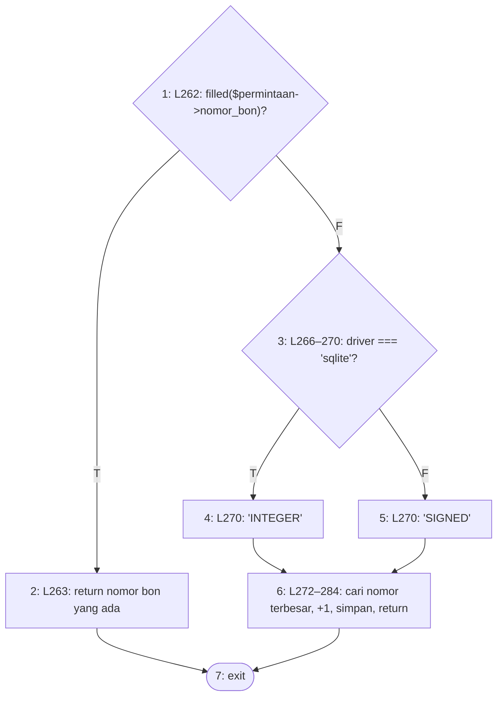

**2. Cyclomatic complexity**

- N = 7, E = 8, P = 1
- V(G) = E − N + 2P = 8 − 7 + 2 = **3**
- Predicate node: 1, 3 (2 node); V(G) = 2 + 1 = **3**

**3. Matriks grafik**

| | 1 | 2 | 3 | 4 | 5 | 6 | 7 | Σ keluar − 1 |
|---|---|---|---|---|---|---|---|---|
| **1** |  | 1 | 1 |  |  |  |  | 1 |
| **2** |  |  |  |  |  |  | 1 | 0 |
| **3** |  |  |  | 1 | 1 |  |  | 1 |
| **4** |  |  |  |  |  | 1 |  | 0 |
| **5** |  |  |  |  |  | 1 |  | 0 |
| **6** |  |  |  |  |  |  | 1 | 0 |
| **7** |  |  |  |  |  |  |  | — |

Jumlah kolom terakhir = 2; V(G) = 2 + 1 = 3.

**4–5. Jalur independen dan kasus uji**

| No | Jalur | Kasus uji | Method tes | Awal | Akhir |
|---|---|---|---|---|---|
| J1 | 1–2–7 | Permintaan sudah bernomor bon → nomor lama dipakai | `JalurBasisModul2Test::test_nomor_bon_yang_sudah_ada_tidak_berganti` *(baru)* | tanpa-tes | lolos |
| J2 | 1–3–4–6–7 | Nomor baru pada SQLite | `NomorBonPengeluaranTest::test_permintaan_pertama_tahun_ini_bernomor_001` — run SQLite | lolos | lolos |
| J3 | 1–3–5–6–7 | Nomor baru pada MySQL | `NomorBonPengeluaranTest::test_permintaan_pertama_tahun_ini_bernomor_001` — run MySQL | lolos | lolos |

**6. Persentase jalur lolos:** J_awal = 2, J_akhir = 3; awal = 2/3 × 100% = 66.7%, akhir = 3/3 × 100% = 100.0%.

### 2.9 `StokService::hitungUlangSaldo`

Berkas: `app/Services/StokService.php` baris 320–349. Dipilih karena: saldo kartu kendali dihitung ulang menurut urutan tanggal; saldo negatif ditolak.

**1. Grafik alir — node**

| Node | Baris | Isi |
|---|---|---|
| 1 | L322–328 | ambil mutasi urut tanggal, id |
| 2 | L330 | masih ada baris? (foreach) *(predicate)* |
| 3 | L331–333 | $saldo += jumlah; $saldo < 0? *(predicate)* |
| 4 | L334–338 | throw InvalidArgumentException (sisa negatif) |
| 5 | L343 | saldo_sesudah !== $saldo? *(predicate)* |
| 6 | L344 | tulis ulang saldo_sesudah |
| 7 | L348 | stok_fisik = saldo terakhir |
| 8 | — | exit |

**Edge** (asal → tujuan):

1→2, 2→3 (T), 2→7 (F), 3→4 (T), 3→5 (F), 4→8, 5→6 (T), 5→2 (F), 6→2, 7→8

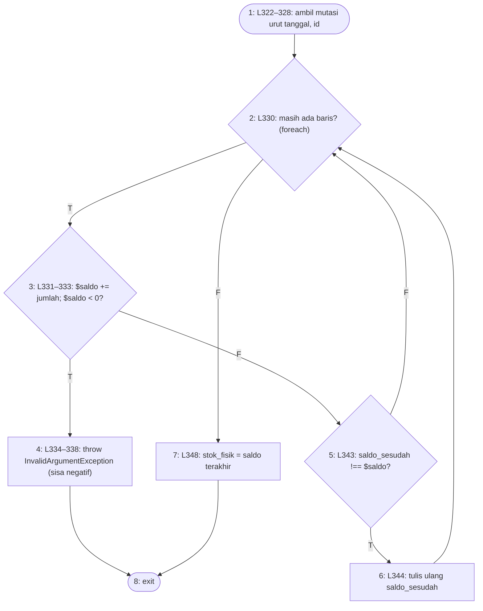

**2. Cyclomatic complexity**

- N = 8, E = 10, P = 1
- V(G) = E − N + 2P = 10 − 8 + 2 = **4**
- Predicate node: 2, 3, 5 (3 node); V(G) = 3 + 1 = **4**

**3. Matriks grafik**

| | 1 | 2 | 3 | 4 | 5 | 6 | 7 | 8 | Σ keluar − 1 |
|---|---|---|---|---|---|---|---|---|---|
| **1** |  | 1 |  |  |  |  |  |  | 0 |
| **2** |  |  | 1 |  |  |  | 1 |  | 1 |
| **3** |  |  |  | 1 | 1 |  |  |  | 1 |
| **4** |  |  |  |  |  |  |  | 1 | 0 |
| **5** |  | 1 |  |  |  | 1 |  |  | 1 |
| **6** |  | 1 |  |  |  |  |  |  | 0 |
| **7** |  |  |  |  |  |  |  | 1 | 0 |
| **8** |  |  |  |  |  |  |  |  | — |

Jumlah kolom terakhir = 3; V(G) = 3 + 1 = 4.

**4–5. Jalur independen dan kasus uji**

| No | Jalur | Kasus uji | Method tes | Awal | Akhir |
|---|---|---|---|---|---|
| J1 | 1–2–7–8 | Barang tanpa mutasi → stok fisik = saldo awal | `JalurBasisModul2Test::test_hitung_ulang_saldo_tanpa_mutasi` *(baru)* | tanpa-tes | lolos |
| J2 | 1–2–3–4–8 | Pengeluaran membuat saldo negatif → ditolak | `JalurBasisModul2Test::test_hitung_ulang_saldo_negatif_ditolak` *(baru)* | tanpa-tes | lolos |
| J3 | 1–2–3–5–6–2–7–8 | Baris baru → saldo ditulis | `PengendalianStokTest::test_stok_masuk_menambah_stok_dan_mencatat_saldo_berjalan` | lolos | lolos |
| J4 | 1–2–3–5–2–7–8 | Saldo sudah benar → tidak ditulis ulang | `JalurBasisModul2Test::test_hitung_ulang_saldo_tidak_menulis_baris_yang_sudah_benar` *(baru)* | tanpa-tes | lolos |

**6. Persentase jalur lolos:** J_awal = 1, J_akhir = 4; awal = 1/4 × 100% = 25.0%, akhir = 4/4 × 100% = 100.0%.

### 2.10 `StokService::tanggalMutasiTerakhir`

Berkas: `app/Services/StokService.php` baris 360–367. Dipilih karena: batas tanggal bersama layanan dan formulir Stok Masuk.

Hasil penelusuran: satu-satunya pemanggil, `StokMasuk::batasTanggal()`, tidak dipanggil dari kode mana pun, sehingga method ini saat ini hanya dijalankan oleh tes.

**1. Grafik alir — node**

| Node | Baris | Isi |
|---|---|---|
| 1 | L362–366 | ada tanggal mutasi? (?:) *(predicate)* |
| 2 | L366 | tanggal Y-m-d |
| 3 | L366 | null |
| 4 | — | exit |

**Edge** (asal → tujuan):

1→2 (T), 1→3 (F), 2→4, 3→4

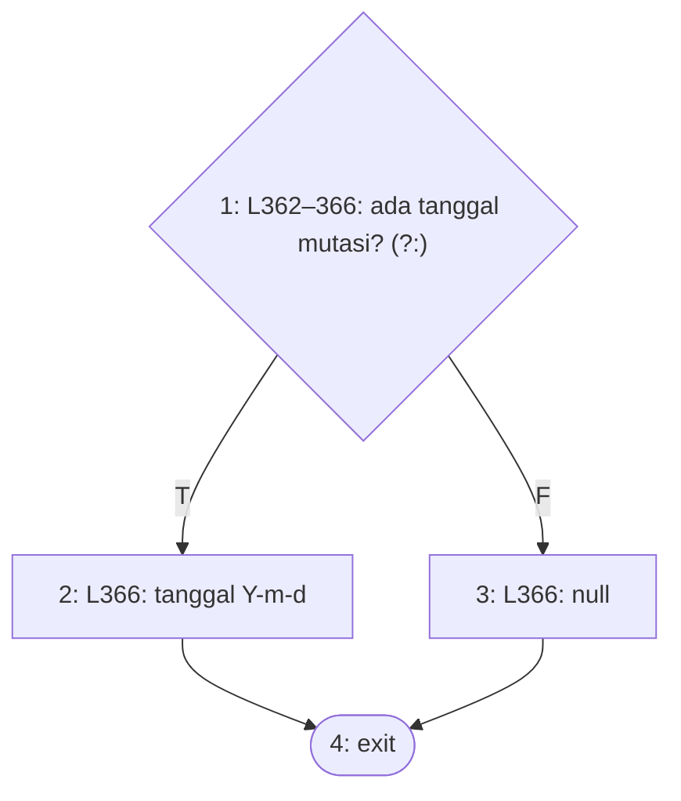

**2. Cyclomatic complexity**

- N = 4, E = 4, P = 1
- V(G) = E − N + 2P = 4 − 4 + 2 = **2**
- Predicate node: 1 (1 node); V(G) = 1 + 1 = **2**

**3. Matriks grafik**

| | 1 | 2 | 3 | 4 | Σ keluar − 1 |
|---|---|---|---|---|---|
| **1** |  | 1 | 1 |  | 1 |
| **2** |  |  |  | 1 | 0 |
| **3** |  |  |  | 1 | 0 |
| **4** |  |  |  |  | — |

Jumlah kolom terakhir = 1; V(G) = 1 + 1 = 2.

**4–5. Jalur independen dan kasus uji**

| No | Jalur | Kasus uji | Method tes | Awal | Akhir |
|---|---|---|---|---|---|
| J1 | 1–2–4 | Barang bermutasi → tanggal terakhir | `JalurBasisModul2Test::test_tanggal_mutasi_terakhir_barang_bermutasi` *(baru)* | tanpa-tes | lolos |
| J2 | 1–3–4 | Barang belum bermutasi → null | `JalurBasisModul2Test::test_tanggal_mutasi_terakhir_barang_tanpa_mutasi` *(baru)* | tanpa-tes | lolos |

**6. Persentase jalur lolos:** J_awal = 0, J_akhir = 2; awal = 0/2 × 100% = 0.0%, akhir = 2/2 × 100% = 100.0%.

### 2.11 `KedaluwarsaService::sapuBilaPerlu`

Berkas: `app/Services/KedaluwarsaService.php` baris 52–59. Dipilih karena: jeda 60 detik antarsapuan yang dipicu kunjungan panel.

**1. Grafik alir — node**

| Node | Baris | Isi |
|---|---|---|
| 1 | L54 | Cache::add gagal (penanda sapuan masih ada)? *(predicate)* |
| 2 | L55 | return collect() |
| 3 | L58 | return $this->sapu() |
| 4 | — | exit |

**Edge** (asal → tujuan):

1→2 (T), 1→3 (F), 2→4, 3→4

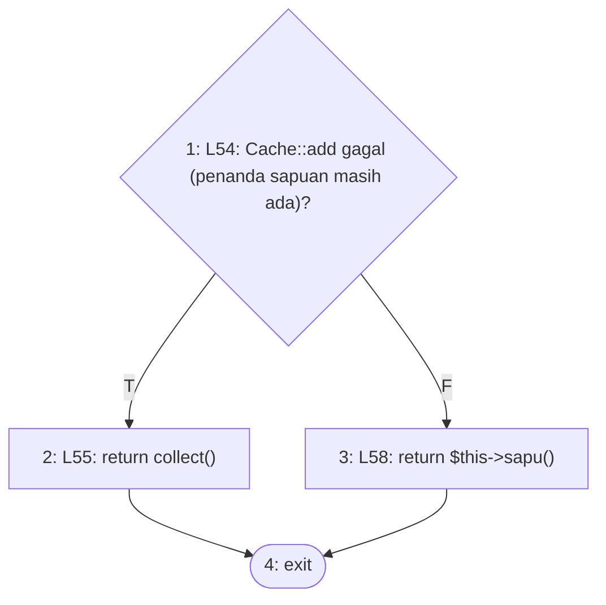

**2. Cyclomatic complexity**

- N = 4, E = 4, P = 1
- V(G) = E − N + 2P = 4 − 4 + 2 = **2**
- Predicate node: 1 (1 node); V(G) = 1 + 1 = **2**

**3. Matriks grafik**

| | 1 | 2 | 3 | 4 | Σ keluar − 1 |
|---|---|---|---|---|---|
| **1** |  | 1 | 1 |  | 1 |
| **2** |  |  |  | 1 | 0 |
| **3** |  |  |  | 1 | 0 |
| **4** |  |  |  |  | — |

Jumlah kolom terakhir = 1; V(G) = 1 + 1 = 2.

**4–5. Jalur independen dan kasus uji**

| No | Jalur | Kasus uji | Method tes | Awal | Akhir |
|---|---|---|---|---|---|
| J1 | 1–2–4 | Dipanggil lagi dalam jeda → tidak menyapu | `JalurBasisModul2Test::test_sapu_bila_perlu_dalam_jeda_tidak_menyapu` *(baru)* | tanpa-tes | lolos |
| J2 | 1–3–4 | Panggilan pertama → menyapu | `JalurBasisModul2Test::test_sapu_bila_perlu_dalam_jeda_tidak_menyapu` *(baru)* `ImporPenggunaTest::test_pengguna_biasa_tidak_terganggu` | lolos | lolos |

**6. Persentase jalur lolos:** J_awal = 1, J_akhir = 2; awal = 1/2 × 100% = 50.0%, akhir = 2/2 × 100% = 100.0%.

### 2.12 `KedaluwarsaService::sapu`

Berkas: `app/Services/KedaluwarsaService.php` baris 69–156. Dipilih karena: penandaan kedaluwarsa: pemeriksaan ulang dengan kunci baris, pelepasan kunci stok, riwayat, notifikasi yang tidak boleh menggagalkan sapuan.

Closure `map` (L78–155) adalah badan perulangan atas daftar kedaluwarsa, digambar sebaris dengan node 2 sebagai kepala perulangan; closure `DB::transaction` (L82–135) dijalankan sekali secara sinkron. `return` di dalam closure transaksi (node 8) keluar dari transaksi, bukan dari method. Exception di dalam transaksi hanya mungkin berasal dari pelepasan/pembaruan/pencatatan (node 9).

**1. Grafik alir — node**

| Node | Baris | Isi |
|---|---|---|
| 1 | L71–76 | ambil permintaan berjalan yang batasnya lewat |
| 2 | L78 | masih ada permintaan? (map) *(predicate)* |
| 3 | L80–87 | $diubah = false; mulai transaksi; kunci baris segar |
| 4 | L90 | ! $segar? *(predicate)* |
| 5 | L91 | status tidak lagi berjalan? *(predicate)* |
| 6 | L92 | hold_expired_at === null? *(predicate)* |
| 7 | L93 | batas belum lewat? *(predicate)* |
| 8 | L95 | return (keluar dari transaksi) |
| 9 | L98–132 | tahap, release, status kedaluwarsa, riwayat — melempar exception? *(predicate)* |
| 10 | L134 | $diubah = true |
| 11 | L139 | ! $diubah? *(predicate)* |
| 12 | L140 | return null |
| 13 | L146 | permintaanBerubah() melempar exception? *(predicate)* |
| 14 | L148 | report($e) |
| 15 | L151 | return berhasil |
| 16 | L152–153 | return gagal beserta pesan |
| 17 | L155 | filter()->values() (exit) |

**Edge** (asal → tujuan):

1→2, 2→3 (T), 2→17 (F), 3→4, 4→8 (T), 4→5 (F), 5→8 (T), 5→6 (F), 6→8 (T), 6→7 (F), 7→8 (T), 7→9 (F), 8→11, 9→16 (T), 9→10 (F), 10→11, 11→12 (T), 11→13 (F), 12→2, 13→14 (T), 13→15 (F), 14→15, 15→2, 16→2

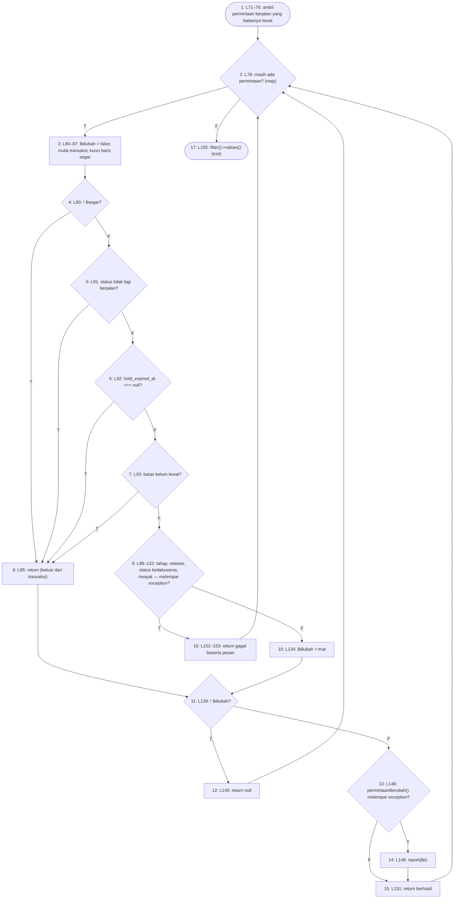

**2. Cyclomatic complexity**

- N = 17, E = 24, P = 1
- V(G) = E − N + 2P = 24 − 17 + 2 = **9**
- Predicate node: 2, 4, 5, 6, 7, 9, 11, 13 (8 node); V(G) = 8 + 1 = **9**

**3. Matriks grafik**

| | 1 | 2 | 3 | 4 | 5 | 6 | 7 | 8 | 9 | 10 | 11 | 12 | 13 | 14 | 15 | 16 | 17 | Σ keluar − 1 |
|---|---|---|---|---|---|---|---|---|---|---|---|---|---|---|---|---|---|---|
| **1** |  | 1 |  |  |  |  |  |  |  |  |  |  |  |  |  |  |  | 0 |
| **2** |  |  | 1 |  |  |  |  |  |  |  |  |  |  |  |  |  | 1 | 1 |
| **3** |  |  |  | 1 |  |  |  |  |  |  |  |  |  |  |  |  |  | 0 |
| **4** |  |  |  |  | 1 |  |  | 1 |  |  |  |  |  |  |  |  |  | 1 |
| **5** |  |  |  |  |  | 1 |  | 1 |  |  |  |  |  |  |  |  |  | 1 |
| **6** |  |  |  |  |  |  | 1 | 1 |  |  |  |  |  |  |  |  |  | 1 |
| **7** |  |  |  |  |  |  |  | 1 | 1 |  |  |  |  |  |  |  |  | 1 |
| **8** |  |  |  |  |  |  |  |  |  |  | 1 |  |  |  |  |  |  | 0 |
| **9** |  |  |  |  |  |  |  |  |  | 1 |  |  |  |  |  | 1 |  | 1 |
| **10** |  |  |  |  |  |  |  |  |  |  | 1 |  |  |  |  |  |  | 0 |
| **11** |  |  |  |  |  |  |  |  |  |  |  | 1 | 1 |  |  |  |  | 1 |
| **12** |  | 1 |  |  |  |  |  |  |  |  |  |  |  |  |  |  |  | 0 |
| **13** |  |  |  |  |  |  |  |  |  |  |  |  |  | 1 | 1 |  |  | 1 |
| **14** |  |  |  |  |  |  |  |  |  |  |  |  |  |  | 1 |  |  | 0 |
| **15** |  | 1 |  |  |  |  |  |  |  |  |  |  |  |  |  |  |  | 0 |
| **16** |  | 1 |  |  |  |  |  |  |  |  |  |  |  |  |  |  |  | 0 |
| **17** |  |  |  |  |  |  |  |  |  |  |  |  |  |  |  |  |  | — |

Jumlah kolom terakhir = 8; V(G) = 8 + 1 = 9.

**4–5. Jalur independen dan kasus uji**

| No | Jalur | Kasus uji | Method tes | Awal | Akhir |
|---|---|---|---|---|---|
| J1 | 1–2–17 | Tidak ada permintaan yang batasnya lewat | `PelepasanHoldKedaluwarsaTest::test_permintaan_yang_belum_lewat_batas_waktu_tidak_disentuh` | lolos | lolos |
| J2 | 1–2–3–4–8–11–12–2–17 | Baris terhapus sejak daftar dibaca | `JalurBasisModul2Test::test_sapu_melewati_permintaan_yang_terhapus_sejak_daftar_dibaca` *(baru)* | tanpa-tes | lolos |
| J3 | 1–2–3–4–5–8–11–12–2–17 | Status sudah ditangani pihak lain | `NotifikasiKedaluwarsaTest::test_permintaan_yang_sudah_ditangani_sejak_daftar_dibaca_dilewati` | lolos | lolos |
| J4 | 1–2–3–4–5–6–8–11–12–2–17 | Batas waktu sudah dikosongkan pihak lain | `JalurBasisModul2Test::test_sapu_melewati_permintaan_yang_batasnya_dikosongkan` *(baru)* | tanpa-tes | lolos |
| J5 | 1–2–3–4–5–6–7–8–11–12–2–17 | Batas waktu sudah diperpanjang pihak lain | `JalurBasisModul2Test::test_sapu_melewati_permintaan_yang_batasnya_diperpanjang` *(baru)* | tanpa-tes | lolos |
| J6 | 1–2–3–4–5–6–7–9–10–11–13–15–2–17 | Permintaan kedaluwarsa diproses dan diberitahukan | `PelepasanHoldKedaluwarsaTest::test_permintaan_yang_lewat_batas_waktu_dilepas_dan_ditandai_kedaluwarsa` | lolos | lolos |
| J7 | 1–2–3–4–5–6–7–9–10–11–13–14–15–2–17 | Notifikasi gagal → sapuan tetap berhasil | `NotifikasiKedaluwarsaTest::test_kegagalan_notifikasi_tidak_menggagalkan_sapuan` | lolos | lolos |
| J8 | 1–2–3–4–5–6–7–9–16–2–17 | Pelepasan kunci melempar exception → dilaporkan gagal, transaksi digulung | `JalurBasisModul2Test::test_sapu_melaporkan_kegagalan_transaksi` *(baru)* | tanpa-tes | lolos |
| J9 | 1–2–3–4–5–6–7–9–10–11–12–2–17 | $diubah true tetapi node 11 benar | — | mustahil | mustahil |

**6. Persentase jalur lolos:** J_awal = 4, J_akhir = 8; awal = 4/9 × 100% = 44.4%, akhir = 8/9 × 100% = 88.9%.

Jalur J9 mustahil dicapai: node 10 menetapkan `$diubah = true` tepat sebelum node 11, dan sesudah node 8 nilainya tetap `false` (L80); hasil node 11 sepenuhnya ditentukan oleh jalur yang ditempuh sebelumnya. Dimensi ke-9 ruang jalur hanya terbentuk dari kombinasi 10→11→12 atau 8→11→13, keduanya bertentangan.

### 2.13 `KedaluwarsaService::tahapTerakhir`

Berkas: `app/Services/KedaluwarsaService.php` baris 159–169. Dipilih karena: tahap yang dicatat pada riwayat permintaan kedaluwarsa (dibaca sebelum status berubah).

`match` enam lengan diurai menjadi lima perbandingan berurutan (predicate) dan lengan `default`.

**1. Grafik alir — node**

| Node | Baris | Isi |
|---|---|---|
| 1 | L162 | 'menunggu_ketua'? *(predicate)* |
| 2 | L162 | 'ketua_tim' |
| 3 | L163 | 'menunggu_verifikasi'? *(predicate)* |
| 4 | L163 | 'verifikasi' |
| 5 | L164 | 'menunggu_kasubbag'? *(predicate)* |
| 6 | L164 | 'kasubbag' |
| 7 | L165 | 'siap_diproses'? *(predicate)* |
| 8 | L165 | 'penyiapan' |
| 9 | L166 | 'siap_diambil'? *(predicate)* |
| 10 | L166 | 'konfirmasi' |
| 11 | L167 | default 'ketua_tim' |
| 12 | — | exit |

**Edge** (asal → tujuan):

1→2 (T), 1→3 (F), 2→12, 3→4 (T), 3→5 (F), 4→12, 5→6 (T), 5→7 (F), 6→12, 7→8 (T), 7→9 (F), 8→12, 9→10 (T), 9→11 (F), 10→12, 11→12

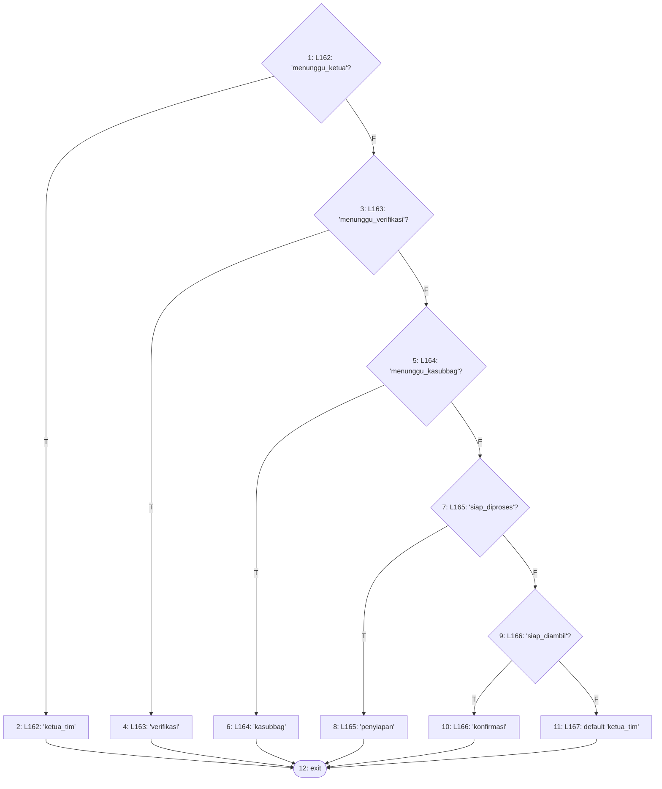

**2. Cyclomatic complexity**

- N = 12, E = 16, P = 1
- V(G) = E − N + 2P = 16 − 12 + 2 = **6**
- Predicate node: 1, 3, 5, 7, 9 (5 node); V(G) = 5 + 1 = **6**

**3. Matriks grafik**

| | 1 | 2 | 3 | 4 | 5 | 6 | 7 | 8 | 9 | 10 | 11 | 12 | Σ keluar − 1 |
|---|---|---|---|---|---|---|---|---|---|---|---|---|---|
| **1** |  | 1 | 1 |  |  |  |  |  |  |  |  |  | 1 |
| **2** |  |  |  |  |  |  |  |  |  |  |  | 1 | 0 |
| **3** |  |  |  | 1 | 1 |  |  |  |  |  |  |  | 1 |
| **4** |  |  |  |  |  |  |  |  |  |  |  | 1 | 0 |
| **5** |  |  |  |  |  | 1 | 1 |  |  |  |  |  | 1 |
| **6** |  |  |  |  |  |  |  |  |  |  |  | 1 | 0 |
| **7** |  |  |  |  |  |  |  | 1 | 1 |  |  |  | 1 |
| **8** |  |  |  |  |  |  |  |  |  |  |  | 1 | 0 |
| **9** |  |  |  |  |  |  |  |  |  | 1 | 1 |  | 1 |
| **10** |  |  |  |  |  |  |  |  |  |  |  | 1 | 0 |
| **11** |  |  |  |  |  |  |  |  |  |  |  | 1 | 0 |
| **12** |  |  |  |  |  |  |  |  |  |  |  |  | — |

Jumlah kolom terakhir = 5; V(G) = 5 + 1 = 6.

**4–5. Jalur independen dan kasus uji**

| No | Jalur | Kasus uji | Method tes | Awal | Akhir |
|---|---|---|---|---|---|
| J1 | 1–2–12 | menunggu_ketua | `PelepasanHoldKedaluwarsaTest::test_seluruh_tahap_berjalan_tercakup` | lolos | lolos |
| J2 | 1–3–4–12 | menunggu_verifikasi | `PelepasanHoldKedaluwarsaTest::test_seluruh_tahap_berjalan_tercakup` | lolos | lolos |
| J3 | 1–3–5–6–12 | menunggu_kasubbag | `PelepasanHoldKedaluwarsaTest::test_seluruh_tahap_berjalan_tercakup` | lolos | lolos |
| J4 | 1–3–5–7–8–12 | siap_diproses | `PelepasanHoldKedaluwarsaTest::test_seluruh_tahap_berjalan_tercakup` | lolos | lolos |
| J5 | 1–3–5–7–9–10–12 | siap_diambil | `PelepasanHoldKedaluwarsaTest::test_seluruh_tahap_berjalan_tercakup` | lolos | lolos |
| J6 | 1–3–5–7–9–11–12 | Status di luar tahap berjalan ('bermasalah') → default | `JalurBasisModul2Test::test_tahap_terakhir_status_lain_memakai_bawaan` *(baru)* | tanpa-tes | lolos |

**6. Persentase jalur lolos:** J_awal = 5, J_akhir = 6; awal = 5/6 × 100% = 83.3%, akhir = 6/6 × 100% = 100.0%.

## Catatan Increment 2

- `StokService::tanggalMutasiTerakhir()` (2.10) saat ini tidak dipanggil dari kode aplikasi mana pun: satu-satunya pemanggilnya, `StokMasuk::batasTanggal()`, tidak dirujuk di mana pun. Jalurnya diuji langsung.
- Tidak ada jalur yang gagal pada increment ini.
