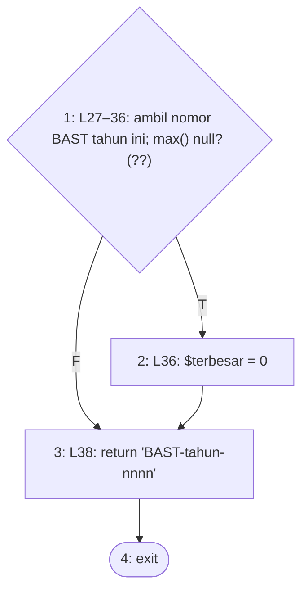
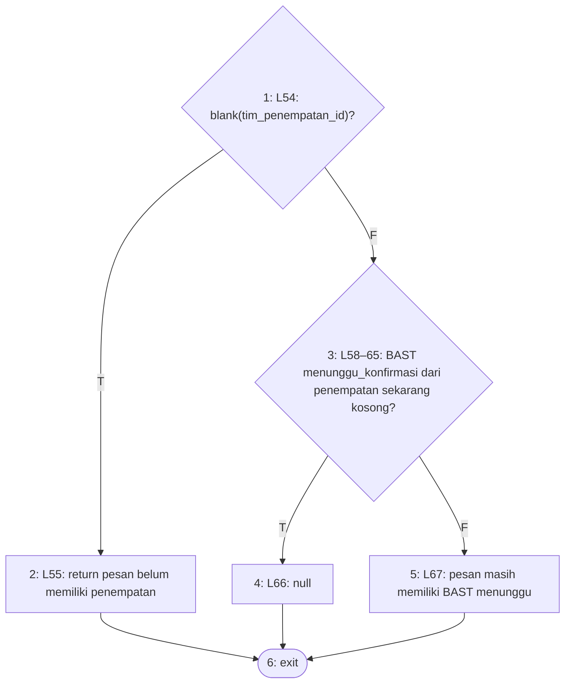
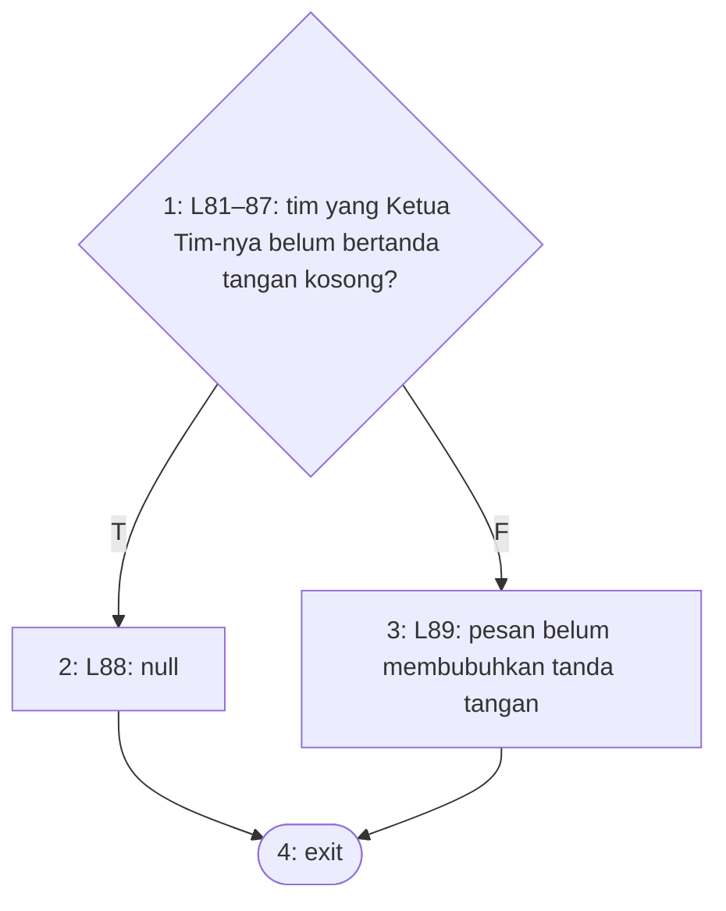
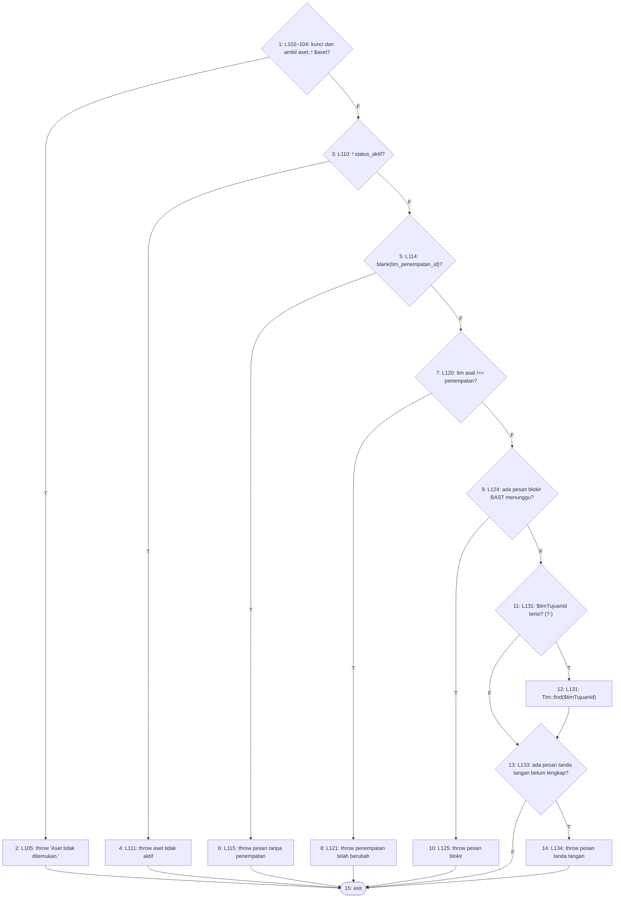
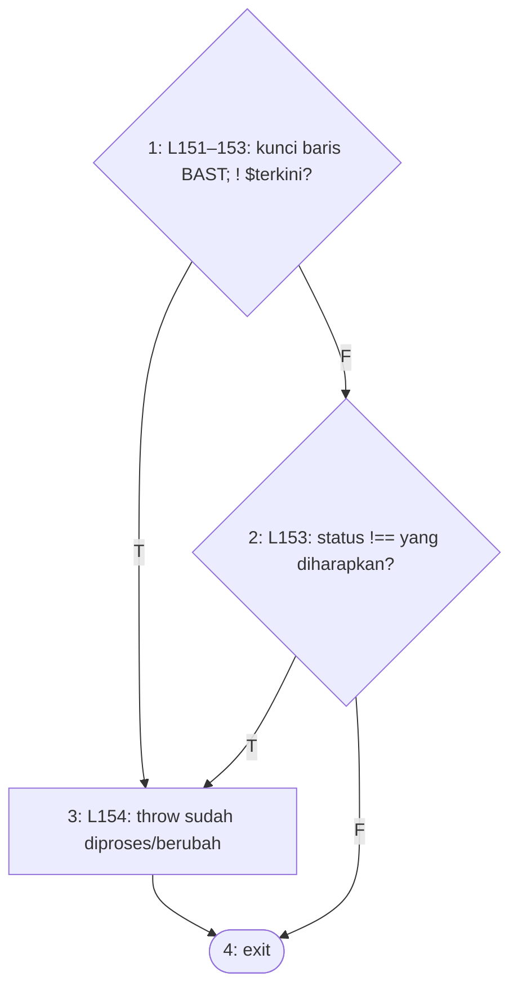
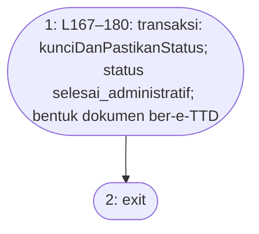
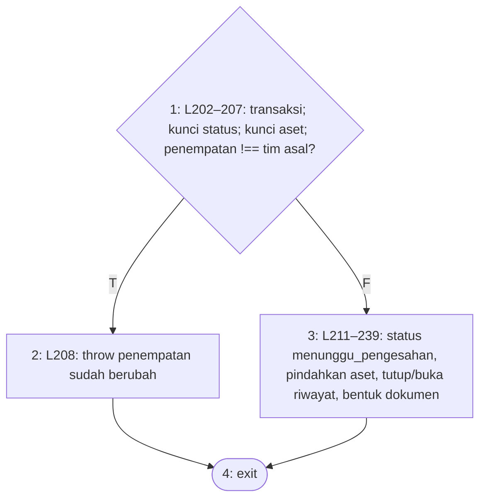
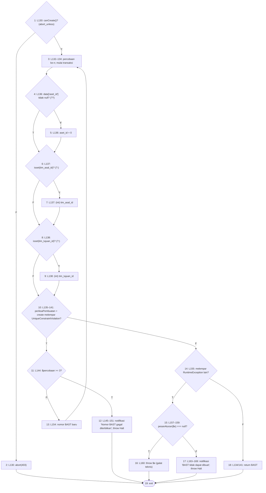
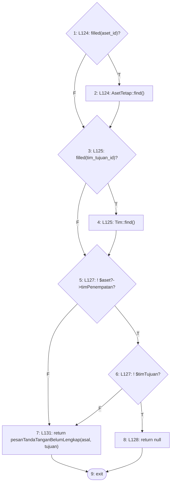
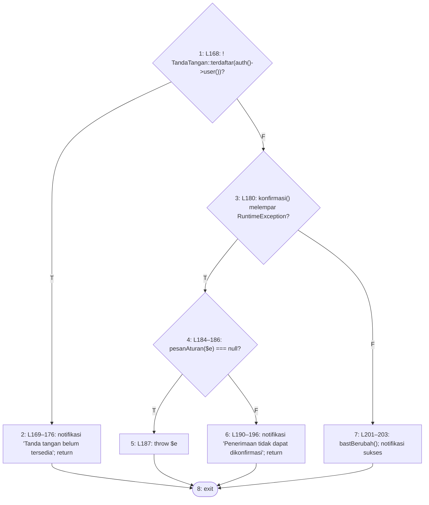

# White-Box Testing Increment 3 — Modul Mutasi Aset

**Versi sistem yang diuji:** commit `8449a47c625bd6e1b185bd43bef9eb6e30320349` (branch `main`, working tree bersih saat pengujian dimulai; satu-satunya tambahan adalah berkas tes baru di `tests/Feature/JalurBasisModul*Test.php`).

**Konvensi penyusunan grafik alir** (berlaku untuk keempat dokumen increment):

1. Satu node mewakili satu blok pernyataan berurutan atau satu kondisi. Setiap kondisi atomik pada ekspresi majemuk (`&&`, `||`) digambar sebagai predicate node tersendiri (Pressman).
2. Konstruksi yang dihitung sebagai predicate: `if`/`elseif`, kepala perulangan (`foreach`, `for` bersyarat, `map` yang menjadi badan perulangan), setiap lengan `match` kecuali `default` (diurai menjadi perbandingan berurutan), operator ternary `?:`, null-coalescing `??`, setiap `catch`, serta pembantu bersyarat Laravel `when()` dan `abort_unless()` yang setara dengan `if`. Operator nullsafe `?->` tidak dihitung.
3. Closure yang dijalankan tepat sekali secara sinkron (`DB::transaction`) digambar sebaris. Closure yang diteruskan ke operasi koleksi (`filter`, `reject`, `sum`, `mapWithKeys`) adalah fungsi terpisah dan digambar sebagai satu node proses. Closure yang dievaluasi Filament sebagai aturan (mis. `->rule()`, `->placeholder()`, `visible()` aksi) dianalisis sebagai unit tersendiri bila memuat percabangan.
4. `return`, `throw`, `halt()`/`throw new Halt`, dan `abort()` langsung menuju node exit. Exception yang tidak ditangkap method itu sendiri tidak digambar sebagai edge.
5. Setiap grafik memiliki satu entry dan satu exit, P = 1. V(G) dihitung dengan dua rumus, dan kedua hasil diperiksa sama secara otomatis. Matriks grafik menandai 1 pada sel (baris = asal, kolom = tujuan); kolom terakhir berisi (jumlah sambungan keluar − 1).
6. Jalur independen dipilih sebanyak V(G) dan diperiksa secara otomatis: setiap jalur adalah walk sah dari entry ke exit, seluruh edge tercakup, dan rank matriks jalur × edge sama dengan V(G) (saling bebas linear). Untuk method berperulangan, satu jalur = entry, satu putaran badan, exit. Tes yang menjalankan beberapa putaran dihitung mencakup jalur bila salah satu putarannya mengikuti urutan node badan jalur itu.
7. Jalur yang secara logika tidak dapat dicapai tetap dicantumkan sebagai bagian himpunan basis (karena dimensi ruang jalurnya hanya dapat dibentuk oleh jalur itu), ditandai **mustahil**, disertai alasannya, dan tidak dipaksa dengan tes.

**Cara status jalur ditentukan.** Setiap jalur dipetakan ke method tes yang isinya dibaca dan dipastikan melalui urutan keputusan jalur tersebut (bukan dari nama tesnya). Status dibaca otomatis dari berkas JUnit hasil eksekusi:
- **Awal** = run seluruh tes yang sudah ada sebelum tes baru ditulis (SQLite: 742 tes; MySQL: run `awal-mysql`).
- **Akhir** = run Increment 4 (seluruh 83 berkas, termasuk tes baru) pada driver yang sama.
- `lolos` = semua method tes pemeta lolos; `tanpa-tes` = belum ada tes yang menjalankan jalur itu; `gagal` = tes pemeta dijalankan dan gagal; `mustahil` = jalur tak terjangkau.
- J_awal dan J_akhir = banyaknya jalur berstatus `lolos`. Persentase = J / V(G) × 100%.

**Unit yang diuji (Tabel 3.2):** MutasiAsetService (pembuatan, konfirmasi penerimaan, pengesahan, pemeriksaan status) dan halaman Mutasi Aset (akses Buat BAST, penjaga tanda tangan).

**Method yang tidak dipilih dan alasannya**

| Kelas | Method / closure | Alasan |
|---|---|---|
| BastMutasiAsetResource | `canCreate()`, `canAccess()` | Satu ekspresi tanpa percabangan; `canCreate()` diuji lewat node 1 pada 3.8. |
| BastMutasiAsetResource | `getEloquentQuery()` | Pembatasan daftar BAST per tim, bukan pembuatan/pengesahan/penjaga tanda tangan. |
| ListBastMutasiAsets | closure `mutateFormDataUsing` (L63–82) | Pengisian otomatis nomor, status awal, dan nama pihak penyerah/penerima; bukan aturan akses atau penjaga. |
| BastMutasiAsetForm | closure `afterStateUpdated` dan `rule` kolom aset (L47–68) | Lapis UX yang meneruskan keputusan ke `pesanAsetTidakDapatDimutasi()` (3.2); aturannya diuji di 3.2 dan 3.4. |
| BastMutasiAsetsTable | aksi Sahkan (L103–129) | Tidak tercantum pada Tabel 3.2 untuk halaman ini; penolakan pengesahan ditegakkan `kunciDanPastikanStatus()` (3.5). |

## Ringkasan

| ID | Method | V(G) | J_awal | % awal | J_akhir | % akhir | Mustahil | Belum lolos |
|---|---|---|---|---|---|---|---|---|
| 3.1 | `MutasiAsetService::nomorBaru` | 2 | 2 | 100.0% | 2 | 100.0% | 0 | — |
| 3.2 | `MutasiAsetService::pesanAsetTidakDapatDimutasi` | 3 | 3 | 100.0% | 3 | 100.0% | 0 | — |
| 3.3 | `MutasiAsetService::pesanTandaTanganBelumLengkap` | 2 | 2 | 100.0% | 2 | 100.0% | 0 | — |
| 3.4 | `MutasiAsetService::periksaPembuatan` | 8 | 6 | 75.0% | 8 | 100.0% | 0 | — |
| 3.5 | `MutasiAsetService::kunciDanPastikanStatus` | 3 | 2 | 66.7% | 3 | 100.0% | 0 | — |
| 3.6 | `MutasiAsetService::sahkan` | 1 | 1 | 100.0% | 1 | 100.0% | 0 | — |
| 3.7 | `MutasiAsetService::konfirmasi` | 2 | 2 | 100.0% | 2 | 100.0% | 0 | — |
| 3.8 | `ListBastMutasiAsets::handleCreation` | 9 | 5 | 55.6% | 9 | 100.0% | 0 | — |
| 3.9 | `BastMutasiAsetForm::pesanTandaTangan` | 5 | 4 | 80.0% | 5 | 100.0% | 0 | — |
| 3.10 | `BastMutasiAsetsTable::configure › aksi Konfirmasi Penerimaan` | 4 | 2 | 50.0% | 4 | 100.0% | 0 | — |
| **Jumlah** | 10 method | **39** | **29** | 74.4% | **39** | 100.0% | 0 | |

⚠ = V(G) > 10, batas yang disarankan McCabe (1976).

## Rincian per method

### 3.1 `MutasiAsetService::nomorBaru`

Berkas: `app/Services/MutasiAsetService.php` baris 25–39. Dipilih karena: penomoran BAST per tahun dari nomor terbesar (bukan jumlah baris), bagian dari pembuatan BAST.

Closure `map` (L35) adalah fungsi terpisah tanpa percabangan dan digambar sebagai bagian node 1.

**1. Grafik alir — node**

| Node | Baris | Isi |
|---|---|---|
| 1 | L27–36 | ambil nomor BAST tahun ini; max() null? (??) *(predicate)* |
| 2 | L36 | $terbesar = 0 |
| 3 | L38 | return 'BAST-tahun-nnnn' |
| 4 | — | exit |

**Edge** (asal → tujuan):

1→2 (T), 1→3 (F), 2→3, 3→4

**2. Cyclomatic complexity**

- N = 4, E = 4, P = 1
- V(G) = E − N + 2P = 4 − 4 + 2 = **2**
- Predicate node: 1 (1 node); V(G) = 1 + 1 = **2**

**3. Matriks grafik**

| | 1 | 2 | 3 | 4 | Σ keluar − 1 |
|---|---|---|---|---|---|
| **1** |  | 1 | 1 |  | 1 |
| **2** |  |  | 1 |  | 0 |
| **3** |  |  |  | 1 | 0 |
| **4** |  |  |  |  | — |

Jumlah kolom terakhir = 1; V(G) = 1 + 1 = 2.

**4–5. Jalur independen dan kasus uji**

| No | Jalur | Kasus uji | Method tes | Awal | Akhir |
|---|---|---|---|---|---|
| J1 | 1–2–3–4 | Belum ada BAST tahun ini → 0001 | `PenomoranBastTest::test_nomor_pertama_tahun_ini_adalah_0001` | lolos | lolos |
| J2 | 1–3–4 | Sudah ada BAST (bercelah) → terbesar + 1 | `PenomoranBastTest::test_celah_nomor_tidak_menyebabkan_bentrok` | lolos | lolos |

**6. Persentase jalur lolos:** J_awal = 2, J_akhir = 2; awal = 2/2 × 100% = 100.0%, akhir = 2/2 × 100% = 100.0%.

### 3.2 `MutasiAsetService::pesanAsetTidakDapatDimutasi`

Berkas: `app/Services/MutasiAsetService.php` baris 52–68. Dipilih karena: aturan A-011: aset tanpa penempatan dan aset yang masih punya BAST menunggu konfirmasi tidak dapat dimutasi.

**1. Grafik alir — node**

| Node | Baris | Isi |
|---|---|---|
| 1 | L54 | blank(tim_penempatan_id)? *(predicate)* |
| 2 | L55 | return pesan belum memiliki penempatan |
| 3 | L58–65 | BAST menunggu_konfirmasi dari penempatan sekarang kosong? *(predicate)* |
| 4 | L66 | null |
| 5 | L67 | pesan masih memiliki BAST menunggu |
| 6 | — | exit |

**Edge** (asal → tujuan):

1→2 (T), 1→3 (F), 2→6, 3→4 (T), 3→5 (F), 4→6, 5→6

**2. Cyclomatic complexity**

- N = 6, E = 7, P = 1
- V(G) = E − N + 2P = 7 − 6 + 2 = **3**
- Predicate node: 1, 3 (2 node); V(G) = 2 + 1 = **3**

**3. Matriks grafik**

| | 1 | 2 | 3 | 4 | 5 | 6 | Σ keluar − 1 |
|---|---|---|---|---|---|---|---|
| **1** |  | 1 | 1 |  |  |  | 1 |
| **2** |  |  |  |  |  | 1 | 0 |
| **3** |  |  |  | 1 | 1 |  | 1 |
| **4** |  |  |  |  |  | 1 | 0 |
| **5** |  |  |  |  |  | 1 | 0 |
| **6** |  |  |  |  |  |  | — |

Jumlah kolom terakhir = 2; V(G) = 2 + 1 = 3.

**4–5. Jalur independen dan kasus uji**

| No | Jalur | Kasus uji | Method tes | Awal | Akhir |
|---|---|---|---|---|---|
| J1 | 1–2–6 | Aset tanpa penempatan | `MutasiAsetPenempatanTest::test_server_menolak_aset_tanpa_penempatan_tanpa_bergantung_pada_form` | lolos | lolos |
| J2 | 1–3–4–6 | BAST terdahulu sudah dikonfirmasi/tuntas → boleh | `MutasiAsetPenempatanTest::test_bast_yang_sudah_dikonfirmasi_atau_tuntas_tidak_memblokir` | lolos | lolos |
| J3 | 1–3–5–6 | Masih ada BAST menunggu konfirmasi → diblokir | `MutasiAsetPenempatanTest::test_server_memblokir_bast_kedua_tanpa_bergantung_pada_form` | lolos | lolos |

**6. Persentase jalur lolos:** J_awal = 3, J_akhir = 3; awal = 3/3 × 100% = 100.0%, akhir = 3/3 × 100% = 100.0%.

### 3.3 `MutasiAsetService::pesanTandaTanganBelumLengkap`

Berkas: `app/Services/MutasiAsetService.php` baris 79–90. Dipilih karena: penjaga tanda tangan (E): Ketua Tim asal dan tujuan wajib sudah bertanda tangan.

Closure `reject` (L84) memanggil `TandaTangan::terdaftar()` tanpa percabangan dan digambar dalam node 1.

**1. Grafik alir — node**

| Node | Baris | Isi |
|---|---|---|
| 1 | L81–87 | tim yang Ketua Tim-nya belum bertanda tangan kosong? *(predicate)* |
| 2 | L88 | null |
| 3 | L89 | pesan belum membubuhkan tanda tangan |
| 4 | — | exit |

**Edge** (asal → tujuan):

1→2 (T), 1→3 (F), 2→4, 3→4

**2. Cyclomatic complexity**

- N = 4, E = 4, P = 1
- V(G) = E − N + 2P = 4 − 4 + 2 = **2**
- Predicate node: 1 (1 node); V(G) = 1 + 1 = **2**

**3. Matriks grafik**

| | 1 | 2 | 3 | 4 | Σ keluar − 1 |
|---|---|---|---|---|---|
| **1** |  | 1 | 1 |  | 1 |
| **2** |  |  |  | 1 | 0 |
| **3** |  |  |  | 1 | 0 |
| **4** |  |  |  |  | — |

Jumlah kolom terakhir = 1; V(G) = 1 + 1 = 2.

**4–5. Jalur independen dan kasus uji**

| No | Jalur | Kasus uji | Method tes | Awal | Akhir |
|---|---|---|---|---|---|
| J1 | 1–2–4 | Kedua Ketua Tim sudah bertanda tangan | `PopUpBastTanpaKetikNipTest::test_server_mengizinkan_pembuatan_bila_kedua_ketua_tim_sudah_bertanda_tangan` | lolos | lolos |
| J2 | 1–3–4 | Ketua Tim tujuan belum bertanda tangan | `PopUpBastTanpaKetikNipTest::test_server_menolak_pembuatan_bila_ketua_tim_tujuan_belum_bertanda_tangan` | lolos | lolos |

**6. Persentase jalur lolos:** J_awal = 2, J_akhir = 2; awal = 2/2 × 100% = 100.0%, akhir = 2/2 × 100% = 100.0%.

### 3.4 `MutasiAsetService::periksaPembuatan`

Berkas: `app/Services/MutasiAsetService.php` baris 100–136. Dipilih karena: pemeriksaan server sebelum BAST dibuat (A-011, F-006, E): aset ada, aktif, bertempat, tim asal cocok, tidak terblokir, tanda tangan lengkap.

**1. Grafik alir — node**

| Node | Baris | Isi |
|---|---|---|
| 1 | L102–104 | kunci dan ambil aset; ! $aset? *(predicate)* |
| 2 | L105 | throw 'Aset tidak ditemukan.' |
| 3 | L110 | ! status_aktif? *(predicate)* |
| 4 | L111 | throw aset tidak aktif |
| 5 | L114 | blank(tim_penempatan_id)? *(predicate)* |
| 6 | L115 | throw pesan tanpa penempatan |
| 7 | L120 | tim asal !== penempatan? *(predicate)* |
| 8 | L121 | throw penempatan telah berubah |
| 9 | L124 | ada pesan blokir BAST menunggu? *(predicate)* |
| 10 | L125 | throw pesan blokir |
| 11 | L131 | $timTujuanId terisi? (?:) *(predicate)* |
| 12 | L131 | Tim::find($timTujuanId) |
| 13 | L133 | ada pesan tanda tangan belum lengkap? *(predicate)* |
| 14 | L134 | throw pesan tanda tangan |
| 15 | — | exit |

**Edge** (asal → tujuan):

1→2 (T), 1→3 (F), 2→15, 3→4 (T), 3→5 (F), 4→15, 5→6 (T), 5→7 (F), 6→15, 7→8 (T), 7→9 (F), 8→15, 9→10 (T), 9→11 (F), 10→15, 11→12 (T), 11→13 (F), 12→13, 13→14 (T), 13→15 (F), 14→15

**2. Cyclomatic complexity**

- N = 15, E = 21, P = 1
- V(G) = E − N + 2P = 21 − 15 + 2 = **8**
- Predicate node: 1, 3, 5, 7, 9, 11, 13 (7 node); V(G) = 7 + 1 = **8**

**3. Matriks grafik**

| | 1 | 2 | 3 | 4 | 5 | 6 | 7 | 8 | 9 | 10 | 11 | 12 | 13 | 14 | 15 | Σ keluar − 1 |
|---|---|---|---|---|---|---|---|---|---|---|---|---|---|---|---|---|
| **1** |  | 1 | 1 |  |  |  |  |  |  |  |  |  |  |  |  | 1 |
| **2** |  |  |  |  |  |  |  |  |  |  |  |  |  |  | 1 | 0 |
| **3** |  |  |  | 1 | 1 |  |  |  |  |  |  |  |  |  |  | 1 |
| **4** |  |  |  |  |  |  |  |  |  |  |  |  |  |  | 1 | 0 |
| **5** |  |  |  |  |  | 1 | 1 |  |  |  |  |  |  |  |  | 1 |
| **6** |  |  |  |  |  |  |  |  |  |  |  |  |  |  | 1 | 0 |
| **7** |  |  |  |  |  |  |  | 1 | 1 |  |  |  |  |  |  | 1 |
| **8** |  |  |  |  |  |  |  |  |  |  |  |  |  |  | 1 | 0 |
| **9** |  |  |  |  |  |  |  |  |  | 1 | 1 |  |  |  |  | 1 |
| **10** |  |  |  |  |  |  |  |  |  |  |  |  |  |  | 1 | 0 |
| **11** |  |  |  |  |  |  |  |  |  |  |  | 1 | 1 |  |  | 1 |
| **12** |  |  |  |  |  |  |  |  |  |  |  |  | 1 |  |  | 0 |
| **13** |  |  |  |  |  |  |  |  |  |  |  |  |  | 1 | 1 | 1 |
| **14** |  |  |  |  |  |  |  |  |  |  |  |  |  |  | 1 | 0 |
| **15** |  |  |  |  |  |  |  |  |  |  |  |  |  |  |  | — |

Jumlah kolom terakhir = 7; V(G) = 7 + 1 = 8.

**4–5. Jalur independen dan kasus uji**

| No | Jalur | Kasus uji | Method tes | Awal | Akhir |
|---|---|---|---|---|---|
| J1 | 1–2–15 | ID aset tidak ada | `JalurBasisModul3Test::test_periksa_pembuatan_aset_tidak_ditemukan` *(baru)* | tanpa-tes | lolos |
| J2 | 1–3–4–15 | Aset nonaktif | `StatusBastDanAsetAktifTest::test_pembuatan_bast_untuk_aset_nonaktif_ditolak_di_server` | lolos | lolos |
| J3 | 1–3–5–6–15 | Aset tanpa penempatan | `MutasiAsetPenempatanTest::test_server_menolak_aset_tanpa_penempatan_tanpa_bergantung_pada_form` | lolos | lolos |
| J4 | 1–3–5–7–8–15 | Muatan tim asal berbeda dari penempatan | `MutasiAsetPenempatanTest::test_muatan_dengan_tim_asal_berbeda_ditolak_dan_tidak_membentuk_bast` | lolos | lolos |
| J5 | 1–3–5–7–9–10–15 | Aset masih punya BAST menunggu konfirmasi | `MutasiAsetPenempatanTest::test_server_memblokir_bast_kedua_tanpa_bergantung_pada_form` | lolos | lolos |
| J6 | 1–3–5–7–9–11–12–13–15 | Semua syarat terpenuhi | `PopUpBastTanpaKetikNipTest::test_server_mengizinkan_pembuatan_bila_kedua_ketua_tim_sudah_bertanda_tangan` | lolos | lolos |
| J7 | 1–3–5–7–9–11–12–13–14–15 | Ketua Tim tujuan belum bertanda tangan | `PopUpBastTanpaKetikNipTest::test_server_menolak_pembuatan_bila_ketua_tim_tujuan_belum_bertanda_tangan` | lolos | lolos |
| J8 | 1–3–5–7–9–11–13–15 | Tim tujuan tidak dikirim (null) → hanya tanda tangan asal diperiksa | `JalurBasisModul3Test::test_periksa_pembuatan_tanpa_tim_tujuan_hanya_memeriksa_tim_asal` *(baru)* | tanpa-tes | lolos |

**6. Persentase jalur lolos:** J_awal = 6, J_akhir = 8; awal = 6/8 × 100% = 75.0%, akhir = 8/8 × 100% = 100.0%.

### 3.5 `MutasiAsetService::kunciDanPastikanStatus`

Berkas: `app/Services/MutasiAsetService.php` baris 149–156. Dipilih karena: pemeriksaan status BAST dari baris terkunci (F-006) untuk konfirmasi dan pengesahan: panggilan ganda dan halaman usang ditolak.

**1. Grafik alir — node**

| Node | Baris | Isi |
|---|---|---|
| 1 | L151–153 | kunci baris BAST; ! $terkini? *(predicate)* |
| 2 | L153 | status !== yang diharapkan? *(predicate)* |
| 3 | L154 | throw sudah diproses/berubah |
| 4 | — | exit |

**Edge** (asal → tujuan):

1→3 (T), 1→2 (F), 2→3 (T), 2→4 (F), 3→4

**2. Cyclomatic complexity**

- N = 4, E = 5, P = 1
- V(G) = E − N + 2P = 5 − 4 + 2 = **3**
- Predicate node: 1, 2 (2 node); V(G) = 2 + 1 = **3**

**3. Matriks grafik**

| | 1 | 2 | 3 | 4 | Σ keluar − 1 |
|---|---|---|---|---|---|
| **1** |  | 1 | 1 |  | 1 |
| **2** |  |  | 1 | 1 | 1 |
| **3** |  |  |  | 1 | 0 |
| **4** |  |  |  |  | — |

Jumlah kolom terakhir = 2; V(G) = 2 + 1 = 3.

**4–5. Jalur independen dan kasus uji**

| No | Jalur | Kasus uji | Method tes | Awal | Akhir |
|---|---|---|---|---|---|
| J1 | 1–3–4 | Baris BAST sudah tidak ada | `JalurBasisModul3Test::test_sahkan_bast_yang_barisnya_hilang_ditolak` *(baru)* | tanpa-tes | lolos |
| J2 | 1–2–3–4 | Status bukan yang diharapkan (sahkan saat menunggu konfirmasi) | `StatusBastDanAsetAktifTest::test_sahkan_pada_status_selain_menunggu_pengesahan_ditolak` | lolos | lolos |
| J3 | 1–2–4 | Status sesuai | `StatusBastDanAsetAktifTest::test_alur_normal_konfirmasi_lalu_sahkan_tetap_berhasil` | lolos | lolos |

**6. Persentase jalur lolos:** J_awal = 2, J_akhir = 3; awal = 2/3 × 100% = 66.7%, akhir = 3/3 × 100% = 100.0%.

### 3.6 `MutasiAsetService::sahkan`

Berkas: `app/Services/MutasiAsetService.php` baris 165–181. Dipilih karena: pengesahan Kasubbag (UC-17), langkah terakhir; disertakan karena disebut eksplisit pada Tabel 3.2 walaupun tanpa percabangan — seluruh penolakannya berada di kunciDanPastikanStatus (3.5).

**1. Grafik alir — node**

| Node | Baris | Isi |
|---|---|---|
| 1 | L167–180 | transaksi: kunciDanPastikanStatus; status selesai_administratif; bentuk dokumen ber-e-TTD |
| 2 | — | exit |

**Edge** (asal → tujuan):

1→2

**2. Cyclomatic complexity**

- N = 2, E = 1, P = 1
- V(G) = E − N + 2P = 1 − 2 + 2 = **1**
- Predicate node: — (0 node); V(G) = 0 + 1 = **1**

**3. Matriks grafik**

| | 1 | 2 | Σ keluar − 1 |
|---|---|---|---|
| **1** |  | 1 | 0 |
| **2** |  |  | — |

Jumlah kolom terakhir = 0; V(G) = 0 + 1 = 1.

**4–5. Jalur independen dan kasus uji**

| No | Jalur | Kasus uji | Method tes | Awal | Akhir |
|---|---|---|---|---|---|
| J1 | 1–2 | BAST menunggu pengesahan disahkan | `StatusBastDanAsetAktifTest::test_alur_normal_konfirmasi_lalu_sahkan_tetap_berhasil` | lolos | lolos |

**6. Persentase jalur lolos:** J_awal = 1, J_akhir = 1; awal = 1/1 × 100% = 100.0%, akhir = 1/1 × 100% = 100.0%.

### 3.7 `MutasiAsetService::konfirmasi`

Berkas: `app/Services/MutasiAsetService.php` baris 200–241. Dipilih karena: konfirmasi penerimaan Ketua Tim tujuan (UC-18): aset berpindah hanya bila penempatannya masih sama dengan tim asal BAST.

**1. Grafik alir — node**

| Node | Baris | Isi |
|---|---|---|
| 1 | L202–207 | transaksi; kunci status; kunci aset; penempatan !== tim asal? *(predicate)* |
| 2 | L208 | throw penempatan sudah berubah |
| 3 | L211–239 | status menunggu_pengesahan, pindahkan aset, tutup/buka riwayat, bentuk dokumen |
| 4 | — | exit |

**Edge** (asal → tujuan):

1→2 (T), 1→3 (F), 2→4, 3→4

**2. Cyclomatic complexity**

- N = 4, E = 4, P = 1
- V(G) = E − N + 2P = 4 − 4 + 2 = **2**
- Predicate node: 1 (1 node); V(G) = 1 + 1 = **2**

**3. Matriks grafik**

| | 1 | 2 | 3 | 4 | Σ keluar − 1 |
|---|---|---|---|---|---|
| **1** |  | 1 | 1 |  | 1 |
| **2** |  |  |  | 1 | 0 |
| **3** |  |  |  | 1 | 0 |
| **4** |  |  |  |  | — |

Jumlah kolom terakhir = 1; V(G) = 1 + 1 = 2.

**4–5. Jalur independen dan kasus uji**

| No | Jalur | Kasus uji | Method tes | Awal | Akhir |
|---|---|---|---|---|---|
| J1 | 1–2–4 | Penempatan berubah sejak BAST dibuat | `MutasiAsetPenempatanTest::test_konfirmasi_di_layanan_melempar_pesan_bisnis_sebelum_menulis_apa_pun` | lolos | lolos |
| J2 | 1–3–4 | Konfirmasi normal | `MutasiAsetPenempatanTest::test_konfirmasi_normal_tetap_berhasil` | lolos | lolos |

**6. Persentase jalur lolos:** J_awal = 2, J_akhir = 2; awal = 2/2 × 100% = 100.0%, akhir = 2/2 × 100% = 100.0%.

### 3.8 `ListBastMutasiAsets::handleCreation`

Berkas: `app/Filament/Resources/BastMutasiAsets/Pages/ListBastMutasiAsets.php` baris 122–172. Dipilih karena: akses Buat BAST (hanya Petugas Gudang, ditegakkan di server) dan penanganan penolakan periksaPembuatan / bentrok nomor.

`abort_unless()` dihitung sebagai predicate karena setara `if (! …) abort()`. Blok `try` dengan dua `catch` diurai menjadi dua predicate berurutan (node 10 dan 14); exception selain RuntimeException tidak ditangkap dan tidak dimodelkan. `for (;;)` tidak memiliki kondisi, sehingga kepala perulangannya (node 3) bukan predicate; perulangan hanya berulang lewat node 13.

**1. Grafik alir — node**

| Node | Baris | Isi |
|---|---|---|
| 1 | L130 | canCreate()? (abort_unless) *(predicate)* |
| 2 | L130 | abort(403) |
| 3 | L132–134 | percobaan ke-n; mulai transaksi |
| 4 | L136 | data['aset_id'] tidak null? (??) *(predicate)* |
| 5 | L136 | aset_id = 0 |
| 6 | L137 | isset(tim_asal_id)? (?:) *(predicate)* |
| 7 | L137 | (int) tim_asal_id |
| 8 | L138 | isset(tim_tujuan_id)? (?:) *(predicate)* |
| 9 | L138 | (int) tim_tujuan_id |
| 10 | L135–141 | periksaPembuatan + create melempar UniqueConstraintViolation? *(predicate)* |
| 11 | L144 | $percobaan >= 3? *(predicate)* |
| 12 | L145–151 | notifikasi 'Nomor BAST gagal diterbitkan'; throw Halt |
| 13 | L154 | nomor BAST baru |
| 14 | L155 | melempar RuntimeException lain? *(predicate)* |
| 15 | L157–159 | pesanAturan($e) === null? *(predicate)* |
| 16 | L160 | throw $e (galat teknis) |
| 17 | L163–169 | notifikasi 'BAST tidak dapat dibuat'; throw Halt |
| 18 | L134/141 | return BAST |
| 19 | — | exit |

**Edge** (asal → tujuan):

1→3 (T), 1→2 (F), 2→19, 3→4, 4→6 (T), 4→5 (F), 5→6, 6→7 (T), 6→8 (F), 7→8, 8→9 (T), 8→10 (F), 9→10, 10→11 (T), 10→14 (F), 11→12 (T), 11→13 (F), 12→19, 13→3, 14→15 (T), 14→18 (F), 15→16 (T), 15→17 (F), 16→19, 17→19, 18→19

**2. Cyclomatic complexity**

- N = 19, E = 26, P = 1
- V(G) = E − N + 2P = 26 − 19 + 2 = **9**
- Predicate node: 1, 4, 6, 8, 10, 11, 14, 15 (8 node); V(G) = 8 + 1 = **9**

**3. Matriks grafik**

| | 1 | 2 | 3 | 4 | 5 | 6 | 7 | 8 | 9 | 10 | 11 | 12 | 13 | 14 | 15 | 16 | 17 | 18 | 19 | Σ keluar − 1 |
|---|---|---|---|---|---|---|---|---|---|---|---|---|---|---|---|---|---|---|---|---|
| **1** |  | 1 | 1 |  |  |  |  |  |  |  |  |  |  |  |  |  |  |  |  | 1 |
| **2** |  |  |  |  |  |  |  |  |  |  |  |  |  |  |  |  |  |  | 1 | 0 |
| **3** |  |  |  | 1 |  |  |  |  |  |  |  |  |  |  |  |  |  |  |  | 0 |
| **4** |  |  |  |  | 1 | 1 |  |  |  |  |  |  |  |  |  |  |  |  |  | 1 |
| **5** |  |  |  |  |  | 1 |  |  |  |  |  |  |  |  |  |  |  |  |  | 0 |
| **6** |  |  |  |  |  |  | 1 | 1 |  |  |  |  |  |  |  |  |  |  |  | 1 |
| **7** |  |  |  |  |  |  |  | 1 |  |  |  |  |  |  |  |  |  |  |  | 0 |
| **8** |  |  |  |  |  |  |  |  | 1 | 1 |  |  |  |  |  |  |  |  |  | 1 |
| **9** |  |  |  |  |  |  |  |  |  | 1 |  |  |  |  |  |  |  |  |  | 0 |
| **10** |  |  |  |  |  |  |  |  |  |  | 1 |  |  | 1 |  |  |  |  |  | 1 |
| **11** |  |  |  |  |  |  |  |  |  |  |  | 1 | 1 |  |  |  |  |  |  | 1 |
| **12** |  |  |  |  |  |  |  |  |  |  |  |  |  |  |  |  |  |  | 1 | 0 |
| **13** |  |  | 1 |  |  |  |  |  |  |  |  |  |  |  |  |  |  |  |  | 0 |
| **14** |  |  |  |  |  |  |  |  |  |  |  |  |  |  | 1 |  |  | 1 |  | 1 |
| **15** |  |  |  |  |  |  |  |  |  |  |  |  |  |  |  | 1 | 1 |  |  | 1 |
| **16** |  |  |  |  |  |  |  |  |  |  |  |  |  |  |  |  |  |  | 1 | 0 |
| **17** |  |  |  |  |  |  |  |  |  |  |  |  |  |  |  |  |  |  | 1 | 0 |
| **18** |  |  |  |  |  |  |  |  |  |  |  |  |  |  |  |  |  |  | 1 | 0 |
| **19** |  |  |  |  |  |  |  |  |  |  |  |  |  |  |  |  |  |  |  | — |

Jumlah kolom terakhir = 8; V(G) = 8 + 1 = 9.

**4–5. Jalur independen dan kasus uji**

| No | Jalur | Kasus uji | Method tes | Awal | Akhir |
|---|---|---|---|---|---|
| J1 | 1–2–19 | Pelaku bukan Petugas Gudang (Ketua Tim) → 403 | `AksesBuatBastTest::test_service_level_menolak_terlepas_dari_muatan_form` | lolos | lolos |
| J2 | 1–3–4–6–7–8–9–10–14–18–19 | Pembuatan normal | `MutasiAsetPenempatanTest::test_pembuatan_normal_menyimpan_asal_dari_penempatan_aset` | lolos | lolos |
| J3 | 1–3–4–6–7–8–9–10–11–13–3–4–6–7–8–9–10–14–18–19 | Nomor bentrok sekali → diulang dengan nomor berikutnya | `PenomoranBastTest::test_bentrok_sekali_diulang_dengan_nomor_berikutnya` | lolos | lolos |
| J4 | 1–3–4–6–7–8–9–10–11–13–3–4–6–7–8–9–10–11–13–3–4–6–7–8–9–10–11–12–19 | Nomor bentrok tiga kali → berhenti dengan pesan umum | `PenomoranBastTest::test_bentrok_berulang_berhenti_setelah_tiga_kali_dengan_pesan_umum` | lolos | lolos |
| J5 | 1–3–4–6–7–8–9–10–14–15–17–19 | Penolakan aturan (tim asal berbeda) → notifikasi | `MutasiAsetPenempatanTest::test_muatan_dengan_tim_asal_berbeda_ditolak_dan_tidak_membentuk_bast` | lolos | lolos |
| J6 | 1–3–4–6–7–8–10–14–15–16–19 | Tanpa tim_tujuan_id → galat NOT NULL basis data dilempar ulang | `JalurBasisModul3Test::test_buat_bast_tanpa_tim_tujuan_melempar_galat_teknis` *(baru)* | tanpa-tes | lolos |
| J7 | 1–3–4–5–6–7–8–9–10–14–15–17–19 | Tanpa aset_id → 'Aset tidak ditemukan.' | `JalurBasisModul3Test::test_buat_bast_tanpa_aset_id_ditolak_dengan_notifikasi` *(baru)* | tanpa-tes | lolos |
| J8 | 1–3–4–6–8–9–10–14–15–17–19 | Tanpa tim_asal_id → penempatan dianggap berubah | `JalurBasisModul3Test::test_buat_bast_tanpa_tim_asal_ditolak_dengan_notifikasi` *(baru)* | tanpa-tes | lolos |
| J9 | 1–3–4–6–7–8–10–14–15–17–19 | Tanpa tim_tujuan_id pada aset yang terblokir BAST menunggu → notifikasi | `JalurBasisModul3Test::test_buat_bast_tanpa_tim_tujuan_pada_aset_terblokir_ditolak` *(baru)* | tanpa-tes | lolos |

**6. Persentase jalur lolos:** J_awal = 5, J_akhir = 9; awal = 5/9 × 100% = 55.6%, akhir = 9/9 × 100% = 100.0%.

### 3.9 `BastMutasiAsetForm::pesanTandaTangan`

Berkas: `app/Filament/Resources/BastMutasiAsets/Schemas/BastMutasiAsetForm.php` baris 122–132. Dipilih karena: penjaga tanda tangan lapis formulir: peringatan reaktif di dalam pop-up Buat BAST.

Dijalankan oleh closure `visible()` Placeholder `penjagaTandaTangan` setiap kali modal Buat BAST dirender.

**1. Grafik alir — node**

| Node | Baris | Isi |
|---|---|---|
| 1 | L124 | filled(aset_id)? *(predicate)* |
| 2 | L124 | AsetTetap::find() |
| 3 | L125 | filled(tim_tujuan_id)? *(predicate)* |
| 4 | L125 | Tim::find() |
| 5 | L127 | ! $aset?->timPenempatan? *(predicate)* |
| 6 | L127 | ! $timTujuan? *(predicate)* |
| 7 | L131 | return pesanTandaTanganBelumLengkap(asal, tujuan) |
| 8 | L128 | return null |
| 9 | — | exit |

**Edge** (asal → tujuan):

1→2 (T), 1→3 (F), 2→3, 3→4 (T), 3→5 (F), 4→5, 5→6 (T), 5→7 (F), 6→8 (T), 6→7 (F), 7→9, 8→9

**2. Cyclomatic complexity**

- N = 9, E = 12, P = 1
- V(G) = E − N + 2P = 12 − 9 + 2 = **5**
- Predicate node: 1, 3, 5, 6 (4 node); V(G) = 4 + 1 = **5**

**3. Matriks grafik**

| | 1 | 2 | 3 | 4 | 5 | 6 | 7 | 8 | 9 | Σ keluar − 1 |
|---|---|---|---|---|---|---|---|---|---|---|
| **1** |  | 1 | 1 |  |  |  |  |  |  | 1 |
| **2** |  |  | 1 |  |  |  |  |  |  | 0 |
| **3** |  |  |  | 1 | 1 |  |  |  |  | 1 |
| **4** |  |  |  |  | 1 |  |  |  |  | 0 |
| **5** |  |  |  |  |  | 1 | 1 |  |  | 1 |
| **6** |  |  |  |  |  |  | 1 | 1 |  | 1 |
| **7** |  |  |  |  |  |  |  |  | 1 | 0 |
| **8** |  |  |  |  |  |  |  |  | 1 | 0 |
| **9** |  |  |  |  |  |  |  |  |  | — |

Jumlah kolom terakhir = 4; V(G) = 4 + 1 = 5.

**4–5. Jalur independen dan kasus uji**

| No | Jalur | Kasus uji | Method tes | Awal | Akhir |
|---|---|---|---|---|---|
| J1 | 1–3–5–6–8–9 | Pop-up baru dibuka (aset dan tujuan kosong) | `MutasiAsetPenempatanTest::test_tim_asal_diturunkan_dari_penempatan_aset_dan_tidak_dapat_diubah` | lolos | lolos |
| J2 | 1–2–3–5–7–9 | Hanya aset bertempat yang dipilih | `MutasiAsetPenempatanTest::test_tim_asal_diturunkan_dari_penempatan_aset_dan_tidak_dapat_diubah` | lolos | lolos |
| J3 | 1–3–4–5–6–7–9 | Hanya tim tujuan (ketua belum bertanda tangan) yang dipilih | `JalurBasisModul3Test::test_peringatan_tanda_tangan_saat_hanya_tim_tujuan_dipilih` *(baru)* | tanpa-tes | lolos |
| J4 | 1–2–3–4–5–7–9 | Aset dan tim tujuan dipilih | `PopUpBastTanpaKetikNipTest::test_peringatan_tanda_tangan_tampil_saat_tim_tujuan_belum_bertanda_tangan_dan_hilang_setelah_lengkap` | lolos | lolos |
| J5 | 1–2–3–5–6–8–9 | Aset tanpa penempatan dipilih, tujuan kosong | `MutasiAsetPenempatanTest::test_memilih_aset_tanpa_penempatan_menampilkan_peringatan` | lolos | lolos |

**6. Persentase jalur lolos:** J_awal = 4, J_akhir = 5; awal = 4/5 × 100% = 80.0%, akhir = 5/5 × 100% = 100.0%.

### 3.10 `BastMutasiAsetsTable::configure › aksi Konfirmasi Penerimaan`

Berkas: `app/Filament/Resources/BastMutasiAsets/Tables/BastMutasiAsetsTable.php` baris 162–204. Dipilih karena: penjaga tanda tangan penerima pada halaman Mutasi Aset: konfirmasi dihentikan bila Ketua Tim tujuan belum bertanda tangan; penolakan aturan tampil sebagai notifikasi.

**1. Grafik alir — node**

| Node | Baris | Isi |
|---|---|---|
| 1 | L168 | ! TandaTangan::terdaftar(auth()->user())? *(predicate)* |
| 2 | L169–176 | notifikasi 'Tanda tangan belum tersedia'; return |
| 3 | L180 | konfirmasi() melempar RuntimeException? *(predicate)* |
| 4 | L184–186 | pesanAturan($e) === null? *(predicate)* |
| 5 | L187 | throw $e |
| 6 | L190–196 | notifikasi 'Penerimaan tidak dapat dikonfirmasi'; return |
| 7 | L201–203 | bastBerubah(); notifikasi sukses |
| 8 | — | exit |

**Edge** (asal → tujuan):

1→2 (T), 1→3 (F), 2→8, 3→4 (T), 3→7 (F), 4→5 (T), 4→6 (F), 5→8, 6→8, 7→8

**2. Cyclomatic complexity**

- N = 8, E = 10, P = 1
- V(G) = E − N + 2P = 10 − 8 + 2 = **4**
- Predicate node: 1, 3, 4 (3 node); V(G) = 3 + 1 = **4**

**3. Matriks grafik**

| | 1 | 2 | 3 | 4 | 5 | 6 | 7 | 8 | Σ keluar − 1 |
|---|---|---|---|---|---|---|---|---|---|
| **1** |  | 1 | 1 |  |  |  |  |  | 1 |
| **2** |  |  |  |  |  |  |  | 1 | 0 |
| **3** |  |  |  | 1 |  |  | 1 |  | 1 |
| **4** |  |  |  |  | 1 | 1 |  |  | 1 |
| **5** |  |  |  |  |  |  |  | 1 | 0 |
| **6** |  |  |  |  |  |  |  | 1 | 0 |
| **7** |  |  |  |  |  |  |  | 1 | 0 |
| **8** |  |  |  |  |  |  |  |  | — |

Jumlah kolom terakhir = 3; V(G) = 3 + 1 = 4.

**4–5. Jalur independen dan kasus uji**

| No | Jalur | Kasus uji | Method tes | Awal | Akhir |
|---|---|---|---|---|---|
| J1 | 1–2–8 | Ketua Tim tujuan belum bertanda tangan | `JalurBasisModul3Test::test_konfirmasi_tanpa_tanda_tangan_penerima_dihentikan` *(baru)* | tanpa-tes | lolos |
| J2 | 1–3–7–8 | Konfirmasi berhasil | `MutasiAsetPenempatanTest::test_konfirmasi_normal_tetap_berhasil` | lolos | lolos |
| J3 | 1–3–4–6–8 | Penempatan berubah → notifikasi penolakan | `MutasiAsetPenempatanTest::test_konfirmasi_ditolak_bila_penempatan_berubah_dan_tidak_ada_yang_berubah` | lolos | lolos |
| J4 | 1–3–4–5–8 | Galat teknis pembentukan dokumen → dilempar ulang | `JalurBasisModul3Test::test_konfirmasi_galat_teknis_dokumen_dilempar_ulang` *(baru)* | tanpa-tes | lolos |

**6. Persentase jalur lolos:** J_awal = 2, J_akhir = 4; awal = 2/4 × 100% = 50.0%, akhir = 4/4 × 100% = 100.0%.

## Catatan Increment 3

- Tes lama `VerifikasiNotifikasiMutasiAsetTest::test_ma9_aset_id_fiktif_...` berhenti pada validasi relasi formulir (`assertHasActionErrors(['aset_id'])`), sehingga tidak pernah mencapai cabang `! $aset` pada `periksaPembuatan()`. Cabang itu kini dijalankan tes baru 3.4 J1.
- Evaluasi `pesanTandaTangan()` (3.9) saat pop-up dirender dibuktikan dengan spy pada `MutasiAsetService`: memilih aset memicu 4 panggilan `pesanTandaTanganBelumLengkap()` — jadi tes lama yang hanya merender pop-up memang menjalankan method ini.
- Tidak ada jalur yang gagal pada increment ini.
