# White-Box Testing Increment 4 — Modul Dashboard & Monitoring

**Versi sistem yang diuji:** commit `8449a47c625bd6e1b185bd43bef9eb6e30320349` (branch `main`, working tree bersih saat pengujian dimulai; satu-satunya tambahan adalah berkas tes baru di `tests/Feature/JalurBasisModul*Test.php`).

**Konvensi penyusunan grafik alir** (berlaku untuk keempat dokumen increment):

1. Satu node mewakili satu blok pernyataan berurutan atau satu kondisi. Setiap kondisi atomik pada ekspresi majemuk (`&&`, `||`) digambar sebagai predicate node tersendiri (Pressman).
2. Konstruksi yang dihitung sebagai predicate: `if`/`elseif`, kepala perulangan (`foreach`, `for` bersyarat, `map` yang menjadi badan perulangan), setiap lengan `match` kecuali `default` (diurai menjadi perbandingan berurutan), operator ternary `?:`, null-coalescing `??`, setiap `catch`, serta pembantu bersyarat Laravel `when()` dan `abort_unless()` yang setara dengan `if`. Operator nullsafe `?->` tidak dihitung.
3. Closure yang dijalankan tepat sekali secara sinkron (`DB::transaction`) digambar sebaris. Closure yang diteruskan ke operasi koleksi (`filter`, `reject`, `sum`, `mapWithKeys`) adalah fungsi terpisah dan digambar sebagai satu node proses. Closure yang dievaluasi Filament sebagai aturan (mis. `->rule()`, `->placeholder()`, `visible()` aksi) dianalisis sebagai unit tersendiri bila memuat percabangan.
4. `return`, `throw`, `halt()`/`throw new Halt`, dan `abort()` langsung menuju node exit. Exception yang tidak ditangkap method itu sendiri tidak digambar sebagai edge.
5. Setiap grafik memiliki satu entry dan satu exit, P = 1. V(G) dihitung dengan dua rumus, dan kedua hasil diperiksa sama secara otomatis. Matriks grafik menandai 1 pada sel (baris = asal, kolom = tujuan); kolom terakhir berisi (jumlah sambungan keluar − 1).
6. Jalur independen dipilih sebanyak V(G) dan diperiksa secara otomatis: setiap jalur adalah walk sah dari entry ke exit, seluruh edge tercakup, dan rank matriks jalur × edge sama dengan V(G) (saling bebas linear). Untuk method berperulangan, satu jalur = entry, satu putaran badan, exit. Tes yang menjalankan beberapa putaran dihitung mencakup jalur bila salah satu putarannya mengikuti urutan node badan jalur itu.
7. Jalur yang secara logika tidak dapat dicapai tetap dicantumkan sebagai bagian himpunan basis (karena dimensi ruang jalurnya hanya dapat dibentuk oleh jalur itu), ditandai **mustahil**, disertai alasannya, dan tidak dipaksa dengan tes.

**Cara status jalur ditentukan.** Setiap jalur dipetakan ke method tes yang isinya dibaca dan dipastikan melalui urutan keputusan jalur tersebut (bukan dari nama tesnya). Status dibaca otomatis dari berkas JUnit hasil eksekusi:
- **Awal** = run seluruh tes yang sudah ada sebelum tes baru ditulis (SQLite: 742 tes; MySQL: run `awal-mysql`).
- **Akhir** = run Increment 4 (seluruh 83 berkas, termasuk tes baru) pada driver yang sama.
- `lolos` = semua method tes pemeta lolos; `tanpa-tes` = belum ada tes yang menjalankan jalur itu; `gagal` = tes pemeta dijalankan dan gagal; `mustahil` = jalur tak terjangkau.
- J_awal dan J_akhir = banyaknya jalur berstatus `lolos`. Persentase = J / V(G) × 100%.

**Unit yang diuji (Tabel 3.2):** NotifikasiService (penentuan penerima) dan widget dasbor (pembatasan data per peran/tim). Untuk widget, yang dipilih adalah method yang menentukan cakupan data menurut peran atau tim — termasuk `PermintaanBarangResource::getEloquentQuery()` dan `TindakanPermintaan::statusUntuk()`, karena cakupan data widget Status Permintaan Tim Saya, Pola Permintaan, dan Perlu Tindakan ditegakkan di sana.

**Method yang tidak dipilih dan alasannya**

| Kelas | Method | Alasan |
|---|---|---|
| NotifikasiService | `anggotaTim()`, `whatsappAktif()` | Satu ekspresi tanpa percabangan (V(G) = 1); `anggotaTim()` meneruskan ke `berperan()` (4.3). |
| Seluruh widget | `canView()` | Satu ekspresi `in_array`/perbandingan tanpa percabangan (V(G) = 1). |
| RingkasanKetua, RingkasanTim, RingkasanGudang, RingkasanKasubbag, RingkasanAdmin | `getStats()` | Pembatasan tim ditulis tanpa percabangan (`where tim_pemohon_id` tetap); ternary di dalamnya hanya memilih teks/warna. |
| PolaPermintaan | `getHeading()`, `getDescription()`, `batasWaktu()` | Memilih judul/teks atau periode, bukan cakupan data per peran. |
| KondisiAsetTetapTim, StatusPermintaanTim | `getData()`, `getDescription()` | Penyajian hasil `cacah()` yang sudah dianalisis (4.10, 4.11). |
| TindakanPermintaan | `ada()` | Dipakai tombol aksi tabel Permintaan Barang, bukan widget. |

## Ringkasan

| ID | Method | V(G) | J_awal | % awal | J_akhir | % akhir | Mustahil | Belum lolos |
|---|---|---|---|---|---|---|---|---|
| 4.1 | `NotifikasiService::kirim` | 2 | 1 | 50.0% | 2 | 100.0% | 0 | — |
| 4.2 | `NotifikasiService::terbitkanWhatsApp` | 5 | 4 | 80.0% | 4 | 80.0% | 1 | — |
| 4.3 | `NotifikasiService::berperan` | 2 | 2 | 100.0% | 2 | 100.0% | 0 | — |
| 4.4 | `NotifikasiService::permintaanBerubah` | 15 ⚠ | 11 | 73.3% | 13 | 86.7% | 2 | — |
| 4.5 | `NotifikasiService::stokMenipis` | 5 | 0 | 0.0% | 4 | 80.0% | 1 | — |
| 4.6 | `NotifikasiService::bastBerubah` | 10 | 4 | 40.0% | 6 | 60.0% | 4 | — |
| 4.7 | `TindakanPermintaan::statusUntuk` | 5 | 3 | 60.0% | 5 | 100.0% | 0 | — |
| 4.8 | `PerluTindakan::kueri` | 3 | 2 | 66.7% | 3 | 100.0% | 0 | — |
| 4.9 | `PermintaanBarangResource::getEloquentQuery` | 2 | 2 | 100.0% | 2 | 100.0% | 0 | — |
| 4.10 | `StatusPermintaanTim::cacah` | 3 | 0 | 0.0% | 2 | 66.7% | 1 | — |
| 4.11 | `KondisiAsetTetapTim::cacah` | 5 | 4 | 80.0% | 4 | 80.0% | 1 | — |
| 4.12 | `TrenKonsumsiTim::keluarPerHari` | 3 | 1 | 33.3% | 3 | 100.0% | 0 | — |
| 4.13 | `PolaPermintaan::cacahPerHari` | 2 | 1 | 50.0% | 2 | 100.0% | 0 | — |
| **Jumlah** | 13 method | **62** | **35** | 56.5% | **52** | 83.9% | 10 | |

⚠ = V(G) > 10, batas yang disarankan McCabe (1976).

## Rincian per method

### 4.1 `NotifikasiService::kirim`

Berkas: `app/Services/NotifikasiService.php` baris 35–77. Dipilih karena: penerbitan notifikasi: penerima disaring (null/ganda dibuang) dan tidak ada baris bila penerima kosong.

`filter()`, `unique()`, dan closure `map` adalah operasi koleksi tanpa percabangan di dalam method dan digambar dalam node 1.

**1. Grafik alir — node**

| Node | Baris | Isi |
|---|---|---|
| 1 | L43–65 | susun baris per penerima unik; $baris === []? *(predicate)* |
| 2 | L66 | return 0 |
| 3 | L69–76 | insert; terbitkanWhatsApp(); return jumlah |
| 4 | — | exit |

**Edge** (asal → tujuan):

1→2 (T), 1→3 (F), 2→4, 3→4

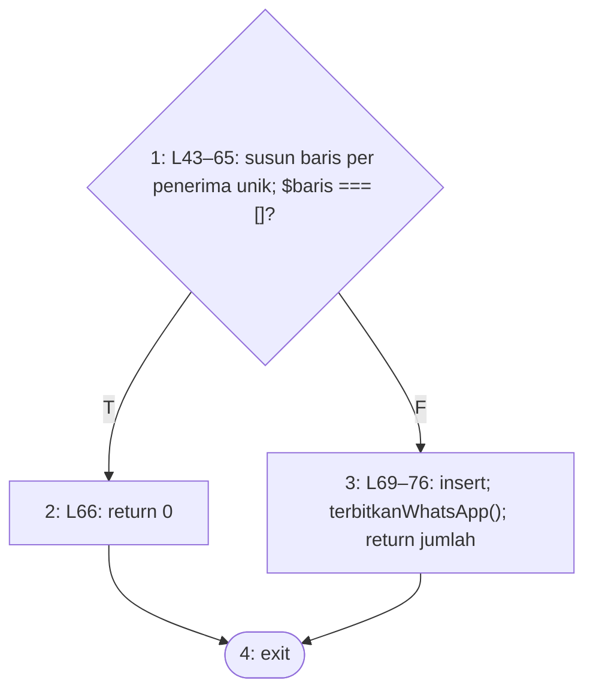

**2. Cyclomatic complexity**

- N = 4, E = 4, P = 1
- V(G) = E − N + 2P = 4 − 4 + 2 = **2**
- Predicate node: 1 (1 node); V(G) = 1 + 1 = **2**

**3. Matriks grafik**

| | 1 | 2 | 3 | 4 | Σ keluar − 1 |
|---|---|---|---|---|---|
| **1** |  | 1 | 1 |  | 1 |
| **2** |  |  |  | 1 | 0 |
| **3** |  |  |  | 1 | 0 |
| **4** |  |  |  |  | — |

Jumlah kolom terakhir = 1; V(G) = 1 + 1 = 2.

**4–5. Jalur independen dan kasus uji**

| No | Jalur | Kasus uji | Method tes | Awal | Akhir |
|---|---|---|---|---|---|
| J1 | 1–2–4 | Tidak ada penerima (hanya null) → 0, tanpa baris | `JalurBasisModul4Test::test_kirim_tanpa_penerima_tidak_menerbitkan_apa_pun` *(baru)* | tanpa-tes | lolos |
| J2 | 1–3–4 | Satu penerima → satu baris dalam aplikasi | `PengirimanWhatsAppTest::test_kanal_mati_tidak_menerbitkan_baris_whatsapp` | lolos | lolos |

**6. Persentase jalur lolos:** J_awal = 1, J_akhir = 2; awal = 1/2 × 100% = 50.0%, akhir = 2/2 × 100% = 100.0%.

### 4.2 `NotifikasiService::terbitkanWhatsApp`

Berkas: `app/Services/NotifikasiService.php` baris 91–141. Dipilih karena: penentuan penerima kanal WhatsApp: kanal mati, pengguna tanpa nomor dilewati kecuali pengalihan menyala.

**1. Grafik alir — node**

| Node | Baris | Isi |
|---|---|---|
| 1 | L99 | ! whatsappAktif()? *(predicate)* |
| 2 | L100 | return |
| 3 | L103–108 | $urutan = 0; $dialihkan = PengalihanWhatsApp::menyala() |
| 4 | L110 | masih ada penerima unik? (foreach) *(predicate)* |
| 5 | L120 | ! $dialihkan? *(predicate)* |
| 6 | L120 | nomor penerima tidak sah? *(predicate)* |
| 7 | L124–139 | buat baris whatsapp berstatus pending; antrekan pengiriman |
| 8 | — | exit |

**Edge** (asal → tujuan):

1→2 (T), 1→3 (F), 2→8, 3→4, 4→5 (T), 4→8 (F), 5→6 (T), 5→7 (F), 6→4 (T), 6→7 (F), 7→4

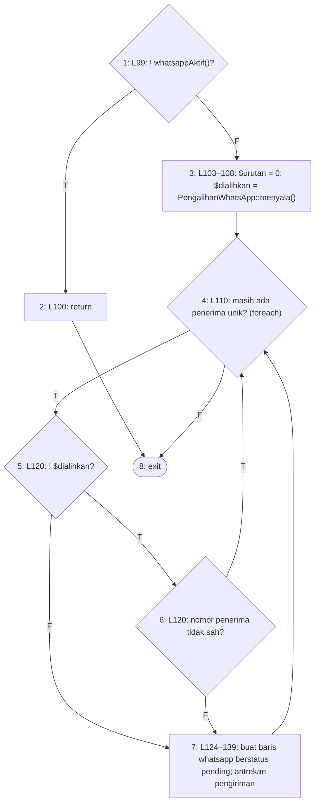

**2. Cyclomatic complexity**

- N = 8, E = 11, P = 1
- V(G) = E − N + 2P = 11 − 8 + 2 = **5**
- Predicate node: 1, 4, 5, 6 (4 node); V(G) = 4 + 1 = **5**

**3. Matriks grafik**

| | 1 | 2 | 3 | 4 | 5 | 6 | 7 | 8 | Σ keluar − 1 |
|---|---|---|---|---|---|---|---|---|---|
| **1** |  | 1 | 1 |  |  |  |  |  | 1 |
| **2** |  |  |  |  |  |  |  | 1 | 0 |
| **3** |  |  |  | 1 |  |  |  |  | 0 |
| **4** |  |  |  |  | 1 |  |  | 1 | 1 |
| **5** |  |  |  |  |  | 1 | 1 |  | 1 |
| **6** |  |  |  | 1 |  |  | 1 |  | 1 |
| **7** |  |  |  | 1 |  |  |  |  | 0 |
| **8** |  |  |  |  |  |  |  |  | — |

Jumlah kolom terakhir = 4; V(G) = 4 + 1 = 5.

**4–5. Jalur independen dan kasus uji**

| No | Jalur | Kasus uji | Method tes | Awal | Akhir |
|---|---|---|---|---|---|
| J1 | 1–2–8 | Kanal WhatsApp dimatikan | `PengirimanWhatsAppTest::test_kanal_mati_tidak_menerbitkan_baris_whatsapp` | lolos | lolos |
| J2 | 1–3–4–8 | Kanal menyala, nol penerima | — | mustahil | mustahil |
| J3 | 1–3–4–5–6–4–8 | Tanpa pengalihan, penerima tanpa nomor → dilewati | `PengalihanWhatsAppTest::test_pengalihan_kosong_tetap_melewati_pengguna_tanpa_nomor` | lolos | lolos |
| J4 | 1–3–4–5–6–7–4–8 | Tanpa pengalihan, penerima bernomor → baris WhatsApp | `PengirimanWhatsAppTest::test_kanal_hidup_menerbitkan_baris_dan_mengantre_pengiriman` | lolos | lolos |
| J5 | 1–3–4–5–7–4–8 | Pengalihan menyala, penerima tanpa nomor tetap dibuatkan baris | `PengalihanWhatsAppTest::test_pengalihan_menyala_menerbitkan_baris_bagi_pengguna_tanpa_nomor` | lolos | lolos |

**6. Persentase jalur lolos:** J_awal = 4, J_akhir = 4; awal = 4/5 × 100% = 80.0%, akhir = 4/5 × 100% = 80.0%.

Jalur J2 mustahil dicapai: satu-satunya pemanggil, `kirim()`, sudah kembali di L65 bila `$baris` kosong, dan `$baris` disusun dari `collect($penerima)->filter()->unique('id')` yang sama persis dengan koleksi perulangan L110. Karena itu setiap kali method ini dipanggil perulangannya berjalan sedikitnya sekali.

### 4.3 `NotifikasiService::berperan`

Berkas: `app/Services/NotifikasiService.php` baris 160–167. Dipilih karena: sumber penerima: hanya akun aktif berperan tertentu, dan dibatasi pada satu tim bila tim diberikan.

`->when($timId, …)` dihitung sebagai predicate karena setara `if ($timId) $q->where(…)`.

**1. Grafik alir — node**

| Node | Baris | Isi |
|---|---|---|
| 1 | L162–165 | akun aktif berperan …; $timId terisi? (when) *(predicate)* |
| 2 | L165 | where('tim_id', $timId) |
| 3 | L166 | get() |
| 4 | — | exit |

**Edge** (asal → tujuan):

1→2 (T), 1→3 (F), 2→3, 3→4

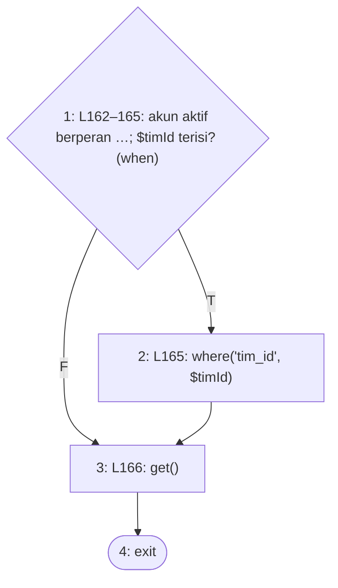

**2. Cyclomatic complexity**

- N = 4, E = 4, P = 1
- V(G) = E − N + 2P = 4 − 4 + 2 = **2**
- Predicate node: 1 (1 node); V(G) = 1 + 1 = **2**

**3. Matriks grafik**

| | 1 | 2 | 3 | 4 | Σ keluar − 1 |
|---|---|---|---|---|---|
| **1** |  | 1 | 1 |  | 1 |
| **2** |  |  | 1 |  | 0 |
| **3** |  |  |  | 1 | 0 |
| **4** |  |  |  |  | — |

Jumlah kolom terakhir = 1; V(G) = 1 + 1 = 2.

**4–5. Jalur independen dan kasus uji**

| No | Jalur | Kasus uji | Method tes | Awal | Akhir |
|---|---|---|---|---|---|
| J1 | 1–2–3–4 | Ketua Tim tim tujuan saja | `NotifikasiMutasiAsetTest::test_bast_baru_memberitahu_ketua_tim_tujuan_saja` | lolos | lolos |
| J2 | 1–3–4 | Seluruh Kasubbag aktif | `NotifikasiMutasiAsetTest::test_bast_dikonfirmasi_memberitahu_kasubbag_saja` | lolos | lolos |

**6. Persentase jalur lolos:** J_awal = 2, J_akhir = 2; awal = 2/2 × 100% = 100.0%, akhir = 2/2 × 100% = 100.0%.

### 4.4 `NotifikasiService::permintaanBerubah`

Berkas: `app/Services/NotifikasiService.php` baris 179–261. Dipilih karena: penentuan penerima notifikasi untuk setiap status permintaan (pihak yang harus bertindak berikutnya dan pemohon).

`match` sebelas lengan diurai menjadi perbandingan berurutan; lengan `ditolak_ketua, ditolak_kasubbag` memuat dua perbandingan (node 17–18). Pemanggilan `berperan()`/`anggotaTim()` di tiap lengan digambar sebagai node proses.

**1. Grafik alir — node**

| Node | Baris | Isi |
|---|---|---|
| 1 | L181 | $permintaan->tim?->nama_tim null? (??) *(predicate)* |
| 2 | L181 | 'Tim Kerja' |
| 3 | L182–185 | status 'menunggu_ketua'? *(predicate)* |
| 4 | L186–188 | Ketua Tim tim pemohon |
| 5 | L191 | 'menunggu_verifikasi'? *(predicate)* |
| 6 | L192–194 | Petugas Gudang |
| 7 | L197 | 'menunggu_kasubbag'? *(predicate)* |
| 8 | L198–200 | Kasubbag |
| 9 | L203 | 'siap_diproses'? *(predicate)* |
| 10 | L204–206 | Petugas Gudang |
| 11 | L209 | 'siap_diambil'? *(predicate)* |
| 12 | L210–212 | anggota tim |
| 13 | L215 | 'menunggu_pengesahan'? *(predicate)* |
| 14 | L216–218 | Kasubbag |
| 15 | L221 | 'selesai'? *(predicate)* |
| 16 | L222–224 | anggota tim |
| 17 | L227 | 'ditolak_ketua'? *(predicate)* |
| 18 | L227 | 'ditolak_kasubbag'? *(predicate)* |
| 19 | L228–230 | anggota tim; $catatan terisi? (?:) *(predicate)* |
| 20 | L230 | '. Alasan: …' |
| 21 | L233 | 'bermasalah'? *(predicate)* |
| 22 | L234–237 | Kasubbag + Petugas Gudang + anggota tim |
| 23 | L240 | 'kedaluwarsa'? *(predicate)* |
| 24 | L241–243 | anggota tim |
| 25 | L246 | default [collect(), '', ''] |
| 26 | L249 | $judul === ''? *(predicate)* |
| 27 | L250 | return 0 |
| 28 | L253–260 | return kirim(...) |
| 29 | — | exit |

**Edge** (asal → tujuan):

1→2 (T), 1→3 (F), 2→3, 3→4 (T), 3→5 (F), 4→26, 5→6 (T), 5→7 (F), 6→26, 7→8 (T), 7→9 (F), 8→26, 9→10 (T), 9→11 (F), 10→26, 11→12 (T), 11→13 (F), 12→26, 13→14 (T), 13→15 (F), 14→26, 15→16 (T), 15→17 (F), 16→26, 17→19 (T), 17→18 (F), 18→19 (T), 18→21 (F), 19→20 (T), 19→26 (F), 20→26, 21→22 (T), 21→23 (F), 22→26, 23→24 (T), 23→25 (F), 24→26, 25→26, 26→27 (T), 26→28 (F), 27→29, 28→29

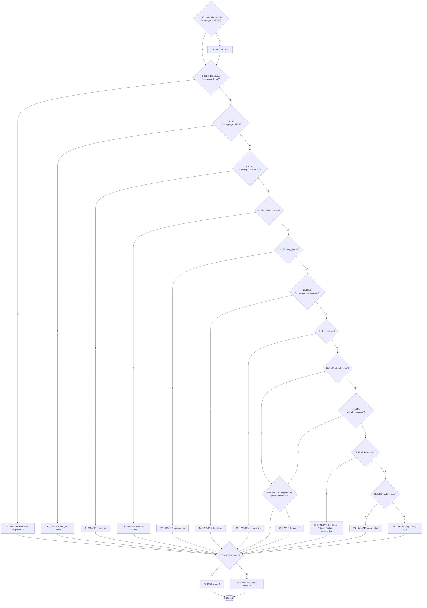

**2. Cyclomatic complexity**

- N = 29, E = 42, P = 1
- V(G) = E − N + 2P = 42 − 29 + 2 = **15**
- Predicate node: 1, 3, 5, 7, 9, 11, 13, 15, 17, 18, 19, 21, 23, 26 (14 node); V(G) = 14 + 1 = **15** — **melebihi batas 10 (McCabe, 1976)**

**3. Matriks grafik**

| | 1 | 2 | 3 | 4 | 5 | 6 | 7 | 8 | 9 | 10 | 11 | 12 | 13 | 14 | 15 | 16 | 17 | 18 | 19 | 20 | 21 | 22 | 23 | 24 | 25 | 26 | 27 | 28 | 29 | Σ keluar − 1 |
|---|---|---|---|---|---|---|---|---|---|---|---|---|---|---|---|---|---|---|---|---|---|---|---|---|---|---|---|---|---|---|
| **1** |  | 1 | 1 |  |  |  |  |  |  |  |  |  |  |  |  |  |  |  |  |  |  |  |  |  |  |  |  |  |  | 1 |
| **2** |  |  | 1 |  |  |  |  |  |  |  |  |  |  |  |  |  |  |  |  |  |  |  |  |  |  |  |  |  |  | 0 |
| **3** |  |  |  | 1 | 1 |  |  |  |  |  |  |  |  |  |  |  |  |  |  |  |  |  |  |  |  |  |  |  |  | 1 |
| **4** |  |  |  |  |  |  |  |  |  |  |  |  |  |  |  |  |  |  |  |  |  |  |  |  |  | 1 |  |  |  | 0 |
| **5** |  |  |  |  |  | 1 | 1 |  |  |  |  |  |  |  |  |  |  |  |  |  |  |  |  |  |  |  |  |  |  | 1 |
| **6** |  |  |  |  |  |  |  |  |  |  |  |  |  |  |  |  |  |  |  |  |  |  |  |  |  | 1 |  |  |  | 0 |
| **7** |  |  |  |  |  |  |  | 1 | 1 |  |  |  |  |  |  |  |  |  |  |  |  |  |  |  |  |  |  |  |  | 1 |
| **8** |  |  |  |  |  |  |  |  |  |  |  |  |  |  |  |  |  |  |  |  |  |  |  |  |  | 1 |  |  |  | 0 |
| **9** |  |  |  |  |  |  |  |  |  | 1 | 1 |  |  |  |  |  |  |  |  |  |  |  |  |  |  |  |  |  |  | 1 |
| **10** |  |  |  |  |  |  |  |  |  |  |  |  |  |  |  |  |  |  |  |  |  |  |  |  |  | 1 |  |  |  | 0 |
| **11** |  |  |  |  |  |  |  |  |  |  |  | 1 | 1 |  |  |  |  |  |  |  |  |  |  |  |  |  |  |  |  | 1 |
| **12** |  |  |  |  |  |  |  |  |  |  |  |  |  |  |  |  |  |  |  |  |  |  |  |  |  | 1 |  |  |  | 0 |
| **13** |  |  |  |  |  |  |  |  |  |  |  |  |  | 1 | 1 |  |  |  |  |  |  |  |  |  |  |  |  |  |  | 1 |
| **14** |  |  |  |  |  |  |  |  |  |  |  |  |  |  |  |  |  |  |  |  |  |  |  |  |  | 1 |  |  |  | 0 |
| **15** |  |  |  |  |  |  |  |  |  |  |  |  |  |  |  | 1 | 1 |  |  |  |  |  |  |  |  |  |  |  |  | 1 |
| **16** |  |  |  |  |  |  |  |  |  |  |  |  |  |  |  |  |  |  |  |  |  |  |  |  |  | 1 |  |  |  | 0 |
| **17** |  |  |  |  |  |  |  |  |  |  |  |  |  |  |  |  |  | 1 | 1 |  |  |  |  |  |  |  |  |  |  | 1 |
| **18** |  |  |  |  |  |  |  |  |  |  |  |  |  |  |  |  |  |  | 1 |  | 1 |  |  |  |  |  |  |  |  | 1 |
| **19** |  |  |  |  |  |  |  |  |  |  |  |  |  |  |  |  |  |  |  | 1 |  |  |  |  |  | 1 |  |  |  | 1 |
| **20** |  |  |  |  |  |  |  |  |  |  |  |  |  |  |  |  |  |  |  |  |  |  |  |  |  | 1 |  |  |  | 0 |
| **21** |  |  |  |  |  |  |  |  |  |  |  |  |  |  |  |  |  |  |  |  |  | 1 | 1 |  |  |  |  |  |  | 1 |
| **22** |  |  |  |  |  |  |  |  |  |  |  |  |  |  |  |  |  |  |  |  |  |  |  |  |  | 1 |  |  |  | 0 |
| **23** |  |  |  |  |  |  |  |  |  |  |  |  |  |  |  |  |  |  |  |  |  |  |  | 1 | 1 |  |  |  |  | 1 |
| **24** |  |  |  |  |  |  |  |  |  |  |  |  |  |  |  |  |  |  |  |  |  |  |  |  |  | 1 |  |  |  | 0 |
| **25** |  |  |  |  |  |  |  |  |  |  |  |  |  |  |  |  |  |  |  |  |  |  |  |  |  | 1 |  |  |  | 0 |
| **26** |  |  |  |  |  |  |  |  |  |  |  |  |  |  |  |  |  |  |  |  |  |  |  |  |  |  | 1 | 1 |  | 1 |
| **27** |  |  |  |  |  |  |  |  |  |  |  |  |  |  |  |  |  |  |  |  |  |  |  |  |  |  |  |  | 1 | 0 |
| **28** |  |  |  |  |  |  |  |  |  |  |  |  |  |  |  |  |  |  |  |  |  |  |  |  |  |  |  |  | 1 | 0 |
| **29** |  |  |  |  |  |  |  |  |  |  |  |  |  |  |  |  |  |  |  |  |  |  |  |  |  |  |  |  |  | — |

Jumlah kolom terakhir = 14; V(G) = 14 + 1 = 15.

**4–5. Jalur independen dan kasus uji**

| No | Jalur | Kasus uji | Method tes | Awal | Akhir |
|---|---|---|---|---|---|
| J1 | 1–3–4–26–28–29 | menunggu_ketua → Ketua Tim | `PengajuanKatalogAturanTest::test_pengajuan_tim_memberi_tahu_ketua_timnya` | lolos | lolos |
| J2 | 1–3–5–6–26–28–29 | menunggu_verifikasi → Petugas Gudang | `PengajuanKatalogAturanTest::test_pengajuan_ketua_tim_memberi_tahu_petugas_gudang` | lolos | lolos |
| J3 | 1–3–5–7–8–26–28–29 | menunggu_kasubbag → Kasubbag | `VerifikasiNotifikasiMutasiAsetTest::test_ns12_verifikasi_gudang_memberi_tahu_kasubbag` | lolos | lolos |
| J4 | 1–3–5–7–9–10–26–28–29 | siap_diproses → Petugas Gudang | `VerifikasiNotifikasiMutasiAsetTest::test_ns13_setujui_kasubbag_memberi_tahu_gudang` | lolos | lolos |
| J5 | 1–3–5–7–9–11–12–26–28–29 | siap_diambil → Tim dan Ketua Tim | `VerifikasiNotifikasiMutasiAsetTest::test_ns14_siapkan_memberi_tahu_tim_dan_ketua` | lolos | lolos |
| J6 | 1–3–5–7–9–11–13–14–26–28–29 | menunggu_pengesahan → Kasubbag | `VerifikasiNotifikasiMutasiAsetTest::test_ns15_konfirmasi_sesuai_memberi_tahu_kasubbag` | lolos | lolos |
| J7 | 1–3–5–7–9–11–13–15–16–26–28–29 | selesai → Tim dan Ketua Tim | `VerifikasiNotifikasiMutasiAsetTest::test_ns16_sahkan_memberi_tahu_tim_dan_ketua` | lolos | lolos |
| J8 | 1–3–5–7–9–11–13–15–17–19–20–26–28–29 | ditolak_ketua beralasan | `VerifikasiNotifikasiMutasiAsetTest::test_ns17a_tolak_ketua_memberi_tahu_tim_dan_ketua_dengan_alasan` | lolos | lolos |
| J9 | 1–3–5–7–9–11–13–15–17–18–19–20–26–28–29 | ditolak_kasubbag beralasan | `VerifikasiNotifikasiMutasiAsetTest::test_ns17b_tolak_kasubbag_memberi_tahu_tim_dan_ketua_dengan_alasan` | lolos | lolos |
| J10 | 1–3–5–7–9–11–13–15–17–19–26–28–29 | ditolak_ketua tanpa catatan | `JalurBasisModul4Test::test_permintaan_ditolak_tanpa_catatan_tanpa_alasan` *(baru)* | tanpa-tes | lolos |
| J11 | 1–3–5–7–9–11–13–15–17–18–21–22–26–28–29 | bermasalah → Kasubbag, Gudang, Tim, Ketua Tim | `VerifikasiNotifikasiMutasiAsetTest::test_ns18_konfirmasi_bermasalah_memberi_tahu_kasubbag_gudang_tim_ketua` | lolos | lolos |
| J12 | 1–3–5–7–9–11–13–15–17–18–21–23–24–26–28–29 | kedaluwarsa → pemohon | `NotifikasiKedaluwarsaTest::test_sapuan_memberi_tahu_pemohon_tepat_satu_kali` | lolos | lolos |
| J13 | 1–3–5–7–9–11–13–15–17–18–21–23–25–26–27–29 | Status tanpa penerima (draf) → 0 | `JalurBasisModul4Test::test_permintaan_berstatus_lain_tidak_menerbitkan_notifikasi` *(baru)* | tanpa-tes | lolos |
| J14 | 1–2–3–4–26–28–29 | Permintaan tanpa tim | — | mustahil | mustahil |
| J15 | 1–3–4–26–27–29 | Lengan bernilai tetapi judul kosong | — | mustahil | mustahil |

**6. Persentase jalur lolos:** J_awal = 11, J_akhir = 13; awal = 11/15 × 100% = 73.3%, akhir = 13/15 × 100% = 86.7%.

Jalur J14 mustahil dicapai: `permintaan_barang.tim_pemohon_id` NOT NULL dengan kunci asing `restrictOnDelete` (migration 2026_08_26_000009), sehingga relasi `tim` permintaan yang tersimpan tidak pernah null.
Jalur J15 mustahil dicapai: seluruh lengan selain `default` mengisi `$judul` dengan teks tetap yang tidak kosong, dan `default` mengisinya `''`; hasil node 26 sepenuhnya ditentukan lengan yang dilalui, sehingga kombinasi lengan bernilai → node 26 benar (atau default → node 26 salah) tidak dapat terjadi.

### 4.5 `NotifikasiService::stokMenipis`

Berkas: `app/Services/NotifikasiService.php` baris 281–308. Dipilih karena: peringatan stok habis/menipis bagi Petugas Gudang dan Kasubbag, hanya saat ambang terlewati.

**1. Grafik alir — node**

| Node | Baris | Isi |
|---|---|---|
| 1 | L283–285 | $tersedia > 0? *(predicate)* |
| 2 | L285 | stok_minimum > 0? *(predicate)* |
| 3 | L285 | $tersedia <= stok_minimum? *(predicate)* |
| 4 | L286 | return 0 |
| 5 | L289 | $tersedia <= 0? *(predicate)* |
| 6 | L290–293 | 'Stok habis' |
| 7 | L294–298 | 'Stok menipis' |
| 8 | L300–307 | return kirim(Gudang + Kasubbag) |
| 9 | — | exit |

**Edge** (asal → tujuan):

1→2 (T), 1→5 (F), 2→3 (T), 2→4 (F), 3→5 (T), 3→4 (F), 4→9, 5→6 (T), 5→7 (F), 6→8, 7→8, 8→9

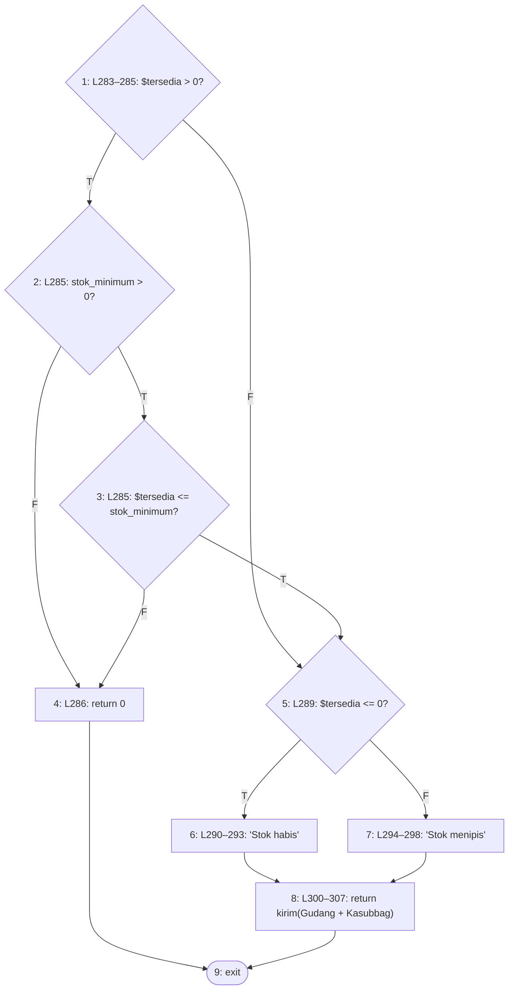

**2. Cyclomatic complexity**

- N = 9, E = 12, P = 1
- V(G) = E − N + 2P = 12 − 9 + 2 = **5**
- Predicate node: 1, 2, 3, 5 (4 node); V(G) = 4 + 1 = **5**

**3. Matriks grafik**

| | 1 | 2 | 3 | 4 | 5 | 6 | 7 | 8 | 9 | Σ keluar − 1 |
|---|---|---|---|---|---|---|---|---|---|---|
| **1** |  | 1 |  |  | 1 |  |  |  |  | 1 |
| **2** |  |  | 1 | 1 |  |  |  |  |  | 1 |
| **3** |  |  |  | 1 | 1 |  |  |  |  | 1 |
| **4** |  |  |  |  |  |  |  |  | 1 | 0 |
| **5** |  |  |  |  |  | 1 | 1 |  |  | 1 |
| **6** |  |  |  |  |  |  |  | 1 |  | 0 |
| **7** |  |  |  |  |  |  |  | 1 |  | 0 |
| **8** |  |  |  |  |  |  |  |  | 1 | 0 |
| **9** |  |  |  |  |  |  |  |  |  | — |

Jumlah kolom terakhir = 4; V(G) = 4 + 1 = 5.

**4–5. Jalur independen dan kasus uji**

| No | Jalur | Kasus uji | Method tes | Awal | Akhir |
|---|---|---|---|---|---|
| J1 | 1–5–6–8–9 | Stok tersedia habis | `JalurBasisModul4Test::test_stok_habis_memberi_tahu_gudang_dan_kasubbag` *(baru)* | tanpa-tes | lolos |
| J2 | 1–2–4–9 | Masih tersedia, tidak dipantau (minimum 0) | `JalurBasisModul4Test::test_stok_tidak_dipantau_tidak_menerbitkan_peringatan` *(baru)* | tanpa-tes | lolos |
| J3 | 1–2–3–4–9 | Masih di atas minimum | `JalurBasisModul4Test::test_stok_di_atas_minimum_tidak_menerbitkan_peringatan` *(baru)* | tanpa-tes | lolos |
| J4 | 1–2–3–5–7–8–9 | Mencapai batas minimum → menipis | `JalurBasisModul4Test::test_stok_menipis_memberi_tahu_gudang_dan_kasubbag` *(baru)* | tanpa-tes | lolos |
| J5 | 1–5–7–8–9 | Tersedia ≤ 0 tetapi dianggap menipis | — | mustahil | mustahil |

**6. Persentase jalur lolos:** J_awal = 0, J_akhir = 4; awal = 0/5 × 100% = 0.0%, akhir = 4/5 × 100% = 80.0%.

Jalur J5 mustahil dicapai: node 5 memeriksa `$tersedia <= 0`, kebalikan tepat node 1: sesudah 1→5 (tersedia ≤ 0) node 5 selalu benar, dan sesudah 3→5 (tersedia > 0) selalu salah. Dimensi kelima hanya terbentuk dari kombinasi yang bertentangan itu.

### 4.6 `NotifikasiService::bastBerubah`

Berkas: `app/Services/NotifikasiService.php` baris 324–366. Dipilih karena: penentuan penerima notifikasi untuk setiap status BAST mutasi aset.

**1. Grafik alir — node**

| Node | Baris | Isi |
|---|---|---|
| 1 | L326–329 | aset?->nama_aset null? (??) *(predicate)* |
| 2 | L329 | 'Aset' |
| 3 | L330–331 | timAsal?->nama_tim null? (??) *(predicate)* |
| 4 | L331 | 'tim kerja asal' |
| 5 | L332 | timTujuan?->nama_tim null? (??) *(predicate)* |
| 6 | L332 | 'tim kerja tujuan' |
| 7 | L334–335 | status 'menunggu_pengesahan'? *(predicate)* |
| 8 | L336–338 | Kasubbag; $nup terisi? (?:) *(predicate)* |
| 9 | L338 | ' (NUP)' |
| 10 | L342 | 'menunggu_konfirmasi'? *(predicate)* |
| 11 | L343–345 | Ketua Tim tim tujuan; $nup terisi? (?:) *(predicate)* |
| 12 | L345 | ' (NUP)' |
| 13 | L349 | 'selesai_administratif'? *(predicate)* |
| 14 | L352–355 | Kasubbag + Petugas Gudang |
| 15 | L358 | default [collect(), '', ''] |
| 16 | L361 | $judul === ''? *(predicate)* |
| 17 | L362 | return 0 |
| 18 | L365 | return kirim(...) |
| 19 | — | exit |

**Edge** (asal → tujuan):

1→2 (T), 1→3 (F), 2→3, 3→4 (T), 3→5 (F), 4→5, 5→6 (T), 5→7 (F), 6→7, 7→8 (T), 7→10 (F), 8→9 (T), 8→16 (F), 9→16, 10→11 (T), 10→13 (F), 11→12 (T), 11→16 (F), 12→16, 13→14 (T), 13→15 (F), 14→16, 15→16, 16→17 (T), 16→18 (F), 17→19, 18→19

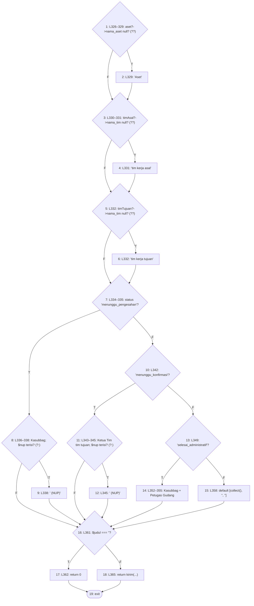

**2. Cyclomatic complexity**

- N = 19, E = 27, P = 1
- V(G) = E − N + 2P = 27 − 19 + 2 = **10**
- Predicate node: 1, 3, 5, 7, 8, 10, 11, 13, 16 (9 node); V(G) = 9 + 1 = **10**

**3. Matriks grafik**

| | 1 | 2 | 3 | 4 | 5 | 6 | 7 | 8 | 9 | 10 | 11 | 12 | 13 | 14 | 15 | 16 | 17 | 18 | 19 | Σ keluar − 1 |
|---|---|---|---|---|---|---|---|---|---|---|---|---|---|---|---|---|---|---|---|---|
| **1** |  | 1 | 1 |  |  |  |  |  |  |  |  |  |  |  |  |  |  |  |  | 1 |
| **2** |  |  | 1 |  |  |  |  |  |  |  |  |  |  |  |  |  |  |  |  | 0 |
| **3** |  |  |  | 1 | 1 |  |  |  |  |  |  |  |  |  |  |  |  |  |  | 1 |
| **4** |  |  |  |  | 1 |  |  |  |  |  |  |  |  |  |  |  |  |  |  | 0 |
| **5** |  |  |  |  |  | 1 | 1 |  |  |  |  |  |  |  |  |  |  |  |  | 1 |
| **6** |  |  |  |  |  |  | 1 |  |  |  |  |  |  |  |  |  |  |  |  | 0 |
| **7** |  |  |  |  |  |  |  | 1 |  | 1 |  |  |  |  |  |  |  |  |  | 1 |
| **8** |  |  |  |  |  |  |  |  | 1 |  |  |  |  |  |  | 1 |  |  |  | 1 |
| **9** |  |  |  |  |  |  |  |  |  |  |  |  |  |  |  | 1 |  |  |  | 0 |
| **10** |  |  |  |  |  |  |  |  |  |  | 1 |  | 1 |  |  |  |  |  |  | 1 |
| **11** |  |  |  |  |  |  |  |  |  |  |  | 1 |  |  |  | 1 |  |  |  | 1 |
| **12** |  |  |  |  |  |  |  |  |  |  |  |  |  |  |  | 1 |  |  |  | 0 |
| **13** |  |  |  |  |  |  |  |  |  |  |  |  |  | 1 | 1 |  |  |  |  | 1 |
| **14** |  |  |  |  |  |  |  |  |  |  |  |  |  |  |  | 1 |  |  |  | 0 |
| **15** |  |  |  |  |  |  |  |  |  |  |  |  |  |  |  | 1 |  |  |  | 0 |
| **16** |  |  |  |  |  |  |  |  |  |  |  |  |  |  |  |  | 1 | 1 |  | 1 |
| **17** |  |  |  |  |  |  |  |  |  |  |  |  |  |  |  |  |  |  | 1 | 0 |
| **18** |  |  |  |  |  |  |  |  |  |  |  |  |  |  |  |  |  |  | 1 | 0 |
| **19** |  |  |  |  |  |  |  |  |  |  |  |  |  |  |  |  |  |  |  | — |

Jumlah kolom terakhir = 9; V(G) = 9 + 1 = 10.

**4–5. Jalur independen dan kasus uji**

| No | Jalur | Kasus uji | Method tes | Awal | Akhir |
|---|---|---|---|---|---|
| J1 | 1–3–5–7–8–9–16–18–19 | menunggu_pengesahan → Kasubbag | `NotifikasiMutasiAsetTest::test_bast_dikonfirmasi_memberitahu_kasubbag_saja` | lolos | lolos |
| J2 | 1–3–5–7–10–11–12–16–18–19 | menunggu_konfirmasi → Ketua Tim tujuan | `NotifikasiMutasiAsetTest::test_bast_baru_memberitahu_ketua_tim_tujuan_saja` | lolos | lolos |
| J3 | 1–3–5–7–10–13–14–16–18–19 | selesai_administratif → Kasubbag + Gudang | `NotifikasiMutasiAsetTest::test_mutasi_selesai_memberitahu_kasubbag_dan_petugas_gudang` | lolos | lolos |
| J4 | 1–3–5–7–10–13–15–16–17–19 | Status tak dikenali → 0 | `NotifikasiMutasiAsetTest::test_status_yang_belum_dikenali_tidak_menerbitkan_notifikasi` | lolos | lolos |
| J5 | 1–3–5–7–8–16–18–19 | menunggu_pengesahan, NUP bernilai '0' (falsy) → tanpa NUP | `JalurBasisModul4Test::test_bast_menunggu_pengesahan_nup_nol_tanpa_nup` *(baru)* | tanpa-tes | lolos |
| J6 | 1–3–5–7–10–11–16–18–19 | menunggu_konfirmasi, NUP bernilai '0' (falsy) → tanpa NUP | `JalurBasisModul4Test::test_bast_menunggu_konfirmasi_nup_nol_tanpa_nup` *(baru)* | tanpa-tes | lolos |
| J7 | 1–2–3–5–7–8–9–16–18–19 | BAST tanpa aset | — | mustahil | mustahil |
| J8 | 1–3–4–5–7–8–9–16–18–19 | BAST tanpa tim asal | — | mustahil | mustahil |
| J9 | 1–3–5–6–7–8–9–16–18–19 | BAST tanpa tim tujuan | — | mustahil | mustahil |
| J10 | 1–3–5–7–10–13–14–16–17–19 | Lengan bernilai tetapi judul kosong | — | mustahil | mustahil |

**6. Persentase jalur lolos:** J_awal = 4, J_akhir = 6; awal = 4/10 × 100% = 40.0%, akhir = 6/10 × 100% = 60.0%.

Jalur J7 mustahil dicapai: `bast_mutasi_aset.aset_id`, `tim_asal_id`, dan `tim_tujuan_id` NOT NULL berkunci asing `restrictOnDelete` (migration BAST), sehingga relasi `aset`, `timAsal`, dan `timTujuan` BAST yang tersimpan tidak pernah null; sisi kanan `??` hanya dapat dicapai dengan model buatan yang tidak dapat disimpan.
Jalur J8 mustahil dicapai: `bast_mutasi_aset.aset_id`, `tim_asal_id`, dan `tim_tujuan_id` NOT NULL berkunci asing `restrictOnDelete` (migration BAST), sehingga relasi `aset`, `timAsal`, dan `timTujuan` BAST yang tersimpan tidak pernah null; sisi kanan `??` hanya dapat dicapai dengan model buatan yang tidak dapat disimpan.
Jalur J9 mustahil dicapai: `bast_mutasi_aset.aset_id`, `tim_asal_id`, dan `tim_tujuan_id` NOT NULL berkunci asing `restrictOnDelete` (migration BAST), sehingga relasi `aset`, `timAsal`, dan `timTujuan` BAST yang tersimpan tidak pernah null; sisi kanan `??` hanya dapat dicapai dengan model buatan yang tidak dapat disimpan.
Jalur J10 mustahil dicapai: ketiga lengan bernilai mengisi `$judul` dengan teks tetap yang tidak kosong dan `default` mengisinya `''`, sehingga hasil node 16 sepenuhnya ditentukan lengan yang dilalui.

### 4.7 `TindakanPermintaan::statusUntuk`

Berkas: `app/Support/TindakanPermintaan.php` baris 30–39. Dipilih karena: pembatasan data per peran pada widget Perlu Tindakan: status yang ditampilkan menurut peran.

**1. Grafik alir — node**

| Node | Baris | Isi |
|---|---|---|
| 1 | L32–33 | peran 'ketua_tim'? *(predicate)* |
| 2 | L33 | menunggu_ketua, siap_diambil |
| 3 | L34 | 'petugas_gudang'? *(predicate)* |
| 4 | L34 | menunggu_verifikasi, siap_diproses |
| 5 | L35 | 'kasubbag'? *(predicate)* |
| 6 | L35 | menunggu_kasubbag, menunggu_pengesahan |
| 7 | L36 | 'tim'? *(predicate)* |
| 8 | L36 | siap_diambil |
| 9 | L37 | default [] |
| 10 | — | exit |

**Edge** (asal → tujuan):

1→2 (T), 1→3 (F), 2→10, 3→4 (T), 3→5 (F), 4→10, 5→6 (T), 5→7 (F), 6→10, 7→8 (T), 7→9 (F), 8→10, 9→10

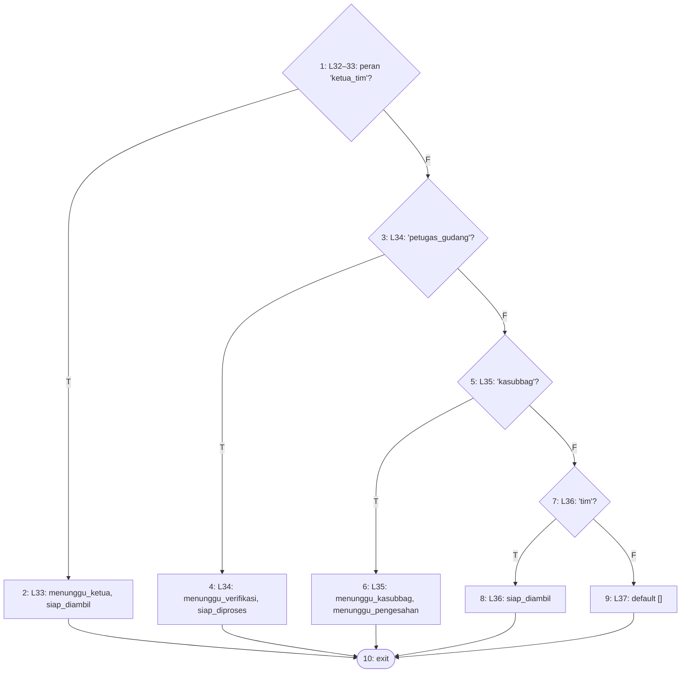

**2. Cyclomatic complexity**

- N = 10, E = 13, P = 1
- V(G) = E − N + 2P = 13 − 10 + 2 = **5**
- Predicate node: 1, 3, 5, 7 (4 node); V(G) = 4 + 1 = **5**

**3. Matriks grafik**

| | 1 | 2 | 3 | 4 | 5 | 6 | 7 | 8 | 9 | 10 | Σ keluar − 1 |
|---|---|---|---|---|---|---|---|---|---|---|---|
| **1** |  | 1 | 1 |  |  |  |  |  |  |  | 1 |
| **2** |  |  |  |  |  |  |  |  |  | 1 | 0 |
| **3** |  |  |  | 1 | 1 |  |  |  |  |  | 1 |
| **4** |  |  |  |  |  |  |  |  |  | 1 | 0 |
| **5** |  |  |  |  |  | 1 | 1 |  |  |  | 1 |
| **6** |  |  |  |  |  |  |  |  |  | 1 | 0 |
| **7** |  |  |  |  |  |  |  | 1 | 1 |  | 1 |
| **8** |  |  |  |  |  |  |  |  |  | 1 | 0 |
| **9** |  |  |  |  |  |  |  |  |  | 1 | 0 |
| **10** |  |  |  |  |  |  |  |  |  |  | — |

Jumlah kolom terakhir = 4; V(G) = 4 + 1 = 5.

**4–5. Jalur independen dan kasus uji**

| No | Jalur | Kasus uji | Method tes | Awal | Akhir |
|---|---|---|---|---|---|
| J1 | 1–2–10 | Ketua Tim | `PerluTindakanWidgetTest::test_ketua_tim_melihat_permintaan_siap_diambil_yang_dapat_dikonfirmasi` | lolos | lolos |
| J2 | 1–3–4–10 | Petugas Gudang | `PerluTindakanWidgetTest::test_petugas_gudang_melihat_verifikasi_dan_penyiapan` | lolos | lolos |
| J3 | 1–3–5–6–10 | Kasubbag | `JalurBasisModul4Test::test_perlu_tindakan_kasubbag_melihat_persetujuan_dan_pengesahan` *(baru)* | tanpa-tes | lolos |
| J4 | 1–3–5–7–8–10 | Tim | `PerluTindakanWidgetTest::test_tim_juga_melihat_permintaan_siap_diambil_timnya` | lolos | lolos |
| J5 | 1–3–5–7–9–10 | Admin (peran tanpa alur operasional) | `JalurBasisModul4Test::test_perlu_tindakan_admin_tidak_melihat_apa_pun` *(baru)* | tanpa-tes | lolos |

**6. Persentase jalur lolos:** J_awal = 3, J_akhir = 5; awal = 3/5 × 100% = 60.0%, akhir = 5/5 × 100% = 100.0%.

### 4.8 `PerluTindakan::kueri`

Berkas: `app/Filament/Widgets/PerluTindakan.php` baris 56–78. Dipilih karena: pembatasan data widget: tanpa status tindakan tidak ada baris; Ketua Tim dan Tim hanya melihat permintaan timnya.

`->when(…)` dihitung sebagai predicate.

**1. Grafik alir — node**

| Node | Baris | Isi |
|---|---|---|
| 1 | L58–61 | status menurut peran kosong? *(predicate)* |
| 2 | L62 | whereRaw('1 = 0') |
| 3 | L65–71 | kueri status; peran Ketua Tim/Tim? (when) *(predicate)* |
| 4 | L72 | where tim_pemohon_id = tim pengguna |
| 5 | L75–77 | urutkan batas waktu |
| 6 | — | exit |

**Edge** (asal → tujuan):

1→2 (T), 1→3 (F), 2→6, 3→4 (T), 3→5 (F), 4→5, 5→6

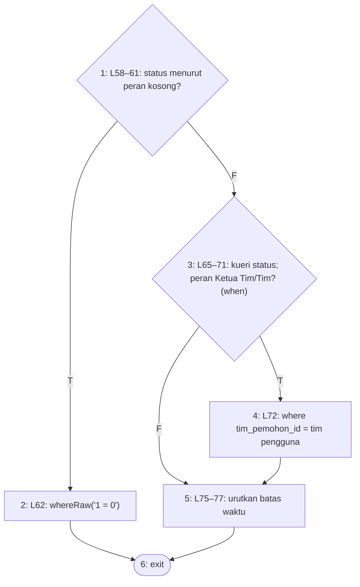

**2. Cyclomatic complexity**

- N = 6, E = 7, P = 1
- V(G) = E − N + 2P = 7 − 6 + 2 = **3**
- Predicate node: 1, 3 (2 node); V(G) = 2 + 1 = **3**

**3. Matriks grafik**

| | 1 | 2 | 3 | 4 | 5 | 6 | Σ keluar − 1 |
|---|---|---|---|---|---|---|---|
| **1** |  | 1 | 1 |  |  |  | 1 |
| **2** |  |  |  |  |  | 1 | 0 |
| **3** |  |  |  | 1 | 1 |  | 1 |
| **4** |  |  |  |  | 1 |  | 0 |
| **5** |  |  |  |  |  | 1 | 0 |
| **6** |  |  |  |  |  |  | — |

Jumlah kolom terakhir = 2; V(G) = 2 + 1 = 3.

**4–5. Jalur independen dan kasus uji**

| No | Jalur | Kasus uji | Method tes | Awal | Akhir |
|---|---|---|---|---|---|
| J1 | 1–2–6 | Admin → kosong | `JalurBasisModul4Test::test_perlu_tindakan_admin_tidak_melihat_apa_pun` *(baru)* | tanpa-tes | lolos |
| J2 | 1–3–4–5–6 | Ketua Tim → hanya tim sendiri | `PerluTindakanWidgetTest::test_permintaan_tim_lain_tidak_muncul` | lolos | lolos |
| J3 | 1–3–5–6 | Petugas Gudang → lintas tim | `PerluTindakanWidgetTest::test_petugas_gudang_melihat_verifikasi_dan_penyiapan` | lolos | lolos |

**6. Persentase jalur lolos:** J_awal = 2, J_akhir = 3; awal = 2/3 × 100% = 66.7%, akhir = 3/3 × 100% = 100.0%.

### 4.9 `PermintaanBarangResource::getEloquentQuery`

Berkas: `app/Filament/Resources/PermintaanBarangs/PermintaanBarangResource.php` baris 67–77. Dipilih karena: cakupan data per peran yang dipakai widget Status Permintaan Tim Saya dan Pola Permintaan (Tim/Ketua Tim hanya timnya).

**1. Grafik alir — node**

| Node | Baris | Isi |
|---|---|---|
| 1 | L69–72 | peran Tim/Ketua Tim? *(predicate)* |
| 2 | L73 | where tim_pemohon_id = tim pengguna |
| 3 | L76 | return $query |
| 4 | — | exit |

**Edge** (asal → tujuan):

1→2 (T), 1→3 (F), 2→3, 3→4

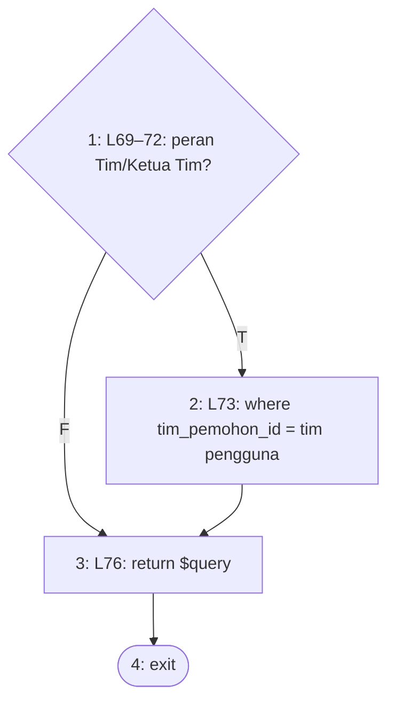

**2. Cyclomatic complexity**

- N = 4, E = 4, P = 1
- V(G) = E − N + 2P = 4 − 4 + 2 = **2**
- Predicate node: 1 (1 node); V(G) = 1 + 1 = **2**

**3. Matriks grafik**

| | 1 | 2 | 3 | 4 | Σ keluar − 1 |
|---|---|---|---|---|---|
| **1** |  | 1 | 1 |  | 1 |
| **2** |  |  | 1 |  | 0 |
| **3** |  |  |  | 1 | 0 |
| **4** |  |  |  |  | — |

Jumlah kolom terakhir = 1; V(G) = 1 + 1 = 2.

**4–5. Jalur independen dan kasus uji**

| No | Jalur | Kasus uji | Method tes | Awal | Akhir |
|---|---|---|---|---|---|
| J1 | 1–2–3–4 | Widget Pola Permintaan sebagai Tim | `DashboardTimWidgetsTest::test_pola_permintaan_menyebut_tim_saya_bagi_ketua_tim_dan_tim` | lolos | lolos |
| J2 | 1–3–4 | Widget Pola Permintaan sebagai Kasubbag | `DashboardTimWidgetsTest::test_pola_permintaan_tetap_judul_lama_bagi_kasubbag` | lolos | lolos |

**6. Persentase jalur lolos:** J_awal = 2, J_akhir = 2; awal = 2/2 × 100% = 100.0%, akhir = 2/2 × 100% = 100.0%.

### 4.10 `StatusPermintaanTim::cacah`

Berkas: `app/Filament/Widgets/StatusPermintaanTim.php` baris 119–139. Dipilih karena: cacah permintaan tim pengguna per kelas status (cakupan tim dari 4.9), dengan singgahan per render.

Closure `sum` (L135) memuat `??` di dalam fungsi terpisah dan digambar dalam node 5.

**1. Grafik alir — node**

| Node | Baris | Isi |
|---|---|---|
| 1 | L121 | $this->cache !== null? *(predicate)* |
| 2 | L122 | return cache |
| 3 | L125–130 | cacah per status dari kueri bercakupan peran |
| 4 | L133 | masih ada kelas? (foreach KELAS) *(predicate)* |
| 5 | L134–135 | jumlahkan status kelas |
| 6 | L138 | simpan dan return cacah |
| 7 | — | exit |

**Edge** (asal → tujuan):

1→2 (T), 1→3 (F), 2→7, 3→4, 4→5 (T), 4→6 (F), 5→4, 6→7

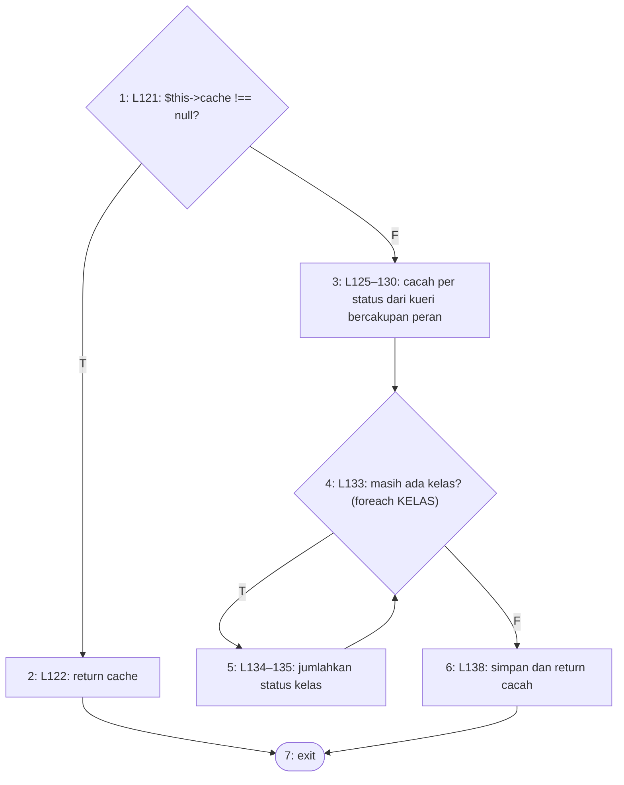

**2. Cyclomatic complexity**

- N = 7, E = 8, P = 1
- V(G) = E − N + 2P = 8 − 7 + 2 = **3**
- Predicate node: 1, 4 (2 node); V(G) = 2 + 1 = **3**

**3. Matriks grafik**

| | 1 | 2 | 3 | 4 | 5 | 6 | 7 | Σ keluar − 1 |
|---|---|---|---|---|---|---|---|---|
| **1** |  | 1 | 1 |  |  |  |  | 1 |
| **2** |  |  |  |  |  |  | 1 | 0 |
| **3** |  |  |  | 1 |  |  |  | 0 |
| **4** |  |  |  |  | 1 | 1 |  | 1 |
| **5** |  |  |  | 1 |  |  |  | 0 |
| **6** |  |  |  |  |  |  | 1 | 0 |
| **7** |  |  |  |  |  |  |  | — |

Jumlah kolom terakhir = 2; V(G) = 2 + 1 = 3.

**4–5. Jalur independen dan kasus uji**

| No | Jalur | Kasus uji | Method tes | Awal | Akhir |
|---|---|---|---|---|---|
| J1 | 1–2–7 | Pemanggilan kedua dalam satu render (singgahan) | `JalurBasisModul4Test::test_status_permintaan_tim_hanya_mencacah_tim_pengguna` *(baru)* | tanpa-tes | lolos |
| J2 | 1–3–4–5–4–6–7 | Pemanggilan pertama: cacah tim pengguna saja | `JalurBasisModul4Test::test_status_permintaan_tim_hanya_mencacah_tim_pengguna` *(baru)* | tanpa-tes | lolos |
| J3 | 1–3–4–6–7 | Tanpa satu kelas pun | — | mustahil | mustahil |

**6. Persentase jalur lolos:** J_awal = 0, J_akhir = 2; awal = 0/3 × 100% = 0.0%, akhir = 2/3 × 100% = 66.7%.

Jalur J3 mustahil dicapai: `KELAS` adalah konstanta kelas yang tidak kosong, sehingga perulangan L133 selalu berjalan minimal sekali.

### 4.11 `KondisiAsetTetapTim::cacah`

Berkas: `app/Filament/Widgets/KondisiAsetTetapTim.php` baris 79–103. Dipilih karena: pembatasan data widget: hanya aset aktif tim pengguna; pengguna tanpa tim tidak melihat aset apa pun.

`->when(tim_id, …, …)` dengan dua closure dihitung sebagai satu predicate.

**1. Grafik alir — node**

| Node | Baris | Isi |
|---|---|---|
| 1 | L81 | $this->cache !== null? *(predicate)* |
| 2 | L82 | return cache |
| 3 | L85–92 | aset aktif; tim pengguna terisi? (when) *(predicate)* |
| 4 | L90 | where tim_penempatan_id = tim pengguna |
| 5 | L91 | whereRaw('1 = 0') |
| 6 | L93–95 | kelompokkan per kondisi |
| 7 | L98 | masih ada kondisi? (foreach KONDISI) *(predicate)* |
| 8 | L99 | kondisi tidak ada pada hasil? (??) *(predicate)* |
| 9 | L99 | 0 |
| 10 | L102 | simpan dan return cacah |
| 11 | — | exit |

**Edge** (asal → tujuan):

1→2 (T), 1→3 (F), 2→11, 3→4 (T), 3→5 (F), 4→6, 5→6, 6→7, 7→8 (T), 7→10 (F), 8→9 (T), 8→7 (F), 9→7, 10→11

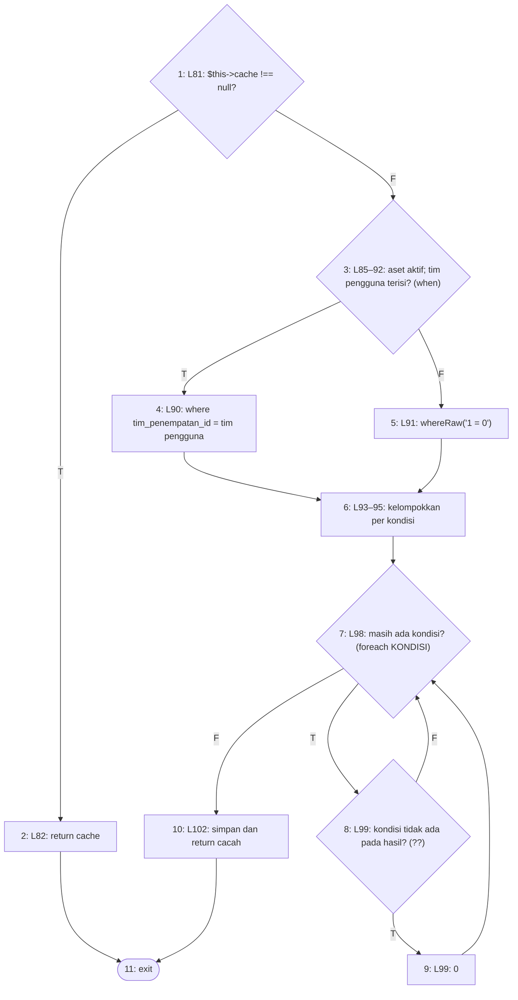

**2. Cyclomatic complexity**

- N = 11, E = 14, P = 1
- V(G) = E − N + 2P = 14 − 11 + 2 = **5**
- Predicate node: 1, 3, 7, 8 (4 node); V(G) = 4 + 1 = **5**

**3. Matriks grafik**

| | 1 | 2 | 3 | 4 | 5 | 6 | 7 | 8 | 9 | 10 | 11 | Σ keluar − 1 |
|---|---|---|---|---|---|---|---|---|---|---|---|---|
| **1** |  | 1 | 1 |  |  |  |  |  |  |  |  | 1 |
| **2** |  |  |  |  |  |  |  |  |  |  | 1 | 0 |
| **3** |  |  |  | 1 | 1 |  |  |  |  |  |  | 1 |
| **4** |  |  |  |  |  | 1 |  |  |  |  |  | 0 |
| **5** |  |  |  |  |  | 1 |  |  |  |  |  | 0 |
| **6** |  |  |  |  |  |  | 1 |  |  |  |  | 0 |
| **7** |  |  |  |  |  |  |  | 1 |  | 1 |  | 1 |
| **8** |  |  |  |  |  |  | 1 |  | 1 |  |  | 1 |
| **9** |  |  |  |  |  |  | 1 |  |  |  |  | 0 |
| **10** |  |  |  |  |  |  |  |  |  |  | 1 | 0 |
| **11** |  |  |  |  |  |  |  |  |  |  |  | — |

Jumlah kolom terakhir = 4; V(G) = 4 + 1 = 5.

**4–5. Jalur independen dan kasus uji**

| No | Jalur | Kasus uji | Method tes | Awal | Akhir |
|---|---|---|---|---|---|
| J1 | 1–2–11 | Pemanggilan kedua (getDescription sesudah render) | `DashboardTimWidgetsTest::test_kondisi_aset_tetap_tim_saya_hanya_mencacah_aset_tim_pengguna` | lolos | lolos |
| J2 | 1–3–4–6–7–8–7–10–11 | Ketua Tim bertim: kondisi yang ada | `DashboardTimWidgetsTest::test_kondisi_aset_tetap_tim_saya_hanya_mencacah_aset_tim_pengguna` | lolos | lolos |
| J3 | 1–3–4–6–7–8–9–7–10–11 | Ketua Tim bertim: kondisi yang tidak ada → 0 | `DashboardTimWidgetsTest::test_kondisi_aset_tetap_tim_saya_hanya_mencacah_aset_tim_pengguna` | lolos | lolos |
| J4 | 1–3–5–6–7–8–9–7–10–11 | Pengguna tanpa tim → nol aset | `PenggunaTanpaTimTest::test_panel_kondisi_kosong_bagi_pengguna_tanpa_tim` | lolos | lolos |
| J5 | 1–3–4–6–7–10–11 | Tanpa satu kondisi pun | — | mustahil | mustahil |

**6. Persentase jalur lolos:** J_awal = 4, J_akhir = 4; awal = 4/5 × 100% = 80.0%, akhir = 4/5 × 100% = 80.0%.

Jalur J5 mustahil dicapai: `KONDISI` adalah konstanta kelas yang tidak kosong, sehingga perulangan L98 selalu berjalan minimal sekali.

### 4.12 `TrenKonsumsiTim::keluarPerHari`

Berkas: `app/Filament/Widgets/TrenKonsumsiTim.php` baris 95–123. Dipilih karena: pembatasan data widget: hanya barang keluar tim pengguna, dapat disaring per kategori.

`->when(filter !== null && filter !== 'semua', …)`: syarat majemuk diurai menjadi dua predicate.

**1. Grafik alir — node**

| Node | Baris | Isi |
|---|---|---|
| 1 | L97–109 | keluar milik tim pengguna tahun ini; $filter !== null? *(predicate)* |
| 2 | L111 | $filter !== 'semua'? *(predicate)* |
| 3 | L112–115 | whereHas barang berkategori $filter |
| 4 | L117–122 | jumlah per hari |
| 5 | — | exit |

**Edge** (asal → tujuan):

1→2 (T), 1→4 (F), 2→3 (T), 2→4 (F), 3→4, 4→5

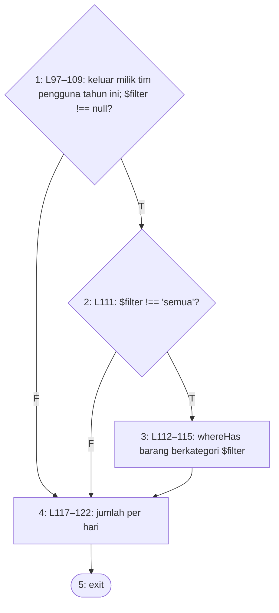

**2. Cyclomatic complexity**

- N = 5, E = 6, P = 1
- V(G) = E − N + 2P = 6 − 5 + 2 = **3**
- Predicate node: 1, 2 (2 node); V(G) = 2 + 1 = **3**

**3. Matriks grafik**

| | 1 | 2 | 3 | 4 | 5 | Σ keluar − 1 |
|---|---|---|---|---|---|---|
| **1** |  | 1 |  | 1 |  | 1 |
| **2** |  |  | 1 | 1 |  | 1 |
| **3** |  |  |  | 1 |  | 0 |
| **4** |  |  |  |  | 1 | 0 |
| **5** |  |  |  |  |  | — |

Jumlah kolom terakhir = 2; V(G) = 2 + 1 = 3.

**4–5. Jalur independen dan kasus uji**

| No | Jalur | Kasus uji | Method tes | Awal | Akhir |
|---|---|---|---|---|---|
| J1 | 1–4–5 | Penyaring null | `JalurBasisModul4Test::test_tren_konsumsi_tim_penyaring_null_tidak_menyaring_kategori` *(baru)* | tanpa-tes | lolos |
| J2 | 1–2–4–5 | Penyaring bawaan 'semua' | `DashboardTimWidgetsTest::test_tren_konsumsi_tim_saya_hanya_menjumlahkan_barang_keluar_tim_pengguna` | lolos | lolos |
| J3 | 1–2–3–4–5 | Penyaring kategori tertentu | `JalurBasisModul4Test::test_tren_konsumsi_tim_menyaring_kategori` *(baru)* | tanpa-tes | lolos |

**6. Persentase jalur lolos:** J_awal = 1, J_akhir = 3; awal = 1/3 × 100% = 33.3%, akhir = 3/3 × 100% = 100.0%.

### 4.13 `PolaPermintaan::cacahPerHari`

Berkas: `app/Filament/Widgets/PolaPermintaan.php` baris 120–138. Dipilih karena: data bagan pola permintaan bercakupan peran (4.9), dibatasi periode terpilih.

**1. Grafik alir — node**

| Node | Baris | Isi |
|---|---|---|
| 1 | L122–126 | kueri bercakupan peran; ada batas periode? *(predicate)* |
| 2 | L127 | where created_at >= batas |
| 3 | L130–137 | cacah per tanggal |
| 4 | — | exit |

**Edge** (asal → tujuan):

1→2 (T), 1→3 (F), 2→3, 3→4

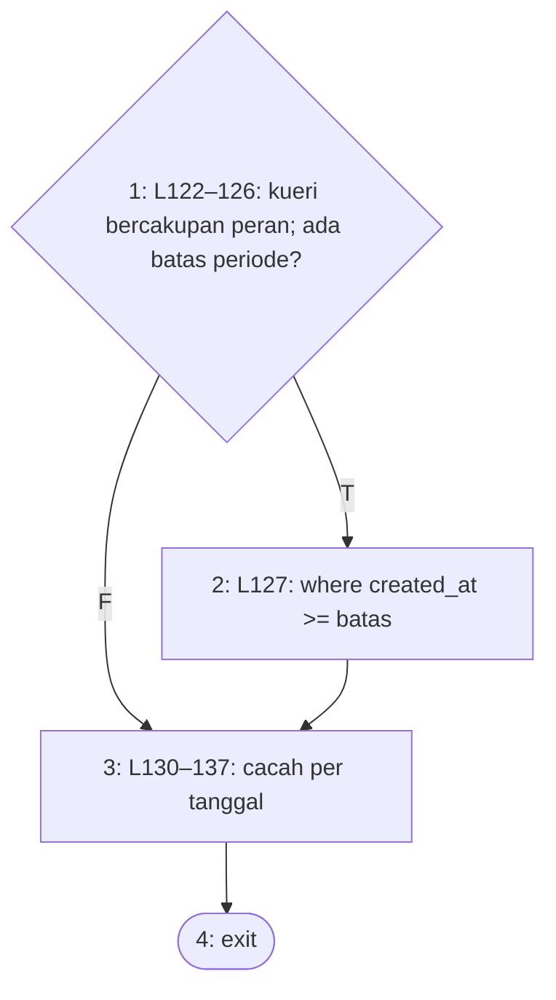

**2. Cyclomatic complexity**

- N = 4, E = 4, P = 1
- V(G) = E − N + 2P = 4 − 4 + 2 = **2**
- Predicate node: 1 (1 node); V(G) = 1 + 1 = **2**

**3. Matriks grafik**

| | 1 | 2 | 3 | 4 | Σ keluar − 1 |
|---|---|---|---|---|---|
| **1** |  | 1 | 1 |  | 1 |
| **2** |  |  | 1 |  | 0 |
| **3** |  |  |  | 1 | 0 |
| **4** |  |  |  |  | — |

Jumlah kolom terakhir = 1; V(G) = 1 + 1 = 2.

**4–5. Jalur independen dan kasus uji**

| No | Jalur | Kasus uji | Method tes | Awal | Akhir |
|---|---|---|---|---|---|
| J1 | 1–2–3–4 | Periode bawaan '30' sebagai Tim | `DashboardTimWidgetsTest::test_pola_permintaan_menyebut_tim_saya_bagi_ketua_tim_dan_tim` | lolos | lolos |
| J2 | 1–3–4 | Periode 'semua' | `JalurBasisModul4Test::test_pola_permintaan_seluruh_periode_tanpa_batas_tanggal` *(baru)* | tanpa-tes | lolos |

**6. Persentase jalur lolos:** J_awal = 1, J_akhir = 2; awal = 1/2 × 100% = 50.0%, akhir = 2/2 × 100% = 100.0%.

## Catatan Increment 4

- Pesan `bastBerubah()` memeriksa NUP dengan `$nup ? … : ''`; NUP bernilai string `'0'` (lolos validasi formulir: wajib, maksimal 30 karakter) bernilai salah di PHP sehingga tidak disebut pada pesan (jalur 4.6 J5–J6). Dicatat sebagai pengamatan, bukan kegagalan jalur: tes jalur menegaskan perilaku kode apa adanya.
- Render widget Pola Permintaan sebagai Tim terbukti menjalankan `cacahPerHari()` beserta cakupan tim: log kueri mencatat `select DATE(created_at) … where "tim_pemohon_id" = ? and "created_at" >= ?`.
- Tidak ada jalur yang gagal pada increment ini.
